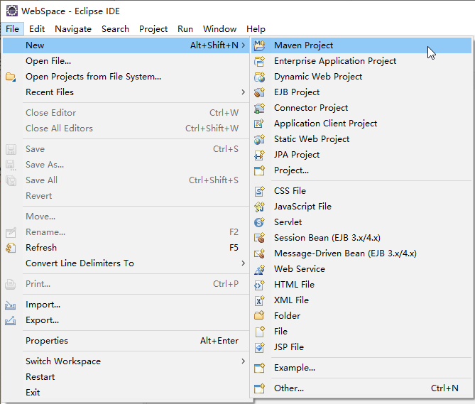
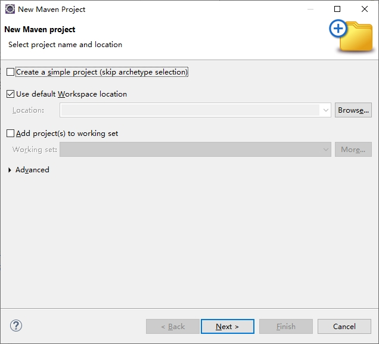
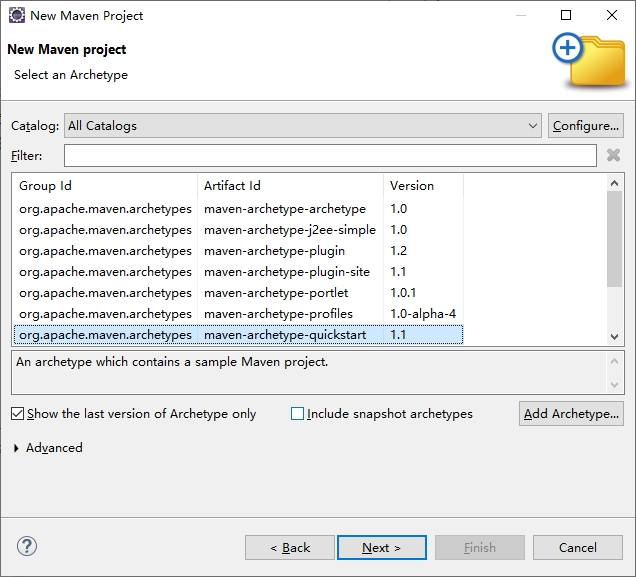
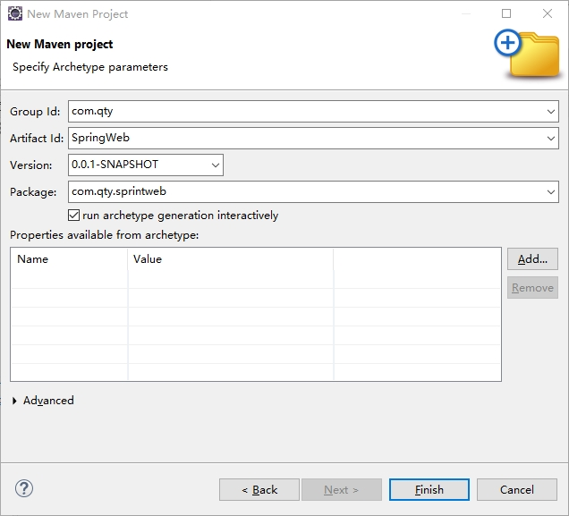
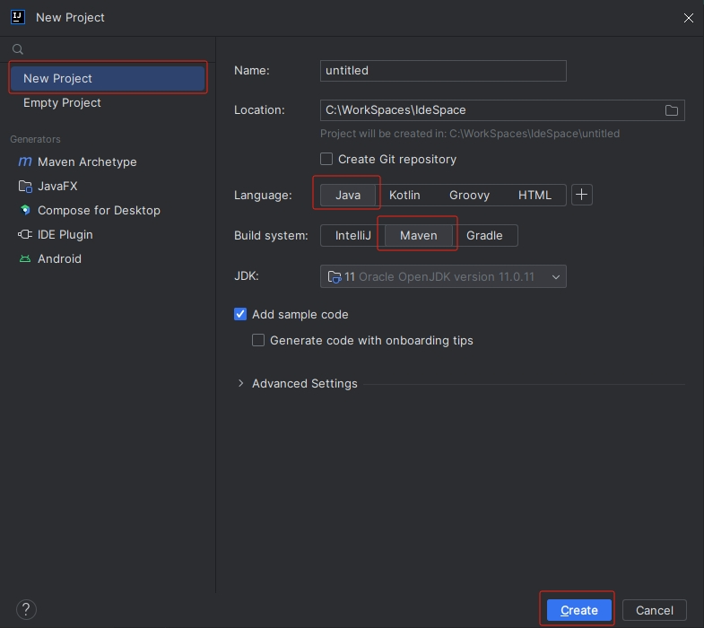
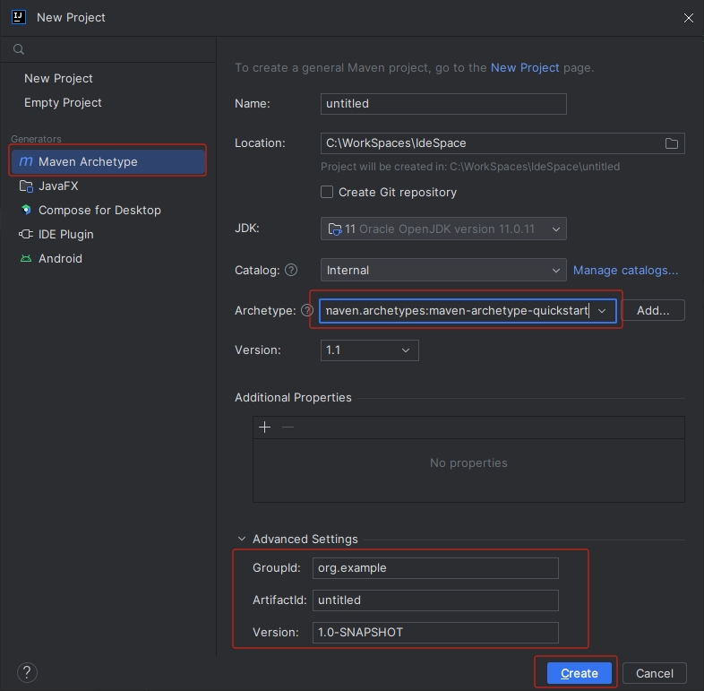

[toc]

### 1. 使用命令创建 Maven 工程

在 Windows 系统通过 <https://maven.apache.org/download.cgi> 网址下载 Maven 命令行工具。

在 Linux 系统在终端中执行下面命令安装 Maven：

```shell
$ sudo apt install maven
```

首先通过 `Maven` 命令创建一个 `Maven` 工程，在 `cmd` 窗口中执行如下命令：

```shell
mvn archetype:generate -DgroupId=com.qty.web -DartifactId=QWeb -DarchetypeArtifactId=maven-archetype-quickstart -DinteractiveMode=false
```

命令解释：

+ `-DgroupId`：组织 Id（项目包名）。
+ `DartifactId`：ArtifactId（项目名称或者模块名称）。
+ `DarchetypeArtifactId`：项目骨架。
+ `-DinteractiveMode`：是否使用交互模式。

使用命令将项目创建好之后，直接用 Eclipse 或者 IntelliJ IDEA 打开即可。

### 2. 在 Eclipse 中创建 Maven 工程

在 Eclipse 中创建 Maven 工程的步骤如下：

**步骤 01** 创建项目时选择 Maven Project：



**步骤 02** 选择 `Use default Workspace location` 复选框：



**步骤 03** 选择项目骨架，保持默认设置即可：



**步骤 04** 输入项目信息



完成以上 4 个步骤之后，单击 `Finish` 按钮即可完成项目创建。

### 3. 使用 IntelliJ IDEA 创建 Maven 工程

使用 IntelliJ IDEA 创建 Maven 工程的步骤如下：

**步骤 01** 创建项目时选择 Maven，但是不必选择项目骨架，直接单击 `Next` 按钮即可。



或者在创建项目时，选择 Maven Archetype，在弹出的对话框中选择骨架以及设置项目信息：



