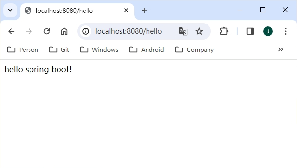
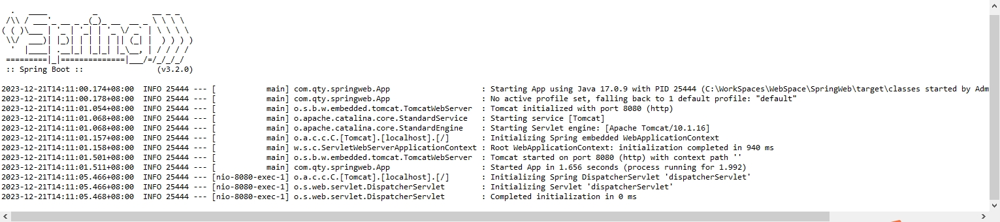
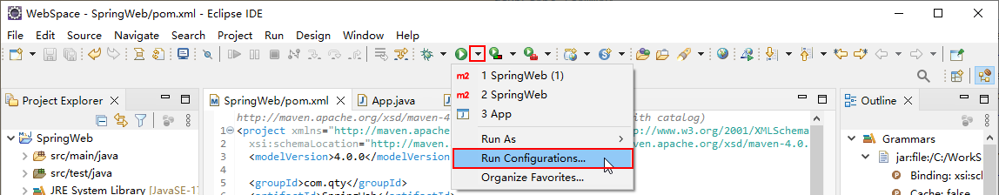
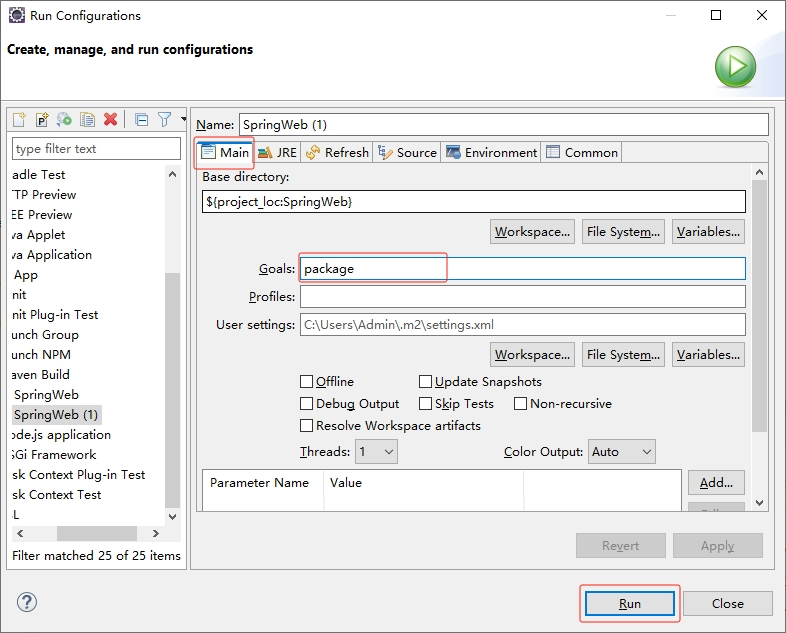

[toc]

### 1. 创建 Maven 工程

参照 [创建 Maven 工程](./创建 Maven 工程.md) 文章创建 Maven 工程。

### 2. 项目构建

#### 2.1 添加依赖

首先添加 `spring-boot-starter-parent` 作为 parent，代码如下：

```xml
<parent>
    <groupId>org.springframework.boot</groupId>
    <artifactId>spring-boot-starter-parent</artifactId>
    <version>3.2.0</version>
    <relativePath/> <!-- lookup parent from repository -->
</parent>
```

> 提示：可以在 <https://mvnrepository.com/> 网站上查询最新版本，当前最新版本为 3.2.0.

最终代码如下：

```xml
<project xmlns="http://maven.apache.org/POM/4.0.0" xmlns:xsi="http://www.w3.org/2001/XMLSchema-instance"
  xsi:schemaLocation="http://maven.apache.org/POM/4.0.0 http://maven.apache.org/xsd/maven-4.0.0.xsd">
  <modelVersion>4.0.0</modelVersion>

  <groupId>com.qty</groupId>
  <artifactId>SpringWeb</artifactId>
  <version>0.0.1-SNAPSHOT</version>
  <packaging>jar</packaging>

  <name>SpringWeb</name>
  <url>http://maven.apache.org</url>

  <properties>
    <project.build.sourceEncoding>UTF-8</project.build.sourceEncoding>
  </properties>
  
  <parent>
    <groupId>org.springframework.boot</groupId>
    <artifactId>spring-boot-starter-parent</artifactId>
    <version>3.2.0</version>
  </parent>

  <dependencies>
    <dependency>
      <groupId>junit</groupId>
      <artifactId>junit</artifactId>
      <version>3.8.1</version>
      <scope>test</scope>
    </dependency>
  </dependencies>
</project>
```

`spring-boot-starter-parent` 是一个特殊的 Starter，提供了一些 Maven 的默认配置，同时还提供了 `dependency-management`，可以使开发者在引入其他依赖时不必输入版本号，方便依赖管理。Spring Boot 中提供的 Starter 非常多，这些 Starter 主要为第三方库提供自动配置，例如要开发一个 Web 项目，就可以先引入一个 Web 的 Starter，代码如下：

```xml
<dependencies>
    <dependency>
        <groupId>org.springframework.boot</groupId>
        <artifactId>spring-boot-starter-web</artifactId>
    </dependency>
</dependencies>
```

#### 2.2 编写启动类

在 Maven 工程的 java 目录下创建项目的包，包里创建一个 App 类，代码如下：

```java
package com.qty.springweb;

/**
 * Hello world!
 *
 */
public class App 
{
    public static void main( String[] args )
    {
        System.out.println( "Hello World!" );
    }
}
```

将 App 类修改为如下代码：

```java
package com.qty.springweb;

import org.springframework.boot.SpringApplication;
import org.springframework.boot.autoconfigure.EnableAutoConfiguration;

@EnableAutoConfiguration
public class App  {
    public static void main( String[] args ) {
        SpringApplication.run(App.class, args);
    }
}
```

代码解释：

+ `@EnableAutoConfiguration` 注解表示开启自动化配置。由于项目中添加了 `spring-boot-starterweb` 依赖，因此在开启了自动化配置之后会自动进行 Spring 和 Spring MVC 的配置。
+ 在 Java 项目的 main 方法中，通过 `SpringApplication` 中的 `run` 方法启动项目。第一个参数传入 `App.class`，告诉 `Spring` 哪个是主要组件。第二个参数是运行时输入的其他参数。

#### 2.3 创建 Spring MVC 控制器

接下来创建一个 Spring MVC 中的控制器—— HelloCController，代码如下：

```java
package com.qty.springweb;

import org.springframework.web.bind.annotation.GetMapping;
import org.springframework.web.bind.annotation.RestController;

@RestController
public class HelloCController {

    @GetMapping("/hello")
    public String hello() {
        return "hello spring boot!";
    }

}
```

在控制器中提供了一个 `/hello` 接口，此时需要配置包扫描才能将 `HelloController` 注册到 Spring MVC 容器中，因此在 `App` 类上面再添加一个注解 `@ComponentScan` 进行包扫描，代码如下：

```java
package com.qty.springweb;

import org.springframework.boot.SpringApplication;
import org.springframework.boot.autoconfigure.EnableAutoConfiguration;
import org.springframework.context.annotation.ComponentScan;

@ComponentScan
@EnableAutoConfiguration
public class App  {
    public static void main( String[] args ) {
        SpringApplication.run(App.class, args);
    }
}
```

也可以直接使用组合注解 `@SpringBootApplication` 来代替 `@EnableAutoConfiguration`  和 `@ComponentScan`，代码如下：

```java
package com.qty.springweb;

import org.springframework.boot.SpringApplication;
import org.springframework.boot.autoconfigure.SpringBootApplication;

@SpringBootApplication
public class App  {
    public static void main( String[] args ) {
        SpringApplication.run(App.class, args);
    }
}
```

### 3. 项目启动

#### 3.1 使用 Maven 命令启动

可以直接使用 `mvn` 命令启动项目：

```shell
$ mvn spring-boot:run
```

启动成功后，在浏览器地址栏输入 <http://localhost:8080/hello> 即可看到运行结果：



#### 3.2 直接运行 main 方法

直接在 IDE 中运行 `App` 类的 `main` 方法，就可以看到项目启动了。



#### 3.3 打包启动

Spring Boot 应用也可以直接打包成 jar 包运行。在生产环境中，也可以直接通过这样的方式来运行一个 Spring Boot 应用。要将 Spring Boot 打包成 jar 包运行，首先需要添加一个 plugin 到 pom.xml 文件中，代码如下：

```xml
<build>
    <plugins>
        <plugin>
            <groupId>org.springframework.boot</groupId>
            <artifactId>spring-boot-maven-plugin</artifactId>
        </plugin>
    </plugins>
</build>
```

完整代码如下：

```xml
<project xmlns="http://maven.apache.org/POM/4.0.0" xmlns:xsi="http://www.w3.org/2001/XMLSchema-instance"
  xsi:schemaLocation="http://maven.apache.org/POM/4.0.0 http://maven.apache.org/xsd/maven-4.0.0.xsd">
  <modelVersion>4.0.0</modelVersion>

  <groupId>com.qty</groupId>
  <artifactId>SpringWeb</artifactId>
  <version>0.0.1-SNAPSHOT</version>
  <packaging>jar</packaging>

  <name>SpringWeb</name>
  <url>http://maven.apache.org</url>

  <properties>
    <project.build.sourceEncoding>UTF-8</project.build.sourceEncoding>
  </properties>
  
  <parent>
    <groupId>org.springframework.boot</groupId>
    <artifactId>spring-boot-starter-parent</artifactId>
    <version>3.2.0</version>
  </parent>

  <dependencies>
    <dependency>
      <groupId>junit</groupId>
      <artifactId>junit</artifactId>
      <scope>test</scope>
    </dependency>
    <dependency>
		<groupId>org.springframework.boot</groupId>
		<artifactId>spring-boot-starter-web</artifactId>
	</dependency>
  </dependencies>
  <build>
        <plugins>
            <plugin>
                <groupId>org.springframework.boot</groupId>
                <artifactId>spring-boot-maven-plugin</artifactId>
            </plugin>
        </plugins>
    </build>
</project>
```

然后运行 `mvn` 命令进行打包：

```shell
$ mvn package
```

打包完成后，在项目的 target 目录下会生成一个 jar 文件，通过 `java -jar` 命令直接启动这个 jar 文件。

```shell
PS C:\WorkSpaces\WebSpace\SpringWeb\target> & 'C:\Program Files\Java\jdk-17\bin\java.exe' -jar .\SpringWeb-0.0.1-SNAPSHO
T.jar

  .   ____          _            __ _ _
 /\\ / ___'_ __ _ _(_)_ __  __ _ \ \ \ \
( ( )\___ | '_ | '_| | '_ \/ _` | \ \ \ \
 \\/  ___)| |_)| | | | | || (_| |  ) ) ) )
  '  |____| .__|_| |_|_| |_\__, | / / / /
 =========|_|==============|___/=/_/_/_/
 :: Spring Boot ::                (v3.2.0)

2023-12-21T17:29:52.728+08:00  INFO 30480 --- [           main] com.qty.springweb.App                    : Starting App
v0.0.1-SNAPSHOT using Java 17.0.9 with PID 30480 (C:\WorkSpaces\WebSpace\SpringWeb\target\SpringWeb-0.0.1-SNAPSHOT.jar s
tarted by Admin in C:\WorkSpaces\WebSpace\SpringWeb\target)
2023-12-21T17:29:52.735+08:00  INFO 30480 --- [           main] com.qty.springweb.App                    : No active pro
file set, falling back to 1 default profile: "default"
2023-12-21T17:29:54.070+08:00  INFO 30480 --- [           main] o.s.b.w.embedded.tomcat.TomcatWebServer  : Tomcat initia
lized with port 8080 (http)
2023-12-21T17:29:54.083+08:00  INFO 30480 --- [           main] o.apache.catalina.core.StandardService   : Starting serv
ice [Tomcat]
2023-12-21T17:29:54.084+08:00  INFO 30480 --- [           main] o.apache.catalina.core.StandardEngine    : Starting Serv
let engine: [Apache Tomcat/10.1.16]
2023-12-21T17:29:54.158+08:00  INFO 30480 --- [           main] o.a.c.c.C.[Tomcat].[localhost].[/]       : Initializing
Spring embedded WebApplicationContext
2023-12-21T17:29:54.159+08:00  INFO 30480 --- [           main] w.s.c.ServletWebServerApplicationContext : Root WebAppli
cationContext: initialization completed in 1323 ms
2023-12-21T17:29:54.581+08:00  INFO 30480 --- [           main] o.s.b.w.embedded.tomcat.TomcatWebServer  : Tomcat starte
d on port 8080 (http) with context path ''
2023-12-21T17:29:54.603+08:00  INFO 30480 --- [           main] com.qty.springweb.App                    : Started App i
n 2.413 seconds (process running for 2.915)
2023-12-21T17:30:06.919+08:00  INFO 30480 --- [nio-8080-exec-2] o.a.c.c.C.[Tomcat].[localhost].[/]       : Initializing
Spring DispatcherServlet 'dispatcherServlet'
2023-12-21T17:30:06.920+08:00  INFO 30480 --- [nio-8080-exec-2] o.s.web.servlet.DispatcherServlet        : Initializing
Servlet 'dispatcherServlet'
2023-12-21T17:30:06.921+08:00  INFO 30480 --- [nio-8080-exec-2] o.s.web.servlet.DispatcherServlet        : Completed ini
tialization in 1 ms
```

#### 3.4 在 Eclipse 中打包项目

1. 选中 `pom.xml` 文件。

2. 点击运行下拉按钮，在下拉列表中选择 `Run Configurations...` 选项。

   

3. 在弹出的 `Run Configurations` 对话框中选择 `Main` 选项卡，在 `Goals` 输入框中输入 `package`，最后点击 `Run` 按钮即可打包项目，打包后的 jar 位于 target 目录下。

   
