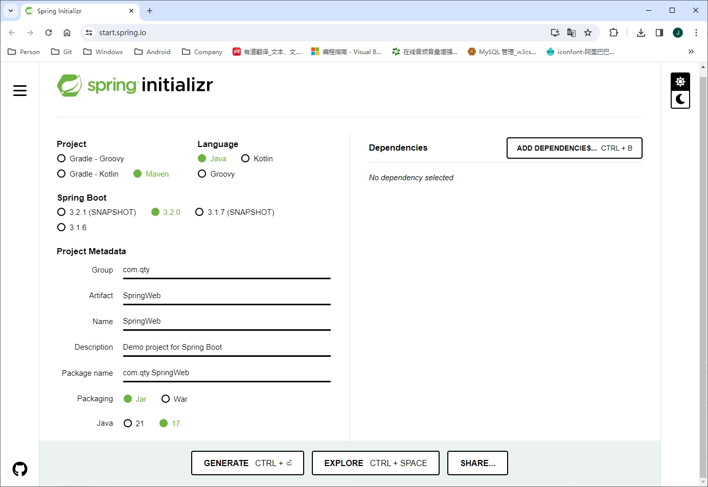

Spring Boot 官方提供在线创建 Spring Boot 项目，通过在浏览器中打开 <https://start.spring.io/> 网站，可以看到如下界面：

在这个页面中，可以选择项目的构件工具是 Maven 还是 Gradle、语音是 Java 还是其他、要使用的 Spring Boot 版本号、项目的组织 Id（包名）、模块名称以及项目的依赖。所有这些信息选好或填好后，单击 `Generate CTRL + Enter` 按钮将生成的模版下载到本地，解压后用 IDE 打开即可开始项目的开发。