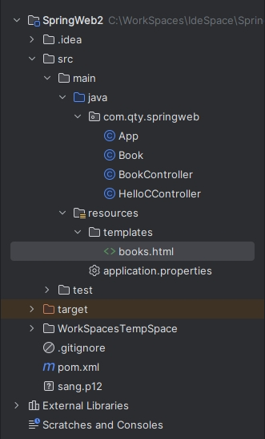

[toc]

> 提示：
>
> 关于 `Thymeleaf` 的更多资料，可以查看 <https://www.thymeleaf.org>。

`Spring Boot` 官方推荐使用的模版引擎是 `Thymeleaf`。`Thymeleaf` 是新一代 Java 模板引擎，类似于 `Velocity`、`FreeMarker` 等传统 `Java` 模板引擎。

### 1. 创建工程，添加依赖

新建一个 `Spring Boot` 工程，然后添加 `spring-boot-starter-web` 和 `spring-boot-starter-thymeleaf` 依赖，代码如下：

```xml
<dependency>
  <groupId>org.springframework.boot</groupId>
  <artifactId>spring-boot-starter-web</artifactId>
</dependency>
<dependency>
  <groupId>org.springframework.boot</groupId>
  <artifactId>spring-boot-starter-thymeleaf</artifactId>
</dependency>
```

### 2. 配置 Thymeleaf

`Spring Boot` 为 `Thymeleaf` 提供了自动化配置类 `ThymeleafAutoConfiguration`，相关的配置属性在 `ThymeleafProperties` 类中，`ThymeleafProperties` 部分源码如下：

```java
@ConfigurationProperties(
    prefix = "spring.thymeleaf"
)
public class ThymeleafProperties {
    private static final Charset DEFAULT_ENCODING;
    public static final String DEFAULT_PREFIX = "classpath:/templates/";
    public static final String DEFAULT_SUFFIX = ".html";
    ...
}
```

由此配置可以看到，默认的模板位置在 `classpath:/templates/`，默认的模板后缀为 `.html`。

当然，如果想对默认的 `Thymeleaf` 配置参数进行自定义配置，那么可以直接在 `application.properties` 中进行配置，部分常见配置如下：

```properties
# 是否开启缓存，开发时可设置为 false，默认为 true
spring.thymeleaf.cache=true
# 检查模板是否存在，默认为 true
spring.thymeleaf.check-template=true
# 检查模板位置是否存在，默认为 true
spring.thymeleaf.check-template-location=true
# 模板文件编码
spring.thymeleaf.encoding=UTF-8
# 模板文件位置
spring.thymeleaf.prefix=classpath:/templates/
# Content-Type 配置
spring.thymeleaf.servlet.content-type=text/html
# 模板文件后缀
spring.thymeleaf.suffix=.html
```

### 3. 配置控制器

创建 `Book` 实体类，然后在 `Controller` 中返回 `ModelAndView`，代码如下：

**Book.java**

```java
import org.springframework.boot.context.properties.ConfigurationProperties;
import org.springframework.stereotype.Component;

public class Book {
    private Integer id;
    private String name;
    private String author;
    // 省略 getter/setter
}
```

**BookController.java**

```java
import org.springframework.web.bind.annotation.GetMapping;
import org.springframework.web.bind.annotation.RestController;
import org.springframework.web.servlet.ModelAndView;

import java.util.ArrayList;
import java.util.List;

@RestController
public class BookController {

    @GetMapping("/books")
    public ModelAndView books() {
        List<Book> books = new ArrayList<>();
        Book b1 = new Book();
        b1.setId(1);
        b1.setAuthor("罗贯中");
        b1.setName("三国演义");
        Book b2 = new Book();
        b2.setId(2);
        b2.setAuthor("曹雪芹");
        b2.setName("红楼梦");
        books.add(b1);
        books.add(b2);
        ModelAndView mv = new ModelAndView();
        mv.addObject("books", books);
        mv.setViewName("books");
        return mv;
    }
}
```

### 4. 创建视图

在 `resources` 目录下的 `templates` 目录中创建 `books.html`，具体代码如下：

```html
<!DOCTYPE html>
<html lang="en" xmlns:th="http://www.thymeleaf.org">
    <head>
        <meta charset="UTF-8" />
        <title>图书列表</title>
    </head>
    <body>
        <table border="1">
            <tr>
                <td>图书编号</td>
                <td>图书名称</td>
                <td>图书作者</td>
            </tr>
            <tr th:each="book:${books}">
                <td th:text="${book.id}"></td>
                <td th:text="${book.name}"></td>
                <td th:text="${book.author}"></td>
            </tr>
        </table>
    </body>
</html>
```

### 5. 文件结构如下


