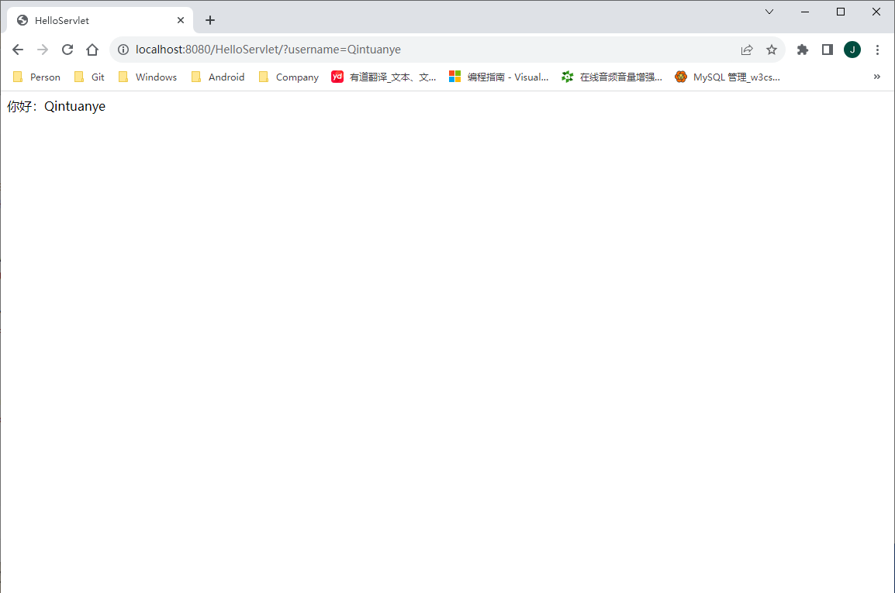

`HttpServletResponse` 接口提供了与 HTTP 协议相关的一些方法，`Servlet` 可通过这些方法来设置 HTTP 响应头或向客户端写 `Cookie`：

+ `addHeader(String name, String value)`：向 HTTP 响应头中加入一项内容。
+ `sendError(int sc)`：向客户端发送一个代表特定错误的 HTTP 响应状态代码。
+ `sendError(int sc, String msg)`：向客户端发送一个代表特定错误的 HTTP 响应状态代码，并且发送具体的错误消息。
+ `setHeader(String name, String value)`：设置 HTTP 响应头中的一项内容。如果响应头中已经存在这项内容，那么原先所作的设置将被覆盖。
+ `setStatus(int sc)`：设置 HTTP 响应的状态码。
+ `addCookie(Cookie cookie)`：向 HTTP 响应中加入一个 Cookie。

`HTTPServletResponse` 接口中定义了一些代表 HTTP 响应状态代码的静态常量，例如：

+ `HTTPServletResponse.SC_BAD_REQUEST`：对应的响应状态代码为 400。
+ `HTTPServletResponse.SC_FOUND`：对应的响应状态代码为 302。
+ `HTTPServletResponse.SC_METHOD_NOT_ALLOWED`：对应的响应状态代码为 405。
+ `HTTPServletResponse.SC_NON_AUTHORITATIVE_INFORMATION`：对应的响应状态代码为 203。
+ `HTTPServletResponse.SC_FORBIDDEN`：对应的响应状态代码为 403。
+ `HTTPServletResponse.SC_OK`：对应的响应状态代码为 200。

以下三种方式都能设置 HTTP 响应正文的 MIME 类型及字符编码：

```java
// 方式一：
response.setContentType("text/html;charset=GBK");
// 方式二：
response.setContentType("text/html");
response.setCharacterEncoding("GBK");
// 方式三：
response.setHeader("Content-type", "text/html;charset-GBK");
```


**示例代码：HelloServlet.java**

```java
package com.qty.web;

import java.io.IOException;
import java.io.PrintWriter;

import javax.servlet.ServletException;
import javax.servlet.http.HttpServlet;
import javax.servlet.http.HttpServletRequest;
import javax.servlet.http.HttpServletResponse;

public class HelloServlet extends HttpServlet {
	
	@Override
	protected void doGet(HttpServletRequest req, HttpServletResponse resp) throws ServletException, IOException {
		// 获得 username 请求参数
		String userName = req.getParameter("username");
		
		if (userName == null) {
			// 仅仅为了演示 resp.sendError() 的用法。
			resp.sendError(resp.SC_FORBIDDEN);
			return;
		}
		
		// 设置 HTTP 响应的正文的 MIME 类型及字符编码
		resp.setContentType("text/html;charset=GBK");
		
		/* 输出 HTML 文档 */
		PrintWriter out = resp.getWriter();
		out.println("<html><head><title>HelloServlet</title></head>");
		out.println("<body>");
		out.println("你好：" + userName);
		out.println("</body></html>");
		
		System.out.println("before close(): " + resp.isCommitted()); // false
		out.close();	// 关闭 PrintWriter
		System.out.println("after close(): " + resp.isCommitted()); // true
	}

}
```

运行效果如下：


