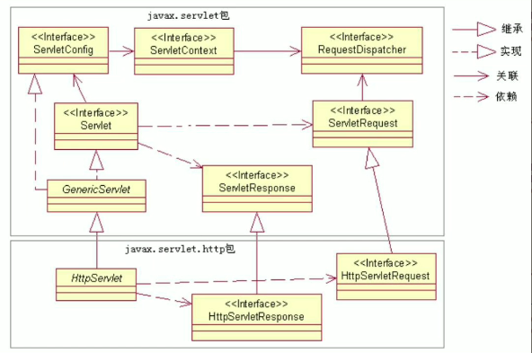

`Servlet API` 的 `JavaDoc` 文档除了在 `Oracle` 的官方网站可以查看，此外，在 `Apache` 网站上也可以查看：

```
http://tomcat.apache.org/tomcat-9.0-doc/servletapi/index.html
```

`Tomcat` 的 `<CATALINA_HOME>/lib/servlet-api.jar` 文件为 Servlet API 的类库文件。Servlet API 主要由两个 Java 包组成：`javax.servlet` 和 `javax.servlet.http`。在 `javax.servlet` 包中定义了 `Servlet` 接口以及相关的通用接口和类。在 `javax.servlet.http` 包中主要定义了与 HTTP 协议相关的 `HttpServlet` 类、`HttpServletRequest` 接口和 `HttpServletResponse` 接口。



<center><b>Servlet API 的类框图</b></center>

