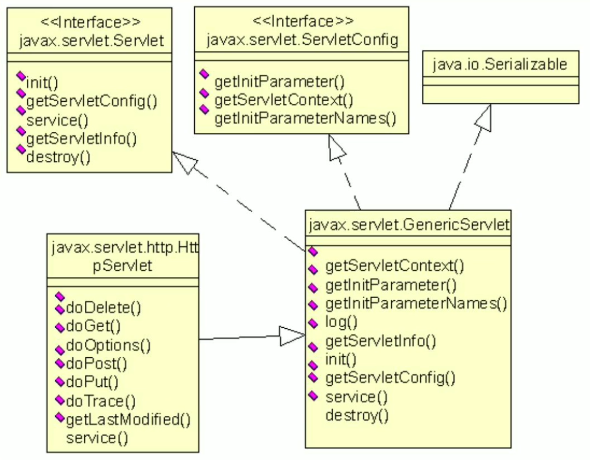

在 `Servlet` 接口中定义了 5 个方法，其中有 3 个方法都由 `Servlet` 容器来调用，容器会在 `Servlet` 的声明周期不同阶段调用特定的方法：

+ `init(ServletConfig config)` 方法：该方法负责初始化 `Servlet` 对象。容器在创建好 `Servlet` 对象后，就会调用该方法。
+ `service(ServletRequest req, ServletResponse res)` 方法：负责响应客户的请求，为客户提供相应服务。容器接收到客户端要求访问特定 `Servlet` 对象的请求时，就会调用该 `Servlet` 对象的 `service()` 方法。
+ `destroy()` 方法：负责释放 `Servlet` 对象占用的资源。当 `Servlet` 对象结束生命周期时，容器会调用此方法。

`Servlet` 接口还定义了一下两个返回 `Servlet` 的相关信息的方法。Java Web 应用中的程序代码可以访问 `Servlet` 的这两个方法，从而获得 `Servlet` 的配置信息以及其他相关信息：

+ `getServletConfig()` ：返回一个 `ServletConfig` 对象，该对象中包含了 `Servlet` 的初始化参数信息。
+ `getServletInfo()` ：返回一个字符串，该字符串中包含了 `Servlet` 的创建者、版本和版权等信息。

在 Servlet API 中，`javax.servlet.GenericServlet` 抽象类实现了 `Servlet` 接口，而 `javax.servlet.http.HttpServlet` 抽象类是 `GenericServlet` 类的子类。当用户开发自己的 `Servlet` 类时，可以选择扩展 `GenericServlet` 类或者 `HttpServlet` 类。

<b>Servlet 接口以及其实现类的类框图</b>

