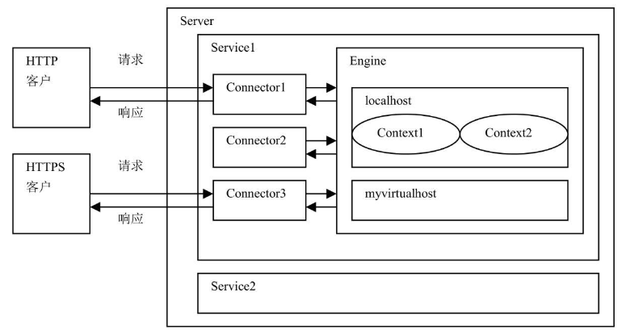

> 提示：`<CATALINA_HOME>` 表示 Tomcat 的安装根目录。

`Tomcat` 的各个组件可以在 `<CATALINA_HOME>/conf/server.xml` 文件中尽显配置，每个 `Tomcat` 组件在 `server.xml` 文件中对应一种配置元素。以下代码以 XML 的形式展示了各种 `Tomcat` 组件之间的关系：

```xml
<Server>
	<servicie>
    	<Connector />
        <Engine>
        	<Host>
            	<Context>
                </Context>
            </Host>
        </Engine>
    </servicie>
</Server>
```

这些元素可分为四类：

+ 顶层类元素

  包括 `<Server>` 元素和 `<Service>` 元素，它们位于整个配置文件的顶层。

+ 连接器类元素

  为 `<Connector>` 元素，代表介于客户与服务器之间的通信接口，负责将客户的请求发送给服务器，并将服务器的响应结果发送给客户。

+ 容器类元素

  代表处理客户请求并生成响应结果的组件，有四种容器类元素，分别为 `<Engine>`、`<Host>`、`<Context>` 和 `<Cluster>` 元素。`Engine` 组件为特定的 `Service` 组件处理所有客户请求，`Host` 组件为特定的虚拟主机处理所有请求，`Context` 组件为特定的 `Web` 应用处理所有客户请求。`Cluster` 组件负责为 `Tomcat` 集群系统进行会话复制、`Context` 组件的属性的复制，以及集群范围内 `WAR` 文件的发布。

+ 嵌套类元素

  代表可以嵌入到容器中的组件，如 `<Valve>` 元素和 `<Realm>` 元素等。

下面再对一些基本的 `Tomcat` 元素进行介绍：

+ `<Server>` 元素

  `<Server>` 元素代表整个 `<Servlet>` 容器组件，它是 `Tomcat` 的顶层元素。`<Server>` 元素中可包含一个或多个 `<Service>` 元素。

+ `<Service>` 元素

  `<Service>` 元素中包含一个 `<Engine>` 元素，以及一个或多个 `<Connector>` 元素，这些 `<Connector>` 元素共享同一个 `<Engine>` 元素。

+ `<Connector>` 元素

  `<Connector>` 元素代表和客户程序实际交互的组件，它负责接收客户请求，以及向客户返回响应结果。

+ `<Engine>` 元素

  每个 `<Service>` 元素只能包含一个 `<Engine>` 元素。`<Engine>` 元素处理在同一个 `<Service>` 中所有 `<Connector>` 元素接收到的客户请求。

+ `<Host>` 元素

  一个 `<Engine>` 元素中可以包含多个 `<Host>` 元素。每个 `<Host>` 元素定义了一个虚拟主机，它可以包含一个或多个 Web 应用。

+ `<Context>` 元素

  `<Context>` 元素是使用最频繁的元素。每个 `<Context>` 元素代表了运行在虚拟主机上的单个 `Web` 应用。一个 `<Host>` 元素中可以包含多个 `<Context>` 元素。



<center><b>Tomcat 各个组件之间的嵌套关系</b></center>

`Tomcat` 安装好以后，在它的 `server.xml` 配置文件中已经配置了 `<Server>`、`<Service>`、`<Connector>`、`<Engine>` 和 `<Host>` 等组件：

```xml
<?xml version="1.0" encoding="UTF-8"?>
<!--
  Licensed to the Apache Software Foundation (ASF) under one or more
  contributor license agreements.  See the NOTICE file distributed with
  this work for additional information regarding copyright ownership.
  The ASF licenses this file to You under the Apache License, Version 2.0
  (the "License"); you may not use this file except in compliance with
  the License.  You may obtain a copy of the License at

      http://www.apache.org/licenses/LICENSE-2.0

  Unless required by applicable law or agreed to in writing, software
  distributed under the License is distributed on an "AS IS" BASIS,
  WITHOUT WARRANTIES OR CONDITIONS OF ANY KIND, either express or implied.
  See the License for the specific language governing permissions and
  limitations under the License.
-->
<!-- Note:  A "Server" is not itself a "Container", so you may not
     define subcomponents such as "Valves" at this level.
     Documentation at /docs/config/server.html
 -->
<Server port="8005" shutdown="SHUTDOWN">
  <Listener className="org.apache.catalina.startup.VersionLoggerListener" />
  <!-- Security listener. Documentation at /docs/config/listeners.html
  <Listener className="org.apache.catalina.security.SecurityListener" />
  -->
  <!-- APR library loader. Documentation at /docs/apr.html -->
  <Listener className="org.apache.catalina.core.AprLifecycleListener" SSLEngine="on" />
  <!-- Prevent memory leaks due to use of particular java/javax APIs-->
  <Listener className="org.apache.catalina.core.JreMemoryLeakPreventionListener" />
  <Listener className="org.apache.catalina.mbeans.GlobalResourcesLifecycleListener" />
  <Listener className="org.apache.catalina.core.ThreadLocalLeakPreventionListener" />

  <!-- Global JNDI resources
       Documentation at /docs/jndi-resources-howto.html
  -->
  <GlobalNamingResources>
    <!-- Editable user database that can also be used by
         UserDatabaseRealm to authenticate users
    -->
    <Resource name="UserDatabase" auth="Container"
              type="org.apache.catalina.UserDatabase"
              description="User database that can be updated and saved"
              factory="org.apache.catalina.users.MemoryUserDatabaseFactory"
              pathname="conf/tomcat-users.xml" />
  </GlobalNamingResources>

  <!-- A "Service" is a collection of one or more "Connectors" that share
       a single "Container" Note:  A "Service" is not itself a "Container",
       so you may not define subcomponents such as "Valves" at this level.
       Documentation at /docs/config/service.html
   -->
  <Service name="Catalina">

    <!--The connectors can use a shared executor, you can define one or more named thread pools-->
    <!--
    <Executor name="tomcatThreadPool" namePrefix="catalina-exec-"
        maxThreads="150" minSpareThreads="4"/>
    -->


    <!-- A "Connector" represents an endpoint by which requests are received
         and responses are returned. Documentation at :
         Java HTTP Connector: /docs/config/http.html
         Java AJP  Connector: /docs/config/ajp.html
         APR (HTTP/AJP) Connector: /docs/apr.html
         Define a non-SSL/TLS HTTP/1.1 Connector on port 8080
    -->
    <Connector port="8080" protocol="HTTP/1.1"
               connectionTimeout="20000"
               redirectPort="8443"
               maxParameterCount="1000"
               />
    <!-- A "Connector" using the shared thread pool-->
    <!--
    <Connector executor="tomcatThreadPool"
               port="8080" protocol="HTTP/1.1"
               connectionTimeout="20000"
               redirectPort="8443"
               maxParameterCount="1000"
               />
    -->
    <!-- Define an SSL/TLS HTTP/1.1 Connector on port 8443
         This connector uses the NIO implementation. The default
         SSLImplementation will depend on the presence of the APR/native
         library and the useOpenSSL attribute of the AprLifecycleListener.
         Either JSSE or OpenSSL style configuration may be used regardless of
         the SSLImplementation selected. JSSE style configuration is used below.
    -->
    <!--
    <Connector port="8443" protocol="org.apache.coyote.http11.Http11NioProtocol"
               maxThreads="150" SSLEnabled="true"
               maxParameterCount="1000"
               >
        <SSLHostConfig>
            <Certificate certificateKeystoreFile="conf/localhost-rsa.jks"
                         type="RSA" />
        </SSLHostConfig>
    </Connector>
    -->
    <!-- Define an SSL/TLS HTTP/1.1 Connector on port 8443 with HTTP/2
         This connector uses the APR/native implementation which always uses
         OpenSSL for TLS.
         Either JSSE or OpenSSL style configuration may be used. OpenSSL style
         configuration is used below.
    -->
    <!--
    <Connector port="8443" protocol="org.apache.coyote.http11.Http11AprProtocol"
               maxThreads="150" SSLEnabled="true"
               maxParameterCount="1000"
               >
        <UpgradeProtocol className="org.apache.coyote.http2.Http2Protocol" />
        <SSLHostConfig>
            <Certificate certificateKeyFile="conf/localhost-rsa-key.pem"
                         certificateFile="conf/localhost-rsa-cert.pem"
                         certificateChainFile="conf/localhost-rsa-chain.pem"
                         type="RSA" />
        </SSLHostConfig>
    </Connector>
    -->

    <!-- Define an AJP 1.3 Connector on port 8009 -->
    <!--
    <Connector protocol="AJP/1.3"
               address="::1"
               port="8009"
               redirectPort="8443"
               maxParameterCount="1000"
               />
    -->

    <!-- An Engine represents the entry point (within Catalina) that processes
         every request.  The Engine implementation for Tomcat stand alone
         analyzes the HTTP headers included with the request, and passes them
         on to the appropriate Host (virtual host).
         Documentation at /docs/config/engine.html -->

    <!-- You should set jvmRoute to support load-balancing via AJP ie :
    <Engine name="Catalina" defaultHost="localhost" jvmRoute="jvm1">
    -->
    <Engine name="Catalina" defaultHost="localhost">

      <!--For clustering, please take a look at documentation at:
          /docs/cluster-howto.html  (simple how to)
          /docs/config/cluster.html (reference documentation) -->
      <!--
      <Cluster className="org.apache.catalina.ha.tcp.SimpleTcpCluster"/>
      -->

      <!-- Use the LockOutRealm to prevent attempts to guess user passwords
           via a brute-force attack -->
      <Realm className="org.apache.catalina.realm.LockOutRealm">
        <!-- This Realm uses the UserDatabase configured in the global JNDI
             resources under the key "UserDatabase".  Any edits
             that are performed against this UserDatabase are immediately
             available for use by the Realm.  -->
        <Realm className="org.apache.catalina.realm.UserDatabaseRealm"
               resourceName="UserDatabase"/>
      </Realm>

      <Host name="localhost"  appBase="webapps"
            unpackWARs="true" autoDeploy="true">

        <!-- SingleSignOn valve, share authentication between web applications
             Documentation at: /docs/config/valve.html -->
        <!--
        <Valve className="org.apache.catalina.authenticator.SingleSignOn" />
        -->

        <!-- Access log processes all example.
             Documentation at: /docs/config/valve.html
             Note: The pattern used is equivalent to using pattern="common" -->
        <Valve className="org.apache.catalina.valves.AccessLogValve" directory="logs"
               prefix="localhost_access_log" suffix=".txt"
               pattern="%h %l %u %t &quot;%r&quot; %s %b" />

      </Host>
    </Engine>
  </Service>
</Server>
```

