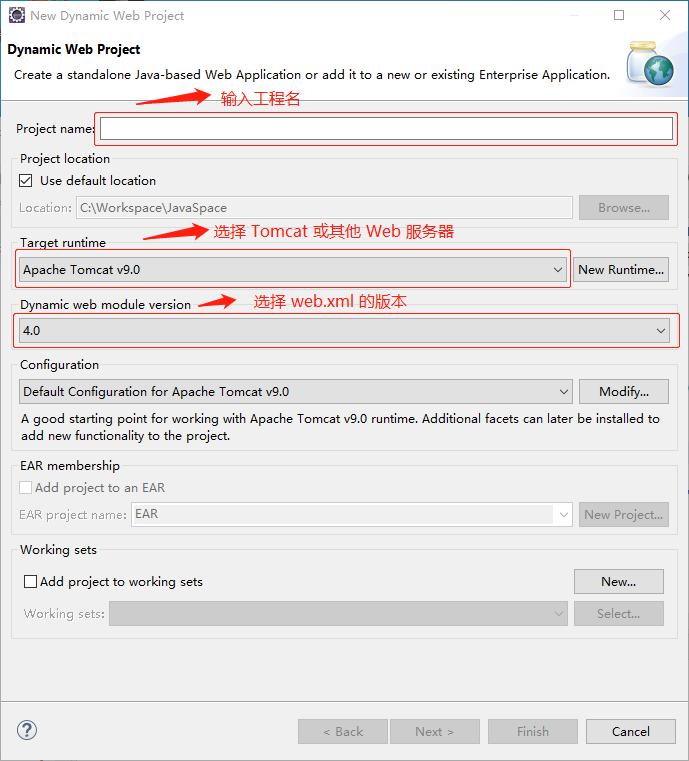
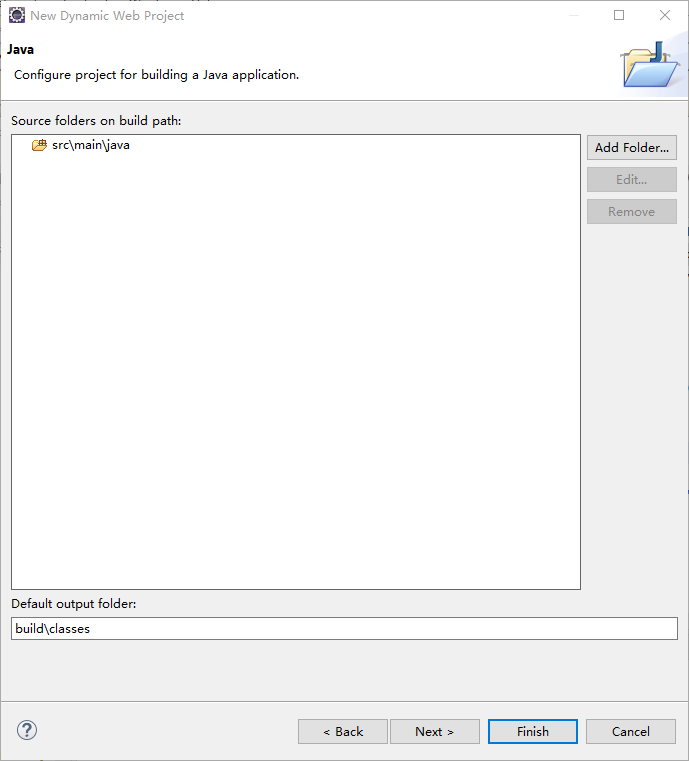
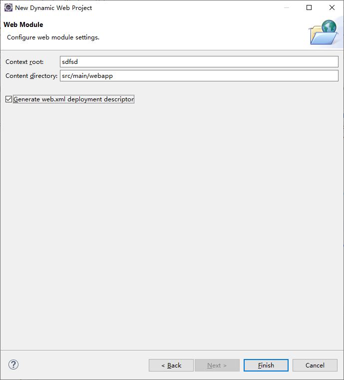
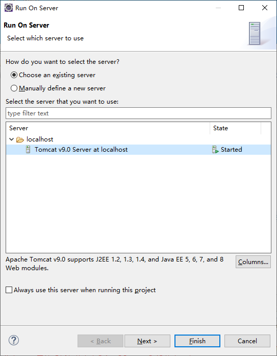

1. 依次点击 `File -> New -> Dynamic Web Project` 菜单。

2. 在弹出的对话框中依次输入信息，最后单击 `Next` 按钮。

   

3. 在 `Java` 选项界面继续点击 `Next` 按钮。

   

4. 在 `Web Module` 界面勾选下面的 `Generate web.xml deployment descriptor` 复选框，然后点击 `Finish` 按钮完成工程的创建。

   

5. 在 `src/main/java` 下创建 Java 类，通过修改 `src/main/webapp/WEB-INF/web.xml` 文件配置网站。

6. 右键工程名称，在弹出的菜单中，依次点击 `Run As` -> `Run on server` 菜单。

7. 在弹出的对话框中勾选 `Choose an existing server` 复选框，在 `Server` 列表中选择要使用的服务器，然后单击 `Finish` 按钮即可运行网站。

   