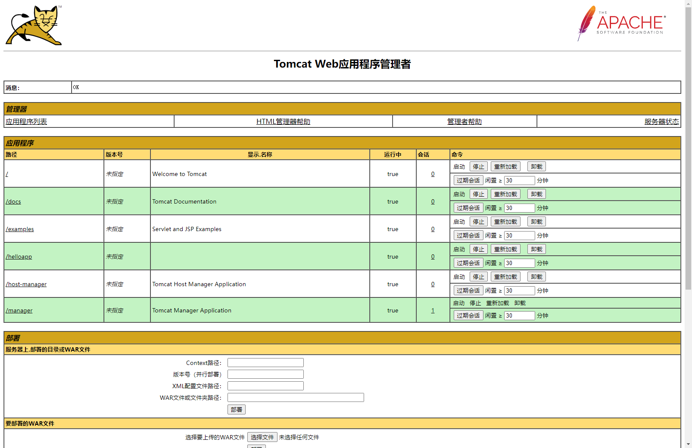

`Tomcat` 作为 `Servlet` 容器的一种具体实现，还提供了一个管理平台，通过该平台，用户可以在 `Tomcat` 运行时，手工管理单个 `Web` 应用的生命周期。以下是通过该管理平台来管理单个 `Web` 应用的生命周期的步骤，其中步骤一只需在 `Tomcat` 安装后操作一次就行。

（1）修改 `<CATALINA_HOME>/conf/tomcat-users.xml` 文件，在其中加入一个 `<user>` 元素：

```xml
<tomcat-users>
	<role rolename="manager-gui" />
    <user username="tomcat", password="tomcat" roles="manger-gui" />
</tomcat-users>
```

以上代码配置了一个名为 `tomcat` 的用户，它具有访问 `Tomcat` 管理平台的权限。

（2）启动 `Tomcat`。

（3）`Tomcat` 管理平台本身也是一个 `Java Web` 应用，它位于 `<CATALINA_HOME>/webapps/manager` 目录下。该 `Web` 应用的主页的 `URL` 为 `http://localhost:8080/manager/html`。通过浏览器访问该 `URL`，将会弹出一个身份验证窗口，在该窗口中输入用户 `tomcat` 以及口令 `tomcat`。



上图列出了已经在 `Tomcat` 中发布的所有 `Web` 应用，对于每个 `Web` 应用，都提供了四个操作：

+ `Start` 操作：启动当前 `Web` 应用。
+ `Stop` 操作：终止当前 `Web` 应用。
+ `Reload` 操作：等价于先终止当前 `Web` 应用，再重新启动当前 `Web` 应用。
+ `Undeploy` 操作：从 `Tomcat` 中卸除当前 `Web` 应用，`Web` 应用的文件会被删除。

手工重新启动一个 `Web` 用用有两种方式：

+ 方式一：重新启动 `Tomcat`。
+ 方式二：不必重新启动 `Tomcat`，只要通过 `Tomcat` 管理平台的 `Reload` 操作来重新启动特定 `Web` 应用即可。

在 `Web` 应用的开发阶段，利用以上第二种方式来调试和运行 `Web` 应用显然更加方便。如果 `Web` 应用发布到 `Tomcat` 中，可以为 `Web` 应用配置一个 `<Context>` 元素，该元素有一个 `reloadable` 属性。如果这个属性设为 `true`，`Tomcat` 在运行时会监视在 `Web` 应用的 `WEB-INF/classes` 和 `WEB-INF/lib` 目录下的类文件的改动。如果监测到有类文件被更新，`Tomcat` 会自动重新启动 `Web` 应用。该属性的默认值为 `false`。在 `Web` 应用的开发阶段，把 `<Context>` 元素的 `reloadable` 属性设为 `true`，可以更加方便地调试和运行 `Servlet`。