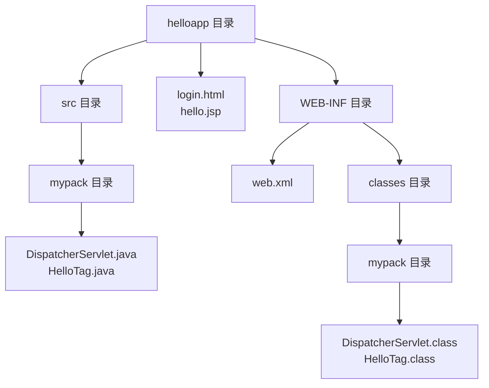
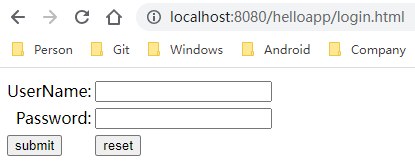

[toc]

<center><b>helloapp 应用的目录结构</b></center>



### 1. 创建 HTML 文件

在 `helloapp` 目录下加入 `login.html` 文件，文件类型如下：

**login.html**

```html
<!DOCTYPE html>
<html>
    <head>
        <title>helloapp</title>
    </head>
    <body>
        <form name="loginForm" method="POSt" action="dispatcher">
            <table>
                <tr>
                	<td><div align="right">UserName:</div></td>
                    <td><input type="text" name="username"/></td>
                </tr>
                <tr>
                	<td><div align="right">Password:</div></td>
                    <td><input type="password" name="password"/></td>
                </tr>
                <tr>
                	<td><input type="submit" name="submit" value="submit"/></td>
                    <td><input type="reset" name="reset" value="reset"/></td>
                </tr>
            </table>
        </form>
    </body>
</html>
```

访问 `login.html` 的 `URL` 为 <http://localhost:8080/helloapp/login.html>，该页面显示如下：



### 2. 创建 Servlet 类

下面创建 `DispatcherServlet` 类，它调用 `ServletRequest` 对象的 `getParameter()` 方法读取客户提交的 `loginForm` 表单数据。

**DispatcherServlet.java**

```java
package mypack;

import javax.servlet.*;
import javax.servlet.http.*;
import java.io.*;
import java.util.*;

public class DispatcherServlet extends GenericServlet {
    
    public String target = "/hello.jsp";
    
    /**
     * 响应客户请求
     */
    public void service(ServletRequest request,
                       ServletResponse response)
        throws ServletException, IOException {
        // 读取表单中的用户名
        String username = request.getParameter("username");
        // 读取表单中的口令
        String password = request.getParameter("password");
        
        // 在 request 对象中添加 USER 属性
        request.setAttribute("USER", username);
        // 在 request 对象中添加 PASSWORD 属性
        request.setAttribute("PASSWORD", password);
        
        /* 把请求转发给 hello.jsp */
        ServletContext context = getServletContext();
        RequestDispatcher dispatcher = context.getRequestDispatcher(target);
        dispatcher.forward(request, response);
    }
}
```

使用下面命令编译 `DispatcherServlet.java` 文件：

```shell
C:\tomcat\webapps\helloapp> javac -sourcepath src -classpath ..\..\servlet-api.jar -d WEB-INF\classes src\mypack\DispatcherServlet.java
```

> 注意：源代码文件中包含中文，可能编译不过，可以删除中文注释后再编译。

### 3. 创建 JSP 文件

`hello.jsp` 文件放在 `helloapp` 根目录下：

**hello.jsp**

```jsp
<!DOCTYPE html>
<html>
    <head>
        <title>helloapp</title>
    </head>
    <body>
        <b>Hello: <%= request.getAttribute("USER") %></b>
    </body>
</html>
```

### 4. 创建 web.xml 文件

先创建一个默认的 `web.xml` 文件，并把这个文件放到 `WEB-INF` 目录中：

```xml
<web-app xmlns="http://xmlns.jcp.org/xml/ns/javaee"
  xmlns:xsi="http://www.w3.org/2001/XMLSchema-instance"
  xsi:schemaLocation="http://xmlns.jcp.org/xml/ns/javaee
                      http://xmlns.jcp.org/xml/ns/javaee/web-app_4_0.xsd"
  version="4.0"
  metadata-complete="true">

......

</web-app>
```

接下来在 `web.xml` 中为 `DispatcherServlet` 类加上 `<servlet>` 和 `<servlet-mapping>` 元素：

```xml
<web-app xmlns=...>
    <servlet>
        <servlet-name>dispatcher</servlet-name>
        <servlet-class>mypack.DispatcherServlet</servlet-class>
    </servlet>

    <servlet-mapping>
        <servlet-name>dispatcher</servlet-name>
        <url-pattern>/dispatcher</url-pattern>
    </servlet-mapping>
</web-app>
```

`<servlet>` 元素用于为 `Servlet` 类定义一个名字，它的子元素如下表：

<center><b>&lt;servlet&gt; 元素的子元素</b></center>

| 子元素             | 说明                                                         |
| ------------------ | ------------------------------------------------------------ |
| \<servlet-name>    | 定义 Servlet 的名字                                          |
| \<servlet-class>   | 指定 Servlet 的完整类名（包括包的名字）。                    |
| \<init-param>      | 定义 Servlet 的初始化参数（包括参数名和参数值），一个 \<servlet> 元素中可以有多个 \<init-param>。 |
| \<load-on-startup> | 指定当 Servlet 容器启动 Web 应用时，加载各个 Servlet 的次序。当这个值为正数或零，Servlet 容器先加载数值小的 Servlet，在依次加载其他数值大的 Servlet。如果这个值为负数或者没有设定，那么 Servlet 容器将在客户端首次访问这个 Servlet 时加载它。 |

`<servlet-mapping>`元素用于为 `Servlet` 映射一个 `URL`。`<servlet-name>` 子元素指定待映射的 `Servlet` 的名字；`<url-pattern>` 子元素指定访问 `Servlet` 的相对 `URL` 路径。根据以上范例中的 `<url-pattern>` 子元素的值，可以确定访问 `DispatcherServlet` 的 `URL` 为 <http://localhost:8080/helloapp/dispatcher>。

在 `web.xml` 文件中还可以加入 `<welcome-file-list>` 元素，它用来为 `Web` 应用设置默认的主页。例如，当客户端提供的 `URL` 为 <http://localhost:8080/helloapp> 时，如果希望服务器端自动返回 `login.html` 页面，则可以在 `web.xml` 文件中加入如下 `<welcome-file-list>` 元素：

```xml
<welcome-file-list>
	<welcome-file>login.html</welcome-file>
</welcome-file-list>
```

