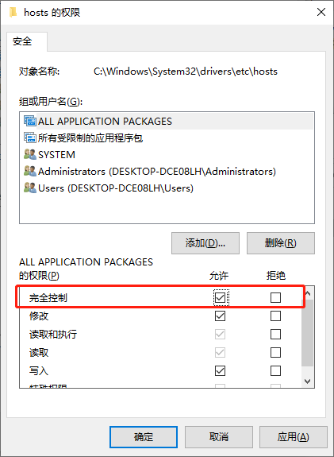

下面介绍 `Windows` 操作系统中进行 `DNS` 映射的步骤：

（1）在文件资源管理器中找到 `C:\Windows\System32\drivers\etc\hosts` （`Windows 10` 以下是 `C:\Windows\System32\etc\hosts`）。选中 `hosts` 文件，按下鼠标右键，在弹出的菜单中，选择 【属性】 -> 【安全】-> 【编辑】,在 `hosts` 文件的访问权限编辑窗口中，设置 `Windows` 用户具有 “完全控制” 权限。



（2）用 `Windows` 记事本打开 `hosts` 文件，在文件中加入如下内容，使得 `www.javathinkerok.com` 等虚拟主机名和本地主机的 `IP` 地址映射：

```
127.0.0.1    www.javathinkerok.com
127.0.0.1    javathinkerok.com
127.0.0.1    javathinkerok

::1    www.javathinkerok.com
::1    javathinkerok.com
::1    javathinkerok
```

以上代码中 `127.0.0.1` 和 `::1` 分别是本地主机的 `IPv4` 格式和 `IPv6` 格式的 `IP` 地址。