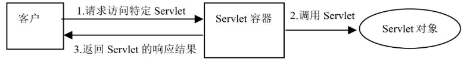
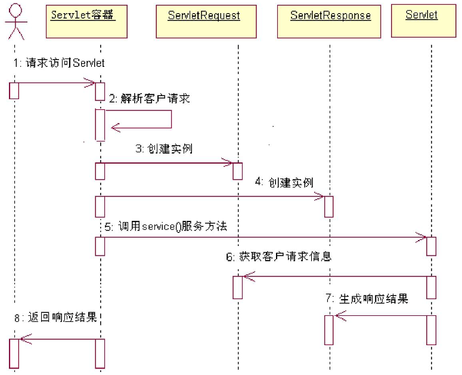

`Servlet` 具有以下特定：

+ 提供了可被服务器动态加载并执行的程序代码，为来自客户的请求提供相应服务。
+ `Servlet` 完全用 `Java` 语言编写，因此要求运行 `Servlet` 的服务器必须支持 `Java` 语言。
+ `Servlet` 完全在服务器端运行，因此它的运行不依赖于浏览器。

`Servlet` 容器相应客户请求访问特定 `Servlet` 的流程如下：

+ 客户发出要求访问特定 `Servlet` 的请求。
+ `Servlet` 容器接收到客户请求，对其解析。
+ `Servlet` 容器创建一个 `ServletRequest` 对象，在 `ServletRequest` 对象中包含了客户请求信息以及其他关于客户的相关信息，如请求头、请求正文、以及客户机的 IP 地址等。
+ `Servlet` 容器创建一个 `ServletResponse` 对象。
+ `Servlet` 容器调用客户所请求的 `Servlet` 的 `service()` 服务方法，并且把 `ServletRequest` 对象和 `ServletResponse` 对象作为参数传给该服务方法。
+ `Servlet` 从 `ServletRequest` 对象中可获得客户的请求信息。
+ `Servlet` 利用 `ServletResponse` 对象来生成响应结果。
+ `Servlet` 容器把 `Servlet` 生成的响应结果发送给客户。

