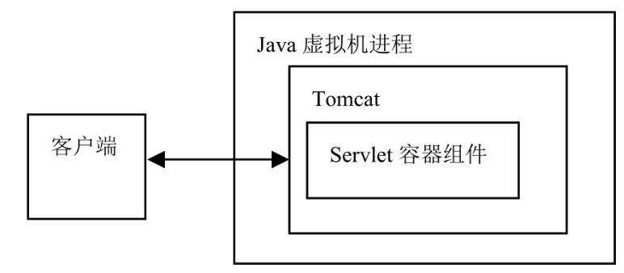
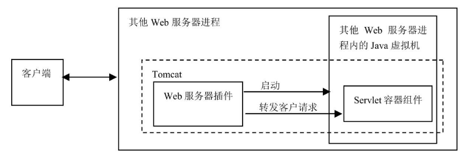
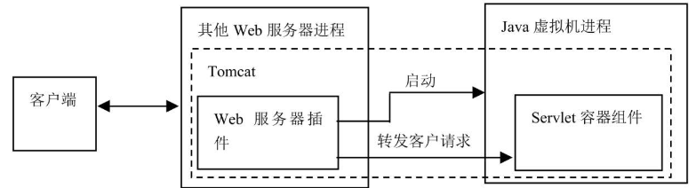

`Tomcat` 作为 `Servlet` 容器，有以下三种工作模式：

（1）独立的 `Servlet` 容器

`Tomcat` 作为独立的 `Web` 服务器来单独运行，`Servlet` 容器组件作为 `Web` 服务器中的一部分而存在。这是 `Tomcat` 的默认工作模式。

<b>Tomcat 由 Java 虚拟机进程来运行</b>

（2）其他 Web 服务器进程内的 `Servlet` 容器

在这种模式下，`Tomcat` 分为 `Web` 服务器插件和 `Servlet` 容器组件两部分。`Web` 服务器插件在其他 `Web` 服务器进程的内部地址空间启动一个 `Java` 虚拟机，`Servlet` 容器组件在此 `Java` 虚拟机中运行。如有客户端发出调用 `Servlet` 的请求，`Web` 服务器插件获得对此请求的控制并将它转发（使用 `JNI` 通信机制）给 `Servlet` 容器组件。

<b>其他 Web 服务器进程内的 Servlet 容器</b>

（3）其他 Web 服务器进程外的 `Servlet` 容器

在这种模式下，`Tomcat` 分为 `Web` 服务器插件和 `Servlet` 容器组件两部分。`Web` 服务器插件在其他 `Web` 服务器的外部地址空间启动一个 `Java` 虚拟机进程，`Servlet` 容器组件在此 `Java` 虚拟机中运行。如有客户端发出调用 `Servlet` 的请求，`Web` 服务器插件获得对此请求的控制并将它转发（采用 IPC 通信机制）给 `Servlet` 容器。

<b>其他 Web 服务器进程外的 Servlet 容器</b>

