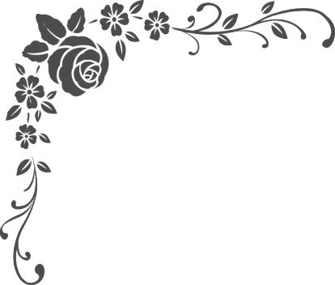
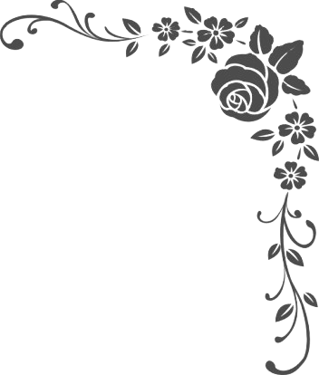
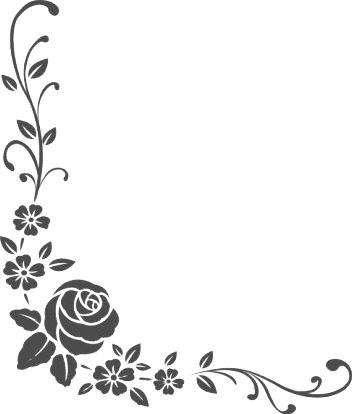
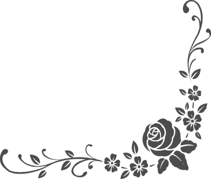

[toc]

### 1. 基本属性

背景的相关属性用于控制元素背景色、背景图片等，同时可以设置背景图片的排列方式。

<center><b>表 11-1 背景的基本属性</b></center>

| 属性                  | 描述                                       |
| --------------------- | ------------------------------------------ |
| background-color      | 设置元素的背景颜色                         |
| background-image      | 把图像设置为背景                           |
| background-repeat     | 设置对象的背景图片是否平铺                 |
| background-attachment | 背景图像是否固定或者随着页面的其余部分滚动 |
| background-position   | 设置背景图像的起始位置                     |
| background            | 简写属性，作用是将背景属性设置在一个声明中 |

#### 1.1 background-color

`background-color` 属性用于设置元素的背景色。它的默认取值为 none，即允许下面的任何内容显示出来。这种状态也可以通过关键字 transparent （透明度）来指定。

```css
p { background-color: yellow; }
body { background-color: #ccc; }
.fun { background-color: #000; }
#test { background-color: rgb(0, 0, 0); }
```

#### 1.2 background-image

`background-image` 属性可以为元素指定背景图像。如果图像包括透明区域，下面的内容将会显示出来。为防止这一点，网页设计者通常将 `background-image` 属性和 `background-color` 属性一起使用。

用作背景图像的图片类型可以为浏览器支持的任何格式，通常为 GIF、JPG 和 PNG 格式。

```css
b { background-image: url(img.gif); background-color: #fff; }
body { background-image: url(img.gif); }
.brick { background-image: url(img.gif); }
#prison { background-image: url(img.gif); }
```

#### 1.3 background-repeat

`background-repeat` 属性决定当背景图像比元素的空间小时将如何排列。该属性的默认值为 repeat，这将让图像在水平和垂直两个方向上平铺。当该属性取值为 repeat-x 时，背景图像将仅仅在水平方向上平铺；当该属性取值为 repeat-y 时，背景图像将仅仅在垂直方向上平铺；当该属性取值为 no-repeat 时，背景图像将不会平铺。

```css
p { background-image: url(img.gif); background-repeat: repeat-x; }
.titleup { background-image: url(img.gif); background-repeat: repeat-y; }
body { background-image: url(img.gif); background-repeat: no-repeat; }
```

#### 1.4 background-attachment

`background-attachment` 属性决定背景图像在元素的内容进行滚动时是应该滚动还是应该停留在屏幕的一个固定位置。这个属性的默认取值为 scroll。当取值为 fixed 时，可实现水印效果。

```css
body { background-image: url(images/logo.png); background-attachment: fixed; }
```

#### 1.5 background-position

`background-position` 属性指定背景图像在元素的画布空间中的定位方式，有三种方法指定位置：

+ 为图像的左上角指定一个绝对距离，通常以像素为单位。
+ 可以使用水平和垂直方向的百分比来指定位置。
+ 可以使用关键字来描述水平和垂直方向的位置。水平方向上的关键字为 left、center 和 right，垂直方向上的关键字为 top、center 和 bottom。在使用关键字时，未指明的方向上默认的取值为 center。

<center><b>表 11-2 背景位置关键字定位方式</b></center>

| 关键字对      | 水平位置 | 垂直位置 |
| ------------- | -------- | -------- |
| top left      | 0%       | 0%       |
| top center    | 50%      | 0%       |
| top right     | 100%     | 0%       |
| center left   | 0%       | 50%      |
| center center | 50%      | 50%      |
| center right  | 100%     | 50%      |
| bottom left   | 0%       | 100%     |
| bottom center | 50%      | 50%      |
| bottom right  | 100%     | 100%     |

具体语法如下所示：

```css
p { background-image: url(img.gif); background-position: 10px 10px; }
p { background-image: url(img.gif); background-position: 20% 20%; }
body { background-image: url(img.gif); background-position: center center; }
```

> 注意：如果仅仅设置了一个关键字，那么第二个关键字将取默认值 center。因此，在上面的例子中，关键字 center 只需用一次即可。

#### 1.6 background

`background` 属性用于全面设置背景样式，具体语法如下所示：

```css
p { background: white url(img.gif) repeat-y center; }
body { background: url(img.gif) top center fixed; }
.bricks { background: repeat-y top url(img.gif); }
```

### 2. CSS3 新增背景属性

<center><b>表 11-3 CSS3 新增背景属性</b></center>

| 属性              | 描述                                       |
| ----------------- | ------------------------------------------ |
| background-clip   | 规定背景的绘制区域                         |
| background-origin | 规定背景图片的定位区域                     |
| background-size   | 规定背景图片的尺寸                         |
| background-break  | 规定内联元素的背景图像进行平铺时的循环方式 |

#### 2.1 background-clip

在 CSS3 中，可以使用 `background-clip` 来修饰背景的显示范围，如果将 `background-clip` 的属性值设定为 border，则背景范围包括边框区域；如果设定为 padding，则不包括边框区域。

**案例：示例 11-01：两种 background-clip 属性值的对比**

```html
<!doctype html>
<html>
    <head>
        <meta charset="utf-8">
        <meta keywords="HTML5 背景与边框">
        <meta content="clip属性值的对比实例">
        <title>两种background-clip属性值的对比实例</title>
        <style type="text/css">
            div {
                width: 200px;
                height: 200px;
                margin: 0 auto;
                background-color: #000;
                border: dashed 15px green;
                /*边框为15px虚线*/
                padding: 30px;
                color: #fff;
                font-size: 30px;
                font-weight: bold;
                /*字体加粗*/
            }

            .div1 {
                -moz-background-clip: border;
                -webkit-background-clip: border;
            }

            .div2 {
                -moz-background-clip: padding;
                -webkit-background-clip: padding;
            }
        </style>
    </head>

    <body>
        <div class="div1">实例文字1</div><br>
        <div class="div2">实例文字2</div>
    </body>
</html>
```

#### 2.2 background-origin

在绘制背景图像时，默认是从内部区域（padding）的左上角开始，但也可以利用 background-origin 属性来指定绘制时从边框的左上角开始，或者从内容的左上角开始。

在 Firefox 浏览器中指定绘制起点时，需要在样式代码中将 background-origin 属性书写成 "-moz-background-origin" 的形式；在 Safari 浏览器或者 Chrome 浏览器中指定绘制起点时，需要在样式代码中将 background-origin 属性写成 "-webkit-background-origin" 的形式。

`background-origin` 属性为 border、padding 和 content，分别代表从边框的左上角、内部补白区域的左上角和内容的左上角开始绘制。

**案例：示例 11-02：background-origin 属性**

```html
<!doctype html>
<html>
    <head>
        <meta charset="utf-8">
        <meta keywords="HTML5 背景与边框">
        <meta content="background-origin属性使用示例">
        <title>background-origin属性使用示例</title>
        <style type="text/css">
            div {
                width: 200px;
                height: 100px;
                margin: 0 auto;
                background-color: #000;
                /*设置背景色*/
                background-image: url(images/img.png);
                /*设置背景图片*/
                background-repeat: no-repeat;
                /*设置背景图片重复方式*/
                border: dashed 15px green;
                /*边框为15px虚线*/
                padding: 30px;
                color: #fff;
                font-size: 2em;
                font-weight: bold;
            }

            .div1 {
                -moz-background-origin: border;
                /*设置背景图片的绘制区域*/
                -webkit-background-origin: border;
            }

            .div2 {
                -moz-background-origin: padding;
                -webkit-background-origin: padding;
            }

            .div3 {
                -moz-background-origin: content;
                -webkit-background-origin: content;
            }
        </style>
    </head>

    <body>
        <div class="div1">示例文字1</div><br>
        <div class="div2">示例文字2</div><br>
        <div class="div3">示例文字3</div>
    </body>
</html>
```


<center>img.png</center>

#### 2.3 background-size

在 CSS3 中，可以使用 `background-size` 属性来指定背景图像的尺寸。使用 `background-size` 属性指定背景图像尺寸的最简单方法如下所示：

```css
background-size: 40px 20px;
-webkit-background-size: 40px 20px;
```

如果要维持图像比例的话，可以在设定图像宽度与高度的同时，将另一个参数设定为 "auto"。

**案例：示例 11-03：background-size 属性**

```html
<!doctype html>
<html>
    <head>
        <meta charset="utf-8">
        <meta keywords="HTML5 背景与边框">
        <meta content="background-size属性使用示例">
        <title>background-size属性</title>
        <style type="text/css">
            div {
                width: 300px;
                height: 300px;
                margin: 0 auto;
                background-color: #000;
                background-image: url(images/img.png);
                padding: 30px;
                color: #fff;
                font-size: 2em;
                font-weight: bold;
                background-size: auto 40px;
                -webkit-background-size: auto 40px;
            }
        </style>
    </head>

    <body>
        <div>示例文字</div><br>
    </body>
</html>
```

### 3. 多背景

#### 3.1 CSS3 多背景语法及参数

在 CSS3 中可以给多个背景图像设置相同或者不相同的 backround-(position|repeat|clip|size|origin|attachment) 属性。其中最重要的是在 CSS3 多背景中，相邻背景之间必须使用逗号分隔开，具体语法如下所示：

```css
background: [background-image] | [background-position] | [background-size] | [background-repeat] | [background-attachment] | [background-clip] | [background-origin],*
```

可以把上面的缩写拆解成以下形式：

```css
background: url1,url2,...,urlN;
background-repeat: repeat1,repeat2,...,repeatN;
background-position: position1,position2,...,positionN;
background-size: size1,size2,...,sizeN;
background-attachment: attachment1,attachment2,...,attachmentN;
background-clip: clip1,clip2,...,clipN;
background-origin: origin1,origin2,...,originN;
background-color: color1,color2,...,colorN;
```

如果一个属性有多个 `background-image` 属性值，而其他属性只有一个值时，表示该属性所有背景图像应用了相同的属性值。

**案例：示例 11-04： 多背景属性使用**

```html
<!doctype html>
<html>
    <head>
        <meta charset="utf-8">
        <meta keywords="HTML5 背景与边框">
        <meta content="多背景属性使用示例">
        <title>多背景属性使用示例</title>
        <style type="text/css">
            .demo {
                width: 800px;
                height: 700px;
                border: 20px solid rgba(104, 104, 142, 0.5);
                border-radius: 10px;
                padding: 80px 60px;
                color: #000;
                font-family: "Microsoft YaHei UI";
                font-size: 40px;
                line-height: 1.5;
                text-align: center;
            }

            .multipleBg {
                background: url(images/FL-tl.png) no-repeat left top,
                    url(images/FL-tr.png) no-repeat right top,
                    url(images/FL-bl.png) no-repeat left bottom,
                    url(images/FL-br.png) no-repeat bottom right,
                    url(images/bg.gif) repeat left top;
                -webkit-background-origin: border-box, border-box, border-box, border-box, padding-box;
                -moz-background-origin: border-box, border-box, border-box, border-box, padding-box;
                -o-background-origin: border-box, border-box, border-box, border-box, padding-box;
                background-origin: border-box, border-box, border-box, border-box, padding-box;
                -moz-background-clip: border-box;
                -webkit-background-clip: border-box;
                background-clip: border-box;
            }
        </style>
    </head>

    <body>
        <div class="demo multipleBg">使用五张背景图片制作效果</div>
    </body>
</html>
```



<center>FL-tl.png</center>



<center>FL-tr.png</center>



<center>FL-bl.png</center>



<center>FL-br.png</center>


<center>bg.gif</center>

#### 3.2 CSS3 多背景的优势

CSS3 多背景也有层次之分，按照浏览器中显示时图像的叠放顺序从上往下指定的、最先声明的背景图片将会居于最上层，最后指定的背景图片将放在最底层。

### 4. 渐变背景

#### 4.1 线性渐变

渐变是通过背景设置的，所以必须使用 background 或 background-image 属性。具体语法如下所示：

```csss
linear-gradient(start position, from color, to color);
```

第一个值可以是像素值、百分比或使用关键字 top、bottom、left 和 right。

开始位置可以用角度替换，指定渐变效果的方向。基本语法如下所示：

```css
background: linear-gradient(30deg, #fff, #000);
```

可以声明各种颜色的结束位置。基本语法如下所示：

```css
background: linear-gradient(top, #fff 50%,#000 90%);
```

**案例：示例 11-05：线性渐变属性**

```html
<!doctype html>
<html>
    <head>
        <meta charset="utf-8">
        <meta keywords="HTML5 背景与边框">
        <meta content="线性渐变属性">
        <title>线性渐变属性</title>
        <style type="text/css">
            body {
                text-align: center;
            }

            .demo {
                width: 220px;
                height: 60px;
                margin: 50px auto;
                text-align: center;
                line-height: 60px;
                font-family: "Microsoft YaHei UI";
                color: #666;
                font-size: 20px;
                border: 2px solid #ccc;
                border-radius: 2px;
                /*圆角边框半径为2px*/
                background: #ddd;
            }

            .div1 {
                /*规定渐变的方向和颜色*/
                background: -webkit-linear-gradient(top, #fff, #33e2f2);
                background: -moz-linear-gradient(top, #fff, #33e2f2);
            }

            .div2 {
                /*规定渐变的角度和颜色*/
                background: -webkit-linear-gradient(30deg, #fff, #33e2f2);
                background: -moz-linear-gradient(30deg, #fff, #33e2f2);
            }

            .div3 {
                /*规定渐变的方向和颜色的结束位置*/
                background: -webkit-linear-gradient(top, #fff 50%, #33e2f2 90%);
                background: -moz-linear-gradient(top, #fff 50%, #33e2f2 90%);
            }
        </style>
    </head>

    <body>
        <div class="demo div1">按钮1</div>
        <div class="demo div2">按钮2</div>
        <div class="demo div3">按钮3</div>
    </body>
</html>
```

#### 4.2 放射渐变

放射渐变的使用方法与前一方法相似，具体语法如下所示：

```css
radial-gradient(start position, from color, to color);
```

**案例：示例 11-06：放射渐变属性**

```html
<!doctype html>
<html>
    <head>
        <meta charset="utf-8">
        <meta keywords="HTML5 背景与边框">
        <meta content="放射渐变属性使用示例">
        <title>放射渐变属性使用示例</title>
        <style type="text/css">
            body {
                text-align: center;
            }

            .div1 {
                width: 220px;
                height: 60px;
                margin: 50px auto;
                text-align: center;
                line-height: 60px;
                font-family: "Microsoft YaHei UI";
                color: #666;
                font-size: 20px;
                border: 2px solid #ccc;
                border-radius: 10px;
                background: -webkit-radial-gradient(center, circle, #fff 0%, #33e2f2 200%);
                -webkit-radial-gradient: (center, circle, #fff 0%, #33e2f2 200%);
            }
        </style>
    </head>

    <body>
        <div class="div1">点击按钮</div>
    </body>
</html>
```

