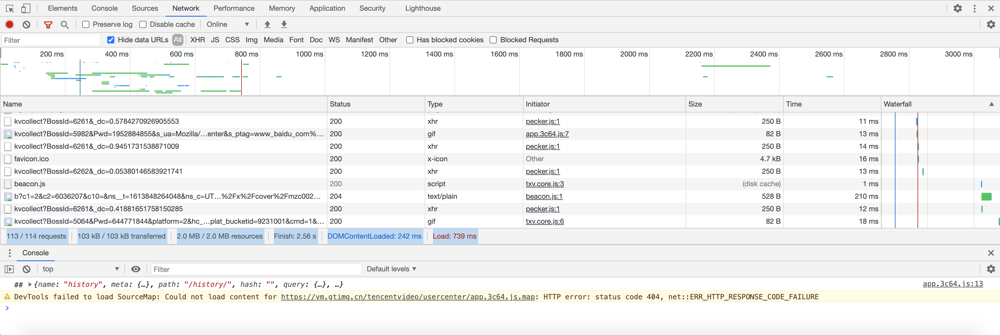
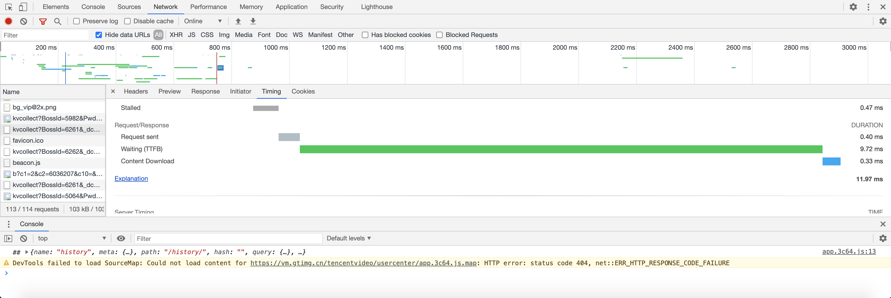

[toc]

### 1. 连接速度测试

#### 1.1 测试目的

通过网站速度测试，掌握不同网络环境访问网站的速度效果，根据网站速度测试服务提供的网页加载过程分析数据，找出导致网页无法成功加载或加载慢的最终原因，调整网站服务器网络环境、修改和完善程序代码以达到提高网站访问速度的目的。

#### 1.2 案例：使用 Chrome 的 Network 工具进行网页连接速度测试

##### 1.2.1 简介

Chrome  的 Network 工具对分析网站请求的网络情况、查看某一请求的请求头、响应头和响应内容很有用，特别是对于网站开发人员在分析 AJAX 类请求的时候，能起到很好的帮助作用。

##### 1.2.2 使用 Chrome Network 工具进行网页连接速度测试

打开 Chrome 浏览器，单击鼠标右键，选择 "审查元素"，页面会出现调试工具的窗口，单击窗口中的 Network，在浏览器地址栏中输入需要测试的网址开始测试。

浏览器会列出与网页组成有关的所有资源名称、请求该资源方法、资源类型、针对该请求服务器返回的状态码、资源从请求开始到接收最后一个字节所经历的时间。

同时浏览器会呈现出每个资源在不同阶段的连接时间，包括起始时间、响应时间、截止时间、文件总加载时间、网络延迟时间等。

Timeline 工具里面使用四种颜色来表示不同类别的事件。

① 蓝色线表示网络和 HTML 解析时间。

② 紫色线表示 DomContentLoaded 事件，即该时间点页面中的 DOM 建立完成，发生了 DomContentLoaded 事件。

③ 红色线表示 load 事件，即该时间点页面加载完了所有的资源，发生了 Load 事件。将鼠标放到单个文件的时间轴上，会弹出时间加载单个阶段的详细信息。

④ 绿色线表示网页渲染和绘制时间。

加载中单个阶段的过程及含义，具体如下所示。

① Stalled：请求处于阻塞状态，若之前有很多请求没处理完，但是浏览器对同域并发请求有限制，则会导致后面的请求处于阻塞状态。

② Proxy negotiation：与代理服务器的连接通信阶段。

③ DNS Lookup：DNS 查找阶段；

④ Initial Connection / connecting：建立连接的过程，包含 TCP 握手/重试。

⑤ SSL：完成 SSL 握手阶段；

⑥ Request sent：发送请求；

⑦ Waiting（TTFB）：发出请求后等待服务器响应的时间，响应时间为第一个字节发送过来的时间；

⑧ Content Download：接收响应数据的时间。

#### 1.3 案例：使用 Pingdom Tools 分析网站访问性能

Pingdom 是免费在线网站速度检测工具，其能够帮助用户找出影响网站速度的原因，并给出改善网页性能的可行性方案。Pingdom 的官方网站为：<http://tools.pingdom.com>。

### 2. 压力测试

#### 2.1 基本原理

一个有效的压力测试需要遵循一些核心的基本原则，这些原则可以时刻提醒测试人员压力测试是否还有更多的极端可能。

① 重复：最明显且最容易理解的压力原则就是测试的重复。

② 并发：并发是同时执行多个操作的行为。

③ 量级：压力测试另一个重要原则就是要给每个操作增加超常规的负载量。

④ 随机：任何压力测试都应该多多少少具有随机性。

#### 2.2 案例：使用 HP LoadRunner 进行网站压力测试

本案例以 HP LoadRunner 为例进行讲解和说明，HP LoadRunner 11 可通过官方网站（<http://www8.hp.com）下载获得试用版本。