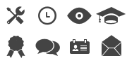

[toc]

### 1. HTML5 语法

+ 可以省略标记元素

    在 HTML5 中，元素的标记可以省略。

    第一，不允许写结束标记元素的有：area、base、br、col、command、embed、hr、img、input、keygen、link、meta、param、source、track 和 wbr。

    第二，可以省略结束标记的元素有：li、dt、dd、p、rt、rp、optgroup、option、colgroup、thead、tbody、tfoor、tr、td 和 th。

    第三，可以省略全部标记的元素有：html、head、body、colgroup 和 tbody。

+ 具有布尔值的属性

    对于具有 boolean 值的属性，如 disabled 与 readonly 等，当只写属性而不知道属性值时，表示属性值为 true；如果想要将属性值设为 false，可以不使用该属性。另外，要想将属性值设定为 true，也可以将属性名设为属性值，或将空字符串设定为属性值。例如：

    ```html
    <!-- 只写属性，不写属性值，代表属性为 true -->
    <input type="checkbox" checked>
    <!-- 不写属性，代表属性为 false -->
    <input type="checkbox">
    <!-- 属性值=属性名，代表属性为 true -->
    <input type="checkbox" checked="checked">
    <!-- 属性值=空字符串，代表属性为 true -->
    <input type="checkbox" checked="">
    ```

+ 省略引号

    属性值两边既可以用双引号，也可以用单引号。HTML5 在此基础上做了一些改进，当属性值不包括空字符串、<、>、=、单引号、双引号等字符时，属性值两边的引号可以省略。

    ```html
    <input type="text">
    <input type='text'>
    <input type=text>
    ```

### 2. HTML5 元素

<center><b>表4-1 HTML5 的内容类型</b></center>

| 内容类型 | 描述                                                         |
| -------- | ------------------------------------------------------------ |
| 内嵌     | 在文档中添加其他类型的内容，如 audio、video、canvas 和 iframe 等 |
| 流       | 在文档和应用的 body 中使用的元素，如 form、h1 和 small 等    |
| 标题     | 段落标题，如 h1、h2 和 group 等                              |
| 交互     | 与用户交互的内容，如音频和视频的控件、button 和 textarea 等  |
| 元数据   | 通常出现在页面的 head 中，设置页面其他部分的表现和行为，如 script、style 和 title 等 |
| 短语     | 文本和文本标记元素，如 mark、kbd、sub 和 sup 等              |

#### 2.1 基础元素

<center><b>表 4-2 HTML5 的基础元素</b></center>

| 元素名称         | 描述           |
| ---------------- | -------------- |
| <!DOCTYPE>       | 定义文档类型   |
| \<html\>         | 定义 HTML 文档 |
| \<title\>        | 定义文档的标题 |
| \<body\>         | 定义文档的主体 |
| \<h1\> to \<h6\> | 定义 HTML 标题 |
| \<p\>            | 定义段落       |
| \<br\>           | 定义简单的换行 |
| \<hr\>           | 定义水平线     |
| <!-- -->         | 定义注释       |

#### 2.2 格式元素

<center><b>表4-3 HTML5 的格式元素</b></center>

| 元素名称       | 描述                                           |
| -------------- | ---------------------------------------------- |
| \<acronym\>    | 定义只取首字母的缩写                           |
| \<abbr\>       | 定义缩写                                       |
| \<address\>    | 定义文档作者或拥有者的联系信息                 |
| \<b\>          | 定义粗体文本                                   |
| \<bdi\>        | 定义文本的文本方向，使其脱离周围文本的方向设置 |
| \<bdo\>        | 定义文字的方向                                 |
| \<big\>        | 定义大号文本                                   |
| \<blockquote\> | 定义长的引用                                   |
| \<center\>     | 不赞成使用。定义居中文本                       |
| \<cite\>       | 定义引用（citation）                           |
| \<code\>       | 定义计算机代码文本                             |
| \<del\>        | 定义被删除文本                                 |
| \<dfn\>        | 定义项目                                       |
| \<em\>         | 定义强调文本                                   |
| \<font\>       | 定义文本的字体、尺寸和颜色                     |
| \<i\>          | 定义斜体字                                     |
| \<ins\>        | 定义被插入文本                                 |
| \<kbd\>        | 定义键盘文本                                   |
| \<mark\>       | 定义有标记的文本                               |
| \<meter\>      | 定义预定义范围内的度量                         |
| \<pre\>        | 定义预格式文本                                 |
| \<progress\>   | 定义任何类型的任务的进度                       |
| \<q\>          | 定义短的引用                                   |
| \<rp\>         | 定义若浏览器不支持 ruby 元素显示的内容         |
| \<rt\>         | 定义 ruby 注释的解释                           |
| \<ruby\>       | 定义 ruby 注释                                 |
| \<s\>          | 不赞成使用。定义加删除线的文本                 |
| \<samp\>       | 定义计算机代码样本                             |
| \<small\>      | 定义小号文本                                   |
| \<strike\>     | 不赞成使用。定义加删除线的文本                 |
| \<strong\>     | 定义强调文本                                   |
| \<sup\>        | 定义上标文本                                   |
| \<sub\>        | 定义下标文本                                   |
| \<time\>       | 定义日期/时间                                  |
| \<tt\>         | 定义打字机文本                                 |
| \<u\>          | 不赞成使用。定义下划线文本                     |
| \<var\>        | 定义文本的变量部分                             |
| \<wbr\>        | 定义换行                                       |

#### 2.3 表单元素

<center><b>表 4-4 HTML5 的表单元素</b></center>

| 元素名称     | 描述                                   |
| ------------ | -------------------------------------- |
| \<form\>     | 定义供用户输入的 HTML 表单             |
| \<input\>    | 定义输入控件                           |
| \<textarea\> | 定义多行的文本输入控件                 |
| \<button\>   | 定义按钮                               |
| \<select\>   | 定义选择列表（下拉列表）               |
| \<optgroup\> | 定义选择列表中相关选项的组合           |
| \<option\>   | 定义选择列表中的选项                   |
| \<label\>    | 定义 input 元素的标注                  |
| \<fieldset\> | 定义围绕表单中元素的边框               |
| \<legend\>   | 定义 fieldset 元素的标题               |
| \<isindex\>  | 不赞成使用。定义与文档相关的可搜索索引 |
| \<datalist\> | 定义下拉列表                           |
| \<keygen\>   | 定义生成秘钥                           |
| \<output\>   | 定义输出的一些类型                     |

#### 2.4 框架元素

| 元素名称     | 描述                               |
| ------------ | ---------------------------------- |
| \<frame\>    | 定义框架集的窗口或框架             |
| \<frameset\> | 定义框架集                         |
| \<noframes\> | 定义针对不支持框架的用户的替代内容 |
| \<iframe\>   | 定义内联框架                       |

#### 2.5 图像元素

| 元素名称       | 描述                   |
| -------------- | ---------------------- |
| \        | 定义图像               |
| \<map\>        | 定义图像映射           |
| \<area\>       | 定义图像地图内部的区域 |
| \<canvas\>     | 定义图形               |
| \<figcaption\> | 定义 figure 元素的标题 |
| \<figure\>     | 定义媒体内容的分组     |

#### 2. 6 音频/视频元素

<center><b>表 4-7 HTML5 的音频/视频元素</b></center>

| 元素名称   | 描述                           |
| ---------- | ------------------------------ |
| \<audio\>  | 定义声音内容                   |
| \<source\> | 定义媒体源                     |
| \<track\>  | 定义用在媒体播放器中的文本轨道 |
| <video\>   | 定义视频                       |

#### 2.7 链接元素

<center><b>表 4-8 HTML5 的链接元素</b></center>

| 元素名称 | 描述                     |
| -------- | ------------------------ |
| \<a\>    | 定义锚                   |
| \<link\> | 定义文档与外部资源的关系 |
| \<nav\>  | 定义导航链接             |

#### 2.8 列表元素

<center><b>表 4-9 HTML5 的列表元素</b></center>

| 元素名称     | 描述                                      |
| ------------ | ----------------------------------------- |
| \<ul\>       | 定义无序列表                              |
| \<ol\>       | 定义有序列表                              |
| \<li\>       | 定义列表的项目                            |
| \<dir\>      | 不赞成使用。定义目录列表                  |
| \<dl\>       | 定义定义列表                              |
| \<dt\>       | 定义定义列表中的项目                      |
| \<dd\>       | 定义定义列表中项目的描述                  |
| \<menu\>     | 定义命令的菜单/列表                       |
| \<menuitem\> | 定义用户可以从弹出菜单调用的命令/菜单项目 |
| \<command\>  | 定义命令按钮                              |

#### 2.9 表格元素

<center><b>表 4-10 HTML5 的表格元素</b></center>

| 元素名称     | 描述                           |
| ------------ | ------------------------------ |
| \<table\>    | 定义表格                       |
| \<caption\>  | 定义表格标题                   |
| \<th\>       | 定义表格中的表头单元格         |
| \<tr\>       | 定义表格中的行                 |
| <td\>        | 定义表格中的单元格             |
| \<thead\>    | 定义表格中的表头内容           |
| \<tbody\>    | 定义表格中的主体内容           |
| \<tfoot\>    | 定义表格中的表注内容（脚注）   |
| \<col\>      | 定义表格中一个或多个列的属性值 |
| \<colgroup\> | 定义表格中供格式化的列组       |

#### 2.10 样式/节元素

<center><b>表 4-11 HTML5 的样式/节元素</b></center>

| 元素名称    | 描述                              |
| ----------- | --------------------------------- |
| \<style\>   | 定义文档的样式信息                |
| \<div\>     | 定义文档中的节                    |
| \<span\>    | 定义文档中的节                    |
| \<header\>  | 定义 section 或 page 的页眉       |
| \<footer\>  | 定义 section 或 page 的页脚       |
| \<section\> | 定义 section                      |
| \<article\> | 定义文章                          |
| <aside\>    | 定义页面内容之外的内容            |
| \<details\> | 定义元素的细节                    |
| \<dialog\>  | 定义对话框或窗口                  |
| \<summary\> | 为 \<details\> 元素定义可见的标题 |

#### 2.11 元信息元素

<center><b>表 4-12 HTML5 的元信息元素</b></center>

| 元素名称     | 描述                                             |
| ------------ | ------------------------------------------------ |
| \<head\>     | 定义关于文档的信息                               |
| \<meta\>     | 定义关于 HTML 文档的元信息                       |
| \<base\>     | 定义页面中所有链接的默认地址或默认目标           |
| \<basefont\> | 不赞成使用。定义页面中文本的默认字体、颜色或尺寸 |

#### 2.12 编程元素

<center><b>表 4-13 HTML5 的编程元素</b></center>

| 元素名称     | 描述                                     |
| ------------ | ---------------------------------------- |
| \<script\>   | 定义客户端脚本                           |
| \<noscript\> | 定义针对不支持客户端脚本的用户的替代内容 |
| \<applet\>   | 不赞成使用。定义嵌入的 applet            |
| \<embed\>    | 为外部应用程序（非 HTML）定义容器        |
| \<object\>   | 定义嵌入的对象                           |
| \<param\>    | 定义对象的参数                           |

### 3. HTML5 属性

#### 3.1 基本属性

<center><b>表 4-14基本属性</b></center>

| 属性名称 | 描述                 |
| -------- | -------------------- |
| class    | 定义类规则或样式规则 |
| id       | 定义元素的唯一 标识  |
| style    | 定义元素的样式声明   |

<center><b>表 4-15 不拥有基本属性的元素</b></center>

| 元素名称      | 描述               |
| ------------- | ------------------ |
| html、head    | 文档和头部基本结构 |
| title         | 网页标题           |
| base          | 网页基准信息       |
| meta          | 网页元信息         |
| partam        | 元素参数信息       |
| script、style | 网页的脚本和样式   |

#### 3.2 语言属性

<center><b>表 4-16 语言属性</b></center>

| 属性名称 | 描述                                                        |
| -------- | ----------------------------------------------------------- |
| lang     | 定义元素的语言代码或编码                                    |
| dir      | 定义文本的方向，包括 ltr 和 rtl，分别标识从左向右和从右向左 |

<center><b>表 4-17 不拥有语言属性的元素</b></center>

| 元素名称                | 描述         |
| ----------------------- | ------------ |
| frameset、frame、iframe | 网页框架结构 |
| br                      | 换行标识     |
| hr                      | 结构装饰线   |
| base                    | 网页基准信息 |
| param                   | 元素参数信息 |
| scrip                   | 网页的脚本   |

#### 3.3 键盘属性

| 属性名称  | 描述                       |
| --------- | -------------------------- |
| accesskey | 定义访问某元素的键盘快捷键 |
| tabindex  | 定义元素的 Tab 键索引编号  |

`accesskey` 属性可以使用快捷键（Alt + 字母）访问指定的 URL，但是浏览器不能很好地支持，在 IE 中仅激活超链接，需要配合 Enter 键确定。(没用)

```html
<a href="http://www.baidu.com" accessKey="a">按住 Alt 键，再按 A 键可以链接到百度首页</a>
```

`tabindex` 属性用来定义元素的 Tab 键访问顺序，可以使用 Tab 键遍历网页中的所有链接和表单元素。

```html
<a href="#" tabindex="1">Tab 1</a>
<a href="#" tabindex="2">Tab 2</a>
<a href="#" tabindex="3">Tab 3</a>
```

#### 3.4 内容属性

<center><b>表 4-19 内容属性</b></center>

| 属性名称 | 描述                           |
| -------- | ------------------------------ |
| alt      | 定义元素的替换文本             |
| title    | 定义元素的提示文本             |
| longdesc | 定义元素包含内容的大段描述信息 |
| cite     | 定义元素包含内容的引用信息     |
| datetime | 定义元素包含内容的日期和时间   |

```html
<a href="URL" title="提示文本">超链接</a>

```

当图像无法显示时，必须准备替换的文本来替换无法显示的图像，这对于图像和图像热点是必需的，因此 alt 属性只能用在 img、area 和 input 元素时中。对于，input 元素，alt 属性用来替换提交按钮的图片。

title 属性为元素在鼠标指向时出现的提示性信息。

<center><b>表 4-20 不能用 title 属性的元素</b></center>

| 元素名称      | 描述               |
| ------------- | ------------------ |
| html、head    | 文档和头部基本结构 |
| title         | 网页标题           |
| base          | 网页基准信息       |
| meta          | 网页元信息         |
| partam        | 元素参数信息       |
| script、style | 网页的脚本和样式   |

### 4. HTML5 全局属性

<center><b>表 4-21 HTML5 全局属性</b></center>

| 属性名称    | 描述                                                 |
| ----------- | ---------------------------------------------------- |
| contextmenu | 规定元素的上下文菜单。上下文菜单在用户点击元素时显示 |
| data-*      | 用于存储页面或应用程序的私有定制数据                 |
| dir         | 规定元素中内容的文本方向                             |
| draggable   | 规定元素是否可拖动                                   |
| dropzone    | 规定在拖动被拖动数据时是否进行复制、移动或链接       |
| hidden      | 规定元素仍未相关或不在相关                           |
| id          | 规定元素的唯一 id                                    |
| lang        | 规定元素内容的语言                                   |
| spellcheck  | 规定是否对元素进行拼写和语法检查                     |
| style       | 规定元素的行内 CSS 样式                              |
| tabindex    | 规定元素的 tab 键次序                                |
| title       | 规定有关元素的额外信息                               |
| translate   | 规定是否应该翻译元素内容                             |

### 案例：个人简历网页的实现

```html
<!DOCTYPE HTML>
<html>
    <head>
        <meta charset="utf-8" />
        <meta keywords="HTML5 Web" />
        <meta content="个人简历网页的实现" />
        <title>个人简历网页的实现</title>
        <style type="text/css">
            /*基本样式*/
            * {
                margin: 0;
                padding: 0;
            }

            body {
                font-family: "Microsoft YaHei UI";
                line-height: 24px;
                background-color: #f3f3f3;
                color: #444;
                height: 100%;
                width: auto;
            }

            #wrapper {
                max-width: 700px;
                margin: 40px auto 30px;
                padding: 60px;
                background: #fff;
                box-shadow: 0 1px 3px rgba(0, 0, 0, .1);
                position: relative;
            }

            ul {
                margin: 0 0 0 15px;
                position: relative;
            }

            li {
                margin: 0 0 5px 0;
                font-size: 13px;
            }

            p {
                text-align: justify;
                font-size: 13px;
            }

            .clear {
                clear: both;
            }

            a {
                color: #444;
                text-decoration: none;
            }

            a:hover {
                text-decoration: underline;
            }

            h1,
            h2,
            h3,
            h4,
            h5,
            h6 {
                font-weight: normal;
            }

            h3 {
                font-weight: bold;
                font-size: 14px
            }

            h2.section-head {
                clear: both;
                font-weight: bold;
                margin: 60px -60px;
                border-left: 52px solid #444;
                color: #444;
                padding: 1px 0 0 8px;
                position: relative;
            }

            h2.section-head:before {
                content: "";
                position: absolute;
                width: 45px;
                height: 45px;
                left: -105px;
                top: -15px;
                background-image: url(images/icons.png);
            }

            /*图标*/
            h2#titleName {
                margin: 20px -60px 10px;
            }

            h2#ribbon:before {
                background-position: left -45px;
            }

            h2#tools:before {
                background-position: left top;
            }

            h2#learn:before {
                background-position: right top;
            }

            h2#clock:before {
                background-position: -45px top;
            }

            h2#titleName:before {
                background-position: -90px bottom;
            }

            /*个人简介*/
            #bio {
                position: relative;
            }

            #bio #avatar {
                float: left;
                margin: 0 20px 0 0;
            }

            #bio h2 {
                font-size: 15px;
            }

            #bio p {
                clear: left;
                margin: 40px auto;
                padding: 40px 45px;
                max-width: 560px;
                background: #fbfbfb;
                border: 1px solid #f3f3f3;
                border-radius: 8px;
                position: relative;
                border-width: 0 1px 1px;
                border-color: #fff #f3f3f3 #e8e8e8;
                line-height: 1.6em;
            }

            #honorsAwards li {
                padding-left: 5px;
                margin-bottom: 8px;
            }

            ul#skills,
            ul#jobs,
            ul#schools,
            ul#recommends,
            ul#seenOn {
                margin: 0;
                list-style: none;
            }

            ul#skills,
            ul#jobs li,
            ul#schools li,
            ul#recommends li {
                margin: 0 0 20px 0;
                clear: both;
            }

            ul#skills .details,
            ul#skills .details,
            ul#jobs li .details,
            ul#schools li .details,
            ul#recommends li .details {
                float: left;
                width: 40%;
                margin-bottom: 25px;
            }

            ul#jobs li p,
            ul#skills li>p,
            ul#schools li>p,
            ul#recommends li>p {
                float: right;
                width: 57%;
                margin-bottom: 25px;
            }

            .details h5 {
                font-style: italic;
            }
        </style>
    </head>

    <body>

        <div id="wrapper">
            <!--个人简介-->
            <h2 id="titleName" class="section-head">张天</h2>
            <div id="bio">
                <h2>Web前端开发工程师、网页设计师</h2>
                <p>我叫张天，男，今年28岁，毕业于河南大学计算机科学与技术学院，主修计算机科学与技术，精通HTML 5、CSS 3、jQuery、JavaScript,熟练使用各种Web开发和设计工具，了解基本的PHP。</p>
            </div>
            <div class="clear"></div>
            <!--个人技能-->
            <h2 id="tools" class="section-head">个人技能</h2>
            <ul id="skills">
                <li>
                    <div class="details">
                        <h3>HTML 5 + CSS 3</h3>
                    </div>
                    <p>精通并熟练使用</p>
                </li>
                <li>
                    <div class="details">
                        <h3>JavaScript</h3>
                    </div>
                    <p>精通并熟练使用</p>
                </li>
                <li>
                    <div class="details">
                        <h3>jQuery</h3>
                    </div>
                    <p>精通并熟练使用</p>
                </li>
            </ul>
            <div class="clear"></div>
            <!--工作经验-->
            <h2 id="clock" class="section-head">工作经验</h2>
            <ul id="jobs">
                <li>
                    <div class="details">
                        <h3>XX科技有限公司</h3>
                        <h4>Web前端开发工程师</h4>
                        <h5>2013.09 - 2015.06</h5>
                    </div>
                    <p>利用(X)HTML/CSS/JavaScript/Flash等各种Web技术进行客户端产品的开发。完成客户端程序（也就是浏览器端）的开发，开发JavaScript以及Flash模块，同时结合后台开发技术模拟整体效果，进行丰富互联网的Web开发，致力于通过技术改善用户体验。
                    </p>
                </li>
                <li>
                    <div class="details">
                        <h3>XX信息公司</h3>
                        <h4>Web前端开发工程师、Web前端设计师</h4>
                        <h5>2011.07 - 2013.08</h5>
                    </div>
                    <p>开发JavaScript以及Flash模块，同时结合后台开发技术模拟整体效果，进行丰富互联网的Web开发，致力于通过技术改善用户体验。</p>
                </li>
            </ul>
            <div class="clear"></div>
            <!--教育背景-->
            <h2 id="learn" class="section-head">教育背景</h2>
            <ul id="schools">
                <li>
                    <div class="details">
                        <h3>河南中医药大学</h3>
                        <h4>计算机科学与技术专业</h4>
                        <h5>2007.06 - 2011.06</h5>
                    </div>
                    <p>主要学习高等数学、线性代数、概率论与数理统计、离散数学、组合数学、计算机原理、人工智能、程序设计基础、面向对象程序设计、数字逻辑电路、模拟电子技术、数据结构、算法设计、WEB程序设计、计算机组成与结构、操作系统、数据库系统原理、编译原理、计算机网络、网络工程、软件工程、数据库应用、信息安全、微型计算机技术、汇编语言、单片机技术、嵌入式系统、嵌入式操作系统、嵌入式设计与应用、移动设备应用软件开发等。
                    </p>
                </li>
            </ul>
            <div class="clear"></div>
            <!--获得荣誉-->
            <h2 id="ribbon" class="section-head">获得荣誉</h2>
            <ul id="honorsAwards">
                <li>CET-6英语六级，优秀的听说写能力</li>
                <li>河南省教育教学信息化大奖赛一等奖</li>
                <li>电子商务设计师</li>
                <li>平面设计师</li>
            </ul>
        </div>
    </body>
</html>
```



<center><b>icons.png</b></center>

