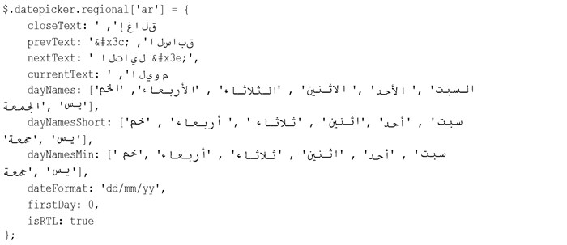

### 11.10.4　本地化

jQuery UI datepicker支持41个地区的本地化，以 `ui.datepicker-xx.js` 文件的形式提供，其中的`xx`是地区代码。每个文件都为 `$.datepicker.regional` 添加一个属性。 `ui.date picker-ar.js` 添加如下属性：



要引用如下属性，可以将日期选择器初始化为阿拉伯地区：

```css
$("#datepicker").datepicker($.datepicker.regional.ar);
```

使用 `$.extend` 也可以混合其他选项：

```css
$("#datepicker").datepicker($.extend({}, $.datepicker.regional.ar, {
　　 changeMonth: true,
　　 changeYear: true
});
```

通过 `{}` 创建一个空对象字面量，然后使用 `$.extend` 将地区选项及 `changeMonth` 和 `changeYear` 值复制到空对象中，然后用该对象初始化日期选择器。


