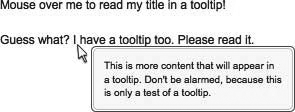

### 13.1.2　解决方案

为了解决上述问题，可以使用jQuery获得页面上感兴趣的区域中的光标位置，然后动态地在离原点一定距离的位置上放置一个 `<div>` 元素，该元素包含操作说明、附加信息（在电子商务中）或者任何开发人员需要显示的信息。这可以在 `</body>` 结束标记之前创建一个动态生成的 `<div>` ，允许它拥有比页面其他元素更高的z-index来实现，如图13-1所示。此外，为了使工具提示获得优先，可以明确地指定极高的z-index—— `9999` 。


<center class="my_markdown"><b class="my_markdown">图13-1　用jQuery生成的工具提示</b></center>

#### 1．工具提示——HTML代码

```css
<!DOCTYPE html PUBLIC "-//W3C//DTD XHTML 1.0 Transitional//EN"
"http://www.w3.org/TR/xhtml1/DTD/xhtml1-transitional.dtd">
<html xmlns="http://www.w3.org/1999/xhtml" xml:lang="en" lang="en">
<head>
<meta http-equiv="content-type" content="text/html; charset=utf-8" />
<meta http-equiv="imagetoolbar" content="false" />
<title>jQuery Cookbook - Ch.13 - Creating Custom Tooltips</title>
<link rel="stylesheet" type="text/css" href="../_common/basic.css" />
<link rel="stylesheet" type="text/css" href="tooltip.css" />
<script type="text/javascript" src="../_common/jquery.js"></script>
<script type="text/javascript" src="tooltip.js"></script>
</head>
<body>
<div id="container">
　 <p>
　　　<span class="tooltip" title="This is my title. There are many like it, but
　　　　　 this one is mine. You will see it as you hover your mouse over me.">
　　　　 Mouse over me to read my title in a tooltip!
　　　</span>
　 </p>
　 <p>
　　　<span class="tooltip" title="This is more content that will appear in a
　　　　　 tooltip. Don't be alarmed, because this is only a test of a tooltip.">
　　　　 Guess what? I have a tooltip too. Please read it.
　　　</span>
　 </p>
</div>
</body>
</html>

```

#### 2．工具提示——jQuery代码

```css
// 初始化
function init_tooltip() {
　 // 元素存在吗？
　 if (!$('.tooltip').length) {
　　　//如果不存在则退出
　　　return;
　 }
　 //插入工具提示(隐藏)
　 $('body').append('<div id="tooltip_outer"><div id="tooltip_inner"></div></div>');
　 // 空变量
　 var $tt_title, $tt_alt;
　 var $tt = $('#tooltip_outer');
　 var $tt_i = $('#tooltip_inner');
　 //监听悬停
　 $('.tooltip').hover(function() {
　　　// 存储title,清空它
　　　if ($(this).attr('title')) {
　　　　 $tt_title = $(this).attr('title');
　　　　 $(this).attr('title', '');
　　　}
　　　// 存储alt,清空它
　　　if ($(this).attr('alt')) {
　　　　 $tt_alt = $(this).attr('alt');
　　　　 $(this).attr('alt', '');
　　　}
　　　// 插入文本
　　　$tt_i.html($tt_title);
　　　// Show tool tip.显示工具提示
　　　$tt.show();
　 },
　 function() {
　　　// 隐藏工具提示
　　　$tt.hide();
　　　// 清空文本
　　　$tt_i.html('');
　　　// 修复title
　　　if ($tt_title) {
　　　　 $(this).attr('title', $tt_title);
　　　}
　　　// 修复alt
　　　if ($tt_alt) {
　　　　 $(this).attr('alt', $tt_alt);
　　　}
　 // 监听移动
　 }).mousemove(function(ev) {
　　　// 事件坐标
　　　var $ev_x = ev.pageX;
　　　var $ev_y = ev.pageY;
　　　//工具提示坐标
　　　var $tt_x = $tt.outerWidth();
　　　var $tt_y = $tt.outerHeight();
　　　// 元素坐标
　　　var $bd_x = $('body').outerWidth();
　　　var $bd_y = $('body').outerHeight();
　 //移动工具提示
　　　$tt.css({
　　　　 'top': $ev_y + $tt_y > $bd_y ? $ev_y−$tt_y : $ev_y,
　　　　 'left': $ev_x + $tt_x + 20 > $bd_x ? $ev_x−$tt_x−10 : $ev_x + 15
　　　});
　 });
}
// 启动所有操作
$(document).ready(function() {
　 init_tooltip();
});

```

