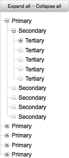

### 13.2.2　解决方案

通过在嵌套的无序列表上使用jQuery的后代元素选择器，可以根据需要隐藏/显示树结构的多余部分。这可以通过为顶级的无序列表添加 `class="tree"` 并组合使用CSS和JavaScript显示子级别来实现，这样会形成类似图13-2中所示的一棵树。此外，使用事件委托支持许多层次，避免为多个元素附加事件监听器的开销。作为替代，事件在最高级别的 `<ul class="tree">` 元素上通过jQuery的 `.live()` 方法捕捉。


<center class="my_markdown"><b class="my_markdown">图13-2　通过文件树表现多层数据</b></center>

#### 1．文件树——HTML代码

```css
<!DOCTYPE html PUBLIC "-//W3C//DTD XHTML 1.0 Transitional//EN"
"http://www.w3.org/TR/xhtml1/DTD/xhtml1-transitional.dtd">
<html xmlns="http://www.w3.org/1999/xhtml" xml:lang="en-us" lang="en-us">
<head>
<meta http-equiv="content-type" content="text/html; charset=utf-8" />
<meta http-equiv="imagetoolbar" content="false" />
<title>jQuery Cookbook - Ch.13 - Navigating a File Tree Expander</title>
<link rel="stylesheet" type="text/css" href="../_common/basic.css" />
<link rel="stylesheet" type="text/css" href="tree.css" />
<script type="text/javascript">
/* <![CDATA[ */
document.write('<link rel="stylesheet" type="text/css" href="preload.css" />');
/* ]]> */
</script>
<script type="text/javascript" src="../_common/jquery.js"></script>
<script type="text/javascript" src="tree.js"></script>
</head>
<body>
<div id="container">
　 <p class="tree_controls">
　　　<a href="#" class="expand_all">Expand all</a> ～
　　　<a href="#" class="collapse_all">Collapse all</a>
　 </p>
　 <ul class="tree">
　　　<li>
　　　　 <a href="#" class="tree_trigger"> </a> Primary
　　　　 <ul class="tree_expanded">
　　　　　　<li>
　　　　　　　 <a href="#" class="tree_trigger"> </a> Secondary
　　　　　　　 <ul class="tree_expanded">
　　　　　　　　　<li>
　　　　　　　　　　 <a href="#" class="tree_trigger"> </a> Tertiary
　　　　　　　　　　 <ul>
　　　　　　　　　　　　<li>
　　　　　　　　　　　　　 <span class="tree_slug"> </span> Quaternary
　　　　　　　　　　　　</li>
　　　　　　　　　　　　<li>
　　　　　　　　　　　　　 <span class="tree_slug"> </span> Quaternary
　　　　　　　　　　　　</li>
　　　　　　　　　　　　<li>
　　　　　　　　　　　　　 <span class="tree_slug"> </span> Quaternary
　　　　　　　　　　　　</li>
　　　　　　　　　　　　<li>
　　　　　　　　　　　　　 <span class="tree_slug"> </span> Quaternary
　　　　　　　　　　　　</li>
　　　　　　　　　　　　<li>
　　　　　　　　　　　　　 <span class="tree_slug"> </span> Quaternary
　　　　　　　　　　　　</li>
　　　　　　　　　　 </ul>
　　　　　　　　　　 ...
　　　　　　　　　</li>
　　　　　　　　　...
　　　　　　　 </ul>
　　　　　　　 ...
　　　　　　</li>
　　　　　　...
　　　　 </ul>
　　　　 ...
　　　</li>
　　　...
　 </ul>
</div>
...
</body>
</html>

```

#### 2．文件树——jQuery代码

```css
//初始化
function init_tree() {
　 //元素存在吗？
　 if (!$('ul.tree').length) {
　　　// 如果不存在则退出
　　　return;
　 }
　 //展开和折叠
　 $('p.tree_controls a.expand_all, p.tree_controls a.collapse_all').click(function() {
　　　// 查看类
　　　if ($(this).hasClass('expand_all')) {
　　　　　 $(this).parent('p').next('ul').find('a.tree_trigger')
　　　　　　　　　　.addClass('trigger_expanded')
　　　　　　　　　　.end().find('ul').addClass('tree_expanded');
　　　　　 return false;
　　　} else {
　　　　　 $(this).parent('p').next('ul').find('a.tree_trigger')
　　　　　　　　　　.removeClass('trigger_expanded')
　　　　　　　　　　.end().find('ul').removeClass('tree_expanded');
　　　}
　　　// Nofollow.
　　　this.blur();
　　　return false;
});
// 监听文件树的单击
$('ul.tree a.tree_trigger').live('click', function() {
　 // 下一个<ul>是隐藏的吗？
　 if ($(this).next('ul').is(':hidden')) {
　　　$(this).addClass('trigger_expanded').next('ul')
　　　　　　　 .addClass('tree_expanded');
　 } else {
　　　$(this).removeClass('trigger_expanded').next('ul')
　　　　　　　 .removeClass('tree_expanded');
　 }
　 // Nofollow.
　 this.blur();
　 return false;
　 });
　 // 为最后一个<li>添加类
　 $('ul.tree li:last-child').addClass('last');
　 // 修改触发器状态
　 $('ul.tree_expanded').prev('a').addClass('trigger_expanded');
}
// 启动
$(document).ready(function() {
　 init_tree();
});

```

