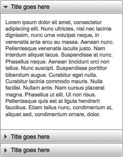
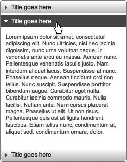

### 13.3.2　解决方案

使用jQuery杰出的DOM遍历功能，也就是邻近兄弟元素选择器，就可以编写一个处理多个折叠元素的通用脚本。此外，这个脚本还能在必要时处理添加到折叠控件的更多元素。图13-3展示了尚未展开的折叠控件，而图13-4展示了展开后折叠控件的内容。


<center class="my_markdown"><b class="my_markdown">图13-3　等待用户展开的折叠控件</b></center>


<center class="my_markdown"><b class="my_markdown">图13-4　展开的折叠控件</b></center>

#### 1．折叠——HTML代码

```css
<!DOCTYPE html PUBLIC "-//W3C//DTD XHTML 1.0 Transitional//EN"
"http://www.w3.org/TR/xhtml1/DTD/xhtml1-transitional.dtd">
<html xmlns="http://www.w3.org/1999/xhtml" xml:lang="en-us" lang="en-us">
<head>
<meta http-equiv="content-type" content="text/html; charset=utf-8" />
<meta http-equiv="imagetoolbar" content="false" />
<title>jQuery Cookbook - Ch.13 - Expanding an Accordion</title>
<link rel="stylesheet" type="text/css" href="../_common/basic.css" />
<link rel="stylesheet" type="text/css" href="accordion.css" />
<script type="text/javascript">
/* <![CDATA[ */
document.write('<link rel="stylesheet" type="text/css" href="preload.css" />');
/* ]]> */
</script>
<script type="text/javascript" src="../_common/jquery.js"></script>
<script type="text/javascript" src="accordion.js"></script>
</head>
<body>
<div id="container">
　 <dl class="accordion">
　　　<dt>
　　　　 <a href="#"><span></span> Title goes here</a>
　　　</dt>
　　　<dd>
　　　　 <p>
　　　　　　Lorem ipsum...
　　　　 </p>
　　　</dd>
　　　<dt>
　　　　 <a href="#"><span></span> Title goes here</a>
　　　</dt>
　　　<dd>
　　　　 <p>
　　　　　　Lorem ipsum...
　　　　 </p>
　　　</dd>
　　　<dt>
　　　　 <a href="#"><span></span> Title goes here</a>
　　　</dt>
　　　<dd>
　　　　 <p>
　　　　　　Lorem ipsum...
　　　　 </p>
　　　</dd>
　 </dl>
　 ...
</div>
</body>
</html>

```

#### 2．折叠——jQuery代码

```css
// 初始化
function init_accordion() {
　 //元素存在吗？
　 if (!$('dl.accordion').length) {
　　　// 如果不存在则退出
　　　return;
　 }
　 //收集所有折叠项
　 $('dl.accordion').each(function() {
　　　//显示第一个折叠项
　　　$(this).find('dt:first a').addClass('accordion_expanded')
　　　　　　　 .end().find('dd:first').show();
　　　// 通过CSS添加圆角
　　　$(this).find('dt:last').addClass('last');
　 });
　 // 单击事件监听器
　 $('dl.accordion dt a').click(function() {
　　　// 获得双亲节点<dl>
　　　var $dl = $(this).parents('dl:first');
　　　// 获得下一个<dd>
　　　var $dd = $(this).parent('dt').next('dd');
　　　//为最后一个<dt>添加类
　　　function findLast() {
　　　if ($dl.find('dd:last').is(':hidden')) {
　　　　 $dl.find('dt:last').addClass('last');
　　　}
　 }
　 // 元素是否可见？
　 if ($dd.is(':hidden')) {
　 // 展开<dd>,隐藏其他元素
　 $dd.slideDown('fast').siblings('dd:visible').slideUp('fast', findLast);
　　　// 修改箭头状态,从<dt>删除"last"类
　　　$(this).addClass('accordion_expanded').parent('dt')
　　　　　　　 .removeClass('last').siblings('dt').find('a')
　　　　　　　 .removeClass('accordion_expanded');
　 }
　 // Nofollow.
　 this.blur();
　 return false;
 });
}
//启动
$(document).ready(function() {
　 init_accordion();
});

```

