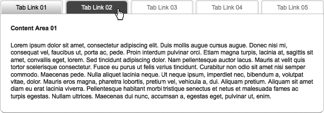

### 13.4.1　问题

你的一个页面上可能有许多数据，这些数据由于网站架构的原因必须放在一起，而不能分别显示在不同的页面上。在这种情况下，选项卡式的界面通常比带有标题和段落的冗长文档更好。这时，选项卡的工作方式就和桌面应用程序上的一样，它不会离开你所在的页面，而是将与各个选项卡关联的信息带到幕前，如图13-5所示。Yahoo!主页就是这种功能的一个例子。

<b class="my_markdown">图13-5　使用选项卡帮助用户浏览信息</b>

