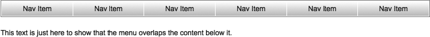
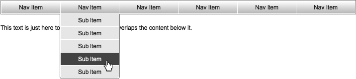

### 13.6.2　解决方案

在桌面程序和操作系统中，这些菜单通常通过单击一个项激活，之后你可以看到多个子项和分类。但是按照Web规范，下拉式菜单是在用户把鼠标悬停于顶级链接之上时出现的，如图13-7和图13-8所示。组合使用CSS  `:hover` 规则和定位技术，大部分繁重的工作根本不需要太多的JavaScript就可以完成。jQuery只需要提供对IE6的小改进。


<center class="my_markdown"><b class="my_markdown">图13-7　准备就绪的下拉菜单</b></center>


<center class="my_markdown"><b class="my_markdown">图13-8　使用中的下拉菜单</b></center>

开发人员应该注意：要考虑无法灵活使用鼠标的用户的可访问性。就像古语：“如果你只拥有锤子，那么什么东西看上去都像钉子。”在将下拉菜单作为简单现成的解决方案之前，必须确认对项目的信息架构已经深思熟虑。要确信下拉模式是最佳选择。例如，Microsoft Word长期以来都因荒谬的下拉菜单级数和可切换选项（其中大部分都是普通用户从未接触过的）而闻名，在Office 2007中这一界面进行了重新设计，改成了绰号为“Ribbon”的标签式UI。突然间，曾经模糊的选项由于更好的执行界面而变得可以正常使用了。

#### 1．下拉菜单——HTML代码

```css
<!DOCTYPE html PUBLIC "-//W3C//DTD XHTML 1.0 Transitional//EN"
"http://www.w3.org/TR/xhtml1/DTD/xhtml1-transitional.dtd">
<html xmlns="http://www.w3.org/1999/xhtml" xml:lang="en-us" lang="en-us">
<head>
<meta http-equiv="content-type" content="text/html; charset=utf-8" />
<meta http-equiv="imagetoolbar" content="false" />
<title>jQuery Cookbook - Ch.13 - Building Drop-Down Menus</title>
<link rel="stylesheet" type="text/css" href="../_common/basic.css" />
<link rel="stylesheet" type="text/css" href="dropdown.css" />
<!--[if IE 6]>
<script type="text/javascript" src="../_common/jquery.js"></script>
<script type="text/javascript" src="dropdown.js"></script>
<![endif]-->
</head>
<body>
<div id="container">
　 <ul class="dropdown">
　　　<li class="dropdown_trigger">
　　　　 <a href="#">Nav Item</a>
　　　　 <ul>
　　　　　　<li>
　　　　　　　 <a href="#">Subitem</a>
　　　　　　</li>
　　　　　　<li>
　　　　　　　 <a href="#">Subitem</a>
　　　　　　</li>
　　　　　　<li>
　　　　　　　 <a href="#">Subitem</a>
　　　　　　</li>
　　　　　　<li>
　　　　　　　 <a href="#">Subitem</a>
　　　　　　</li>
　　　　　　<li>
　　　　　　　 <a href="#">Subitem</a>
　　　　　　</li>
　　　　 </ul>
　　　</li>
　　　...
　 </ul>
　 <p>
　　　This text is just here to show that the menu overlaps the content below it.
　 </p>
　 ...
</div>
</body>
</html>

```

#### 2．下拉菜单——jQuery代码

```css
// 初始化
function init_dropdown() {
　 // 元素存在吗？
　 if (!$('ul.dropdown').length) {
　　　// 如果不存在,退出
　　　return;
　 }
　 // 为悬停添加监听器
　 $('ul.dropdown li.dropdown_trigger').hover(function() {
　　　//显示后续的<ul>
　　　$(this).find('ul').fadeIn(1);
　 },
　 function() {
　　　//隐藏后续的<ul>
　　　$(this).find('ul').hide();
　 });
}
//启动
$(document).ready(function() {
　 init_dropdown();
});

```

