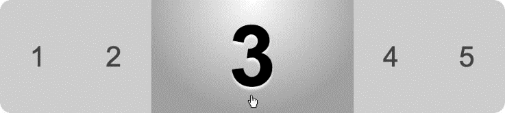

### 13.8.1　问题

有时候，你可能需要水平显示多种选择，并且为此做一些修饰，但是由于选择太多而超过了布局的宽度。或者，你可能只是寻求一种方式，说明这里有某些有趣的用户交互。不管是哪一种用途，滑动面板方法（有时称作水平折叠）都是表现这类信息的一种可能方法。图13-9展示了一个关闭的面板，而图3-10显示滑出后的可视面板。

<b class="my_markdown">图13-9　关闭的水平面板</b>

<b class="my_markdown">图13-10　打开的水平面板</b>

