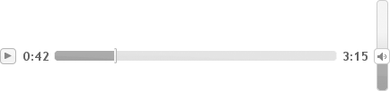
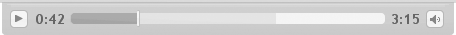
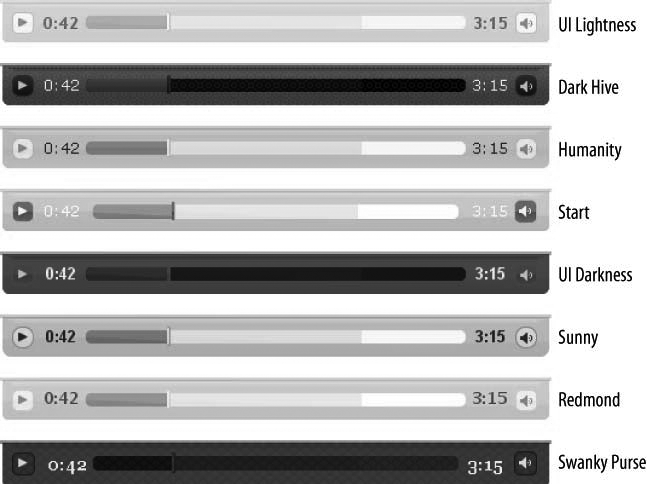

### 14.10.2　解决方案

用jQuery UI来构建一个音乐播放器。将用jQuery UI CSS Framework的图标创建播放和暂停按钮，并用jQuery UI Slider插件创建轨道条。进度计使用jQuery UI Progressbar插件。最后，音量控制开关也是一个jQuery UI Slider。在一个常见的容器中包装这些元素，提供某个漂亮的窗口组件主题，不仅每个控件都可以设置主题，而且整个音乐播放器可以设置主题。

注意

> 我们不打算将这个音乐播放器构建为一个可重用的插件。我们只准备将jQuery UI窗口组件连接在一起，使用户感觉像是一个组件在工作。但是这个音乐播放其本身不是jQuery插件或者jQuery UI插件。在这个秘诀中，它只是一组HTML、JavaScript和CSS。那样，我们可以专注于底层jQuery UI插件的使用，而不用担心从现有插件中构建新插件的额外复杂性。

#### 1．HTML5音频

为了保持简洁，这里打算使用HTML5媒体元素API（<a class="my_markdown" href="['http://dev.w3.org/html5/spec/Overview.html#htmlmediaelement']">http://dev.w3.org/html5/spec/Overview.html#htmlmediaelement</a>）的最小子集。这个API存在于许多最新的浏览器（如Firefox 3.5）中。把它当作兼容性图层来使用，这样就可以轻松地替换Flash Player等其他回放机制。在这个秘诀中，需要从音频API中得到如下接口：

+ 开始或者恢复播放（ `play` ）
+ 暂停播放（ `pause` ）
+ 获得歌曲长度（ `duration` ）
+ 获取当前播放点（ `timeupdate` ）
+ 转到歌曲中的某一点（ `currentTime` ）
+ 获取歌曲播放音量（ `volumeChange` ）
+ 设置特定音量（ `volume` ）

假定文档中存在一个HTML5音频元素（<a class="my_markdown" href="['http://dev.w3.org/html5/spec/Overview.html#audio']">http://dev.w3.org/html5/spec/Overview.html#audio</a>），下面是兼容性图层的代码：

```css
var $audio = $('audio'), audioEl = $audio[0];
var audio = {
　　　　　currentTime: 0,
　　　　　duration: secondsTotal,
　　　　　volume: 0.5,
　　　　　set: function(key, value) {
　　　　　　　　　　this[key] = value;
　　　　　　　　　　try { audioEl[key] = value; } catch(e) {}
　　　　　　　　　　if (key == 'currentTime') {
　　　　　　　　　　　　　　　$audio.trigger('timeupdate');
　　　　　　　　　　}
　　　　　　　　　　if (key == 'volume') {
　　　　　　　　　　　　　　　$audio.trigger('volumechange');
　　　　　　　　　　}
　　　　　},
　　　　　play: function() {
　　　　　　　　　　audioEl.play && audioEl.play();
　　　　　},
　　　　　pause: function() {
　　　　　　　　　　audioEl.pause && audioEl.pause();
　　　　　}
};
$audio.bind('timeupdate', function() {
　　　　　audio.currentTime = audioEl.currentTime;
});
audio.set('currentTime', 0);
audio.set('volume', 0.5);

```

#### 2．音乐播放器

为音乐播放器使用CSS类 `mplayer` 。这也将是主 `<div>` 的类，并作为所有CSS规则和jQuery选择器的前缀。下面是“裸”播放器的CSS和HTML：

```css
.mplayer { position: relative; width: 40%; height: 2.5em; margin: 50px 0 100px 0; }
<div class="mplayer ui-widget"></div>

```

将宽度设置为40%，以便能够从一开始就获得一个灵活的播放器。调整浏览器大小并观察播放器大小的变化。当播放器非空时更容易看到效果。

除了 `mplayer` 类之外，主 `<div>` 还有一个 `ui-widget` 类，用于确定其中的元素设置了合适的样式。有关利用jQuery UI CSS Framework类设置主题的更多内容参见下一章。

一个空的 `<div>` ，没有任何JavaScript，这就形成了一个不可见也没有任何动静的音乐播放器。下面添加一个播放按钮，启动音乐。

#### 3．播放和暂停按钮

jQuery UI中还没有按钮插件。可以用一个 `a` 元素和一些语义命名的jQuery UI CSS Framework图标类来建立一个：

下面是CSS：

```css
.mplayer .buttons-container { position: absolute; top: 10px; left: 10px; }
.mplayer .buttons-container .playpause { height: 1.2em; width: 1.2em; display: block;
　　　　　position: relative; top: −2px; left: −2px; }
.mplayer .buttons-container .playpause .ui-icon { margin: −1px 0 0−1px; }
.mplayer .playpause .ui-icon-play, .paused .playpause .ui-icon-pause { display: none; }
.paused .playpause .ui-icon-play { display: block; }

```

下面是HTML：

```css
<div class="mplayer ui-widget">
　　　　　<div class="buttons-container">
　　　　　　　　　　<a class="playpause ui-state-default ui-corner-all" href="#">
　　　　　　　　　　　　　　　<span class="ui-icon ui-icon-play"></span>
　　　　　　　　　　　　　　　<span class="ui-icon ui-icon-pause"></span>
　　　　　　　　　　</a>
　　　　　</div>
</div>

```

通过几条CSS规则，就能拥有一个暂停/播放两用按钮。根据前面的CSS，一次只能看到一个图标，显示的是播放还是暂停取决于 `div.mplayer` 是否有 `paused` 类。但是不同设计人员可以用相同的HTML，让两个图标都可见，但是根据歌曲是否播放使用不同的颜色和不透明度。

下面是JavaScript：

```css
$('.mplayer .playpause').click(function() {
　　　　　var player = $(this).parents('.mplayer');
　　　　　if (player.is('.paused')) {
　　　　　　　　　　$('.mplayer').removeClass('paused');
　　　　　　　　　　audio.play();
　　　　　} else {
　　　　　　　　　　$('.mplayer').addClass('paused');
　　　　　　　　　　audio.pause();
　　　　　}
　　　　　return false;
})
.hover(function() { $(this).addClass('ui-state-hover'); },
　　　　　function() { $(this).removeClass('ui-state-hover'); })
.focus(function() { $(this).addClass('ui-state-focus'); })
.blur(function() { $(this).removeClass('ui-state-focus'); });
$('.mplayer').addClass('paused');

```

按钮需要用JavaScript进行如下操作：

+ 在单击按钮时，根据 `div.mplayer` 上有没有 `paused` 类，调用 `audio.play()` 或 `audio.pause()` 函数。
+ 切换 `.mplayer` 上的 `paused` 类。
+ 对鼠标和键盘的 `foucus` 、 `hover` 和 `blur` 事件做出反应。这是按钮插件方便的地方（有一个按钮插件正在开发中），但是对于这种简单的图标按钮，不需要太多的代码。

不要忘记 `return false;` 语句，因为按钮是一个href属性为 `#` 的 `<a>` 元素。

加载了jQuery、jQuery UI和UI Lightness主题之后，图14-1展示了只带播放/暂停按钮的音乐播放器外观。


<center class="my_markdown"><b class="my_markdown">图14-1　播放和暂停按钮</b></center>

如果单击播放按钮，它应该变成暂停按钮。如果再次单击，按钮应该变回播放按钮。还要注意，鼠标悬停时的效果和用键盘的Tab键将焦点移进/移出按钮时的视觉提示。如果你在一个支持 `audio` 元素的浏览器中且元素的 `src` 属性指向一个支持的音乐文件，在单击播放按钮时应该听到音乐。

#### 4．当前和总时间标签

下一步是添加两个标签，一个显示在歌曲中的当前位置，另一个显示歌曲的总时间。这些标签相当简单。

下面是CSS：

```css
.mplayer .currenttime { position: absolute; top: 0.6em; left: 2.2em;
　　　　　width: 3em; text-align: center; background: none; border: none; }
.mplayer .duration { position: absolute; top: 0.6em; right: 2.2em;
　　　　　width: 3em; text-align: center; background: none; border: none; }

```

下面是HTML：

```css
<div class="mplayer ui-widget">
　　　　　<div class="buttons-container">
　　　　　　　　　　<a class="playpause ui-state-default ui-corner-all" href="#">
　　　　　　　　　　　　　　　<span class="ui-icon ui-icon-play"></span>
　　　　　　　　　　　　　　　<span class="ui-icon ui-icon-pause"></span>
　　　　　　　　　　</a>
　　　　　</div>
　　　　　<span class="currenttime ui-state-default"></span>
　　　　　<span class="duration ui-state-default"></span>
</div>

```

下面是JavaScript：

```css
function minAndSec(sec) {
　　　　　sec = parseInt(sec);
　　　　　return Math.floor(sec / 60) + ":" + (sec % 60 < 10 ? '0' : '') +
Math.floor(sec % 60);
}
$('.mplayer .currenttime').text(minAndSec(audio.currentTime));
$('.mplayer .duration').text(minAndSec(secondsTotal));
$audio
　　　　　.bind('timeupdate', function(event) {
　　　　　　　　　　$('.mplayer .currenttime').text(minAndSec(audio.currentTime));
　　　　　});

```

我们将当前时间放在左侧，总时间放在右侧，中间为轨道条留出空间（见图14-2）。因为我们希望当前时间始终反映出在歌曲中的位置，所以绑定音频的 `timeupdate` 通知事件。这个事件本身不会告诉我们 `currentTime` 。因此，转向 `audio.currentTime` 属性。需要一个小的函数将其格式化为分：秒，因为音频图层中的时间以秒表示：


<center class="my_markdown"><b class="my_markdown">图14-2　当前和总时间标签</b></center>

#### 5．表示歌曲位置的滑块轨道

我们已经有了一些进展，下一步是轨道栏。它由一个简单的 `<div>` 组成，但是我们打算通过调用 `.slider()` 为它添加轨道和手柄。我们将使用Slider插件的 `range:'min'` 选项，以便使0∶00和当前时间之间的区域加上阴影。对了，还要将 `max` 选项设置为歌曲的长度（以秒表示）。如果歌曲长度为3.5分钟，将 `max` 设置为210。不需要任何计算，因为 `audio.duration` 已经告诉我们歌曲的总秒数。Slider的其他默认值对我们来说可以正常使用： `max:0` 、 `step:1` 。

CSS如下：

```css
.mplayer .track { top: 11px; margin: 0 5.2em; margin-top: −2px;
　　　　　border-style: none; }
.mplayer .track .ui-slider-handle { border-left-width: 0; height: 1.1em;
　　　　　top: −0.24em; width: 2px; margin-left: −3px; }

```

HTML如下：

```css
<div class="mplayer ui-widget">
　　　　　<div class="buttons-container">
　　　　　　　　　　<a class="playpause ui-state-default ui-corner-all" href="#">
　　　　　　　　　　　　　　　<span class="ui-icon ui-icon-play"></span>
　　　　　　　　　　　　　　　<span class="ui-icon ui-icon-pause"></span>
　　　　　　　　　　</a>
　　　　　</div>
　　　　　<span class="currenttime ui-state-default"></span>
　　　　　<div class="track"></div>
　　　　　<span class="duration ui-state-default"></span>
</div>

```

JavaScript如下：

```css
$('.mplayer .track')
　　　　　.slider({
　　　　　　　　　　range: 'min',
　　　　　　　　　　max: audio.duration,
　　　　　　　　　　slide: function(event, ui) {
　　　　　　　　　　　　　　　$('.ui-slider-handle', this).css('margin-left',
　　　　　　　　　　　　　　　　　　　　 (ui.value < 3) ? (1 - ui.value) + 'px' : '');
　　　　　　　　　　　　　　　if (ui.value >= 0 && ui.value <= audio.duration) {
　　　　　　　　　　　　　　　　　　　　audio.set('currentTime', ui.value);
　　　　　　　　　　　　　　　}
　　　　　　　　　　},
　　　　　　　　　　change: function(event, ui) {
　　　　　　　　　　　　　　　$('.ui-slider-handle', this).css('margin-left',
　　　　　　　　　　　　　　　　　　　　 (ui.value < 3) ? (1 - ui.value) + 'px' : '');
　　　　　　　　　　}
　　　　　})
　　　　　.find('.ui-slider-handle').css('margin-left', '0').end()
　　　　　.find('.ui-slider-range').addClass('ui-corner-left').end();
$audio
　　　　　.bind('timeupdate', function(event) {
　　　　　　　　　　$('.mplayer .track').each(function() {
　　　　　　　　　　　　　　　if ($(this).slider('value') != audio.currentTime) {
　　　　　　　　　　　　　　　　　　　　$(this).slider('value', audio.currentTime);
　　　　　　　　　　　　　　　}
　　　　　　　　　　});
　　　　　　　　　　$('.mplayer .currenttime').text(minAndSec(audio.currentTime));
　　　　　});

```

滑块手柄居中对齐，意味着在 `min` 值，手柄的左半部超出滑块的左侧，而在 `max` 值，手柄的右半部超出滑块的右侧。我们已经采用了比常规更细的手柄，并且去掉了左边框，使其更好地靠近边缘，但是在接近 `min` 的地方仍然需要稍作调整。这就是如下代码行的用途：

```css
slide: function(event, ui) {
　　　　$('.ui-slider-handle', this).css('margin-left',
　　　　　　　　　 (ui.value < 3) ? (1 - ui.value) + 'px' : '');
　　　　if (ui.value >= 0 && ui.value <= audio.duration) {
　　　　　　　　　audio.set('currentTime', ui.value);
　　　　}
},
change: function(event, ui) {
　　　　　$('.ui-slider-handle', this).css('margin-left',
　　　　　　　　　　 (ui.value < 3) ? (1 - ui.value) + 'px' : '');
}

```

而且，在 `slide` 回调函数中，在让音频转到某一点之前检查该值是否有效。当用户拖动滑块时就是这种情况，我们必须移动歌曲中的播放点。这一做法考虑到了“刷洗”的情况。如果仅在 `change` 回调中处理这种情况，在用户单击或者拖动滑块手柄到新的播放点时，音频在用户放开鼠标之前不会变化。图14-3展示了创建的滑块。


<center class="my_markdown"><b class="my_markdown">图14-3　表示歌曲位置的滑块轨道</b></center>

#### 6．轨道中显示缓冲的进度栏

接下来我们准备做些有趣的事情。如果我告诉你，我们可以在同一个元素上调用两个不同的jQuery UI插件，那会怎么样呢？在这个例子中它能工作得很好。我们已经有一个轨道栏，它是作为 `<div>` 创建的，在它上面调用 `.slider()` 。除了为 `.track` 元素添加一个 `ui-slider` 类，jQuery UI的Slider插件创建两个元素——滑块手柄（ `.ui-slider-handle` ）和滑块范围（ `.ui-slider-range` ，因为指定了 `range:min` ），并附加到轨道上。幸运的是，这就是需要对 `<div>` 所做的全部修改了。 `<div>` 仍然是一个 `<div>` 。所以，赋予它两个功能，并调用 `.progressbar()` 。这将在显示当前时间的区域后面显示缓冲的情况。让我们来看看效果。

CSS如下：

```css
.mplayer .ui-progressbar .ui-progressbar-value { border-style: none; }

```

JavaScript如下：

```css
var secondsCached = 0, cacheInterval;
$('.mplayer .track')
　　　　　.progressbar({
　　　　　　　　　　value: secondsCached / secondsTotal * 100
　　　　　})
　　　　　.find('.ui-progressbar-value').css('opacity', 0.2).end();
cacheInterval = setInterval(function() {
　　　　　secondsCached += 2;
　　　　　if (secondsCached > secondsTotal) clearInterval(cacheInterval);
　　　　　$('.mplayer .track.ui-progressbar')
　　　　　　　　　　.progressbar('value', secondsCached / secondsTotal * 100);
}, 30);

```

这里没有HTML，因为重用了前一部分中的 `.track` 元素。你也许还没有注意到，缓冲的代码完全是虚构的，但是，它能够正常工作；它并不能真正表现歌曲的缓冲，只是模拟而已。但是它工作得很棒！如果你确实有一个音乐资源可以加载并缓冲，而且你的音频API支持缓冲通知，你就可以绑定到有关的事件，并且设置前面看到的进度栏的数值（0～100之间）。和Slider不同，你不能为进度条指定自定义的 `max` 值。但是那确实有意义，对吗？进度介于0%～100%。

好了，我们已经有了一些概念验证代码。当页面加载时，缓冲进度将很快向前延伸，就像文件飞速加载一样，但是又不完全像本地文件的加载。这样的视觉效果很有趣。图14-4展示了创建的进度栏。缓冲进度指示器是另一个需要虚构的东西吗？因为它不是真正的缓冲进度，你可以忽略它。会发生什么情况？这取决于你的音频API和后端。所以，如果你没有或者不想要缓冲进度，可以省略，或者为了美观而留着它。


<center class="my_markdown"><b class="my_markdown">图14-4　轨道中的进度栏用于显示缓冲</b></center>

#### 7．音量滑块

需要添加一个音量控件。滑块对此很合适，从 `volume: 0` 拖动到 `volume:1` ，将 `step` 设置为 `0.01` ：

```css
$('.mplayer .volume').slider({
　　　　　max: 1,
　　　　　step: 0.01,
　　　　　value: audio.volume,
　　　　　slide: fnSlide,
　　　　　change: fnChange
});

```

就这样，简单得让人不敢相信。可是，为什么不能这么简单呢？上述代码无疑能够正常工作，但是它会占据一些空间，方向也是个问题。如果将它设计为水平方向（Slider插件的默认值），就会和表示播放进度的滑轨争夺水平空间。更不用说我们还想削减播放器的空间了。那么，应该为滑块添加 `orientation:'vertical'` 选项吗？这也能够正常工作，但是这意味着播放器现在为了容纳音量控制需要有100个像素高。其余控件只需要30个像素的高度。一定还有更好的办法。

确实有更好的解决方案。在不用的时候隐藏音量滑块的滑动条。我们保持滑块手柄可见，并为它添加一个小喇叭图标。然后将控件高度设置为0，隐藏其余部分。当用户把光标悬停于手柄之上时，将高度设置为100个像素。在光标移出时，将移除滑动条，高度又回到0。而且，由于它的容器是在相对包装器中绝对定位的，因此在它完全可见时不会影响到播放器的整体高度。

还有一个问题，当滑动条显示时，假定音量为0.1（10%），这意味着手柄靠近底部。手柄应该跳下来，还是向上？当用户滑动手柄时又该怎么样呢？如果用户从10%拖动到90%然后放开鼠标会怎么样呢？当滑动条再次隐藏时，它又会跳回去，真麻烦！

所以，这就是我们需要努力的地方。我们将在拖动中保持手柄固定。用户向上拉增加音量，向下则降低音量。滑动条包含 `range:"min"` 选项，手柄下面的阴影部分将相应地上下移动。

CSS如下：

```css
.mplayer .volume-container { position: absolute; top: 12px; right: 12px; }
.mplayer .volume { height: 0; margin-top: 5px; }

```

HTML如下：

```css
<div class="mplayer ui-widget">
　　　　　<div class="buttons-container">
　　　　　　　　　　<a class="playpause ui-state-default ui-corner-all" href="#">
　　　　　　　　　　　　　　　<span class="ui-icon ui-icon-play"></span>
　　　　　　　　　　　　　　　<span class="ui-icon ui-icon-pause"></span>
　　　　　　　　　　</a>
　　　　　</div>
　　　　　<span class="currenttime ui-state-default"></span>
　　　　　<div class="track"></div>
　　　　　<span class="duration ui-state-default"></span>
　　　　　<div class="volume-container">
　　　　　　　　　　<div class="volume">
　　　　　　　　　　　　　　　<a href="#" class="ui-state-default ui-corner-all
ui-slider-handle">
　　　　　　　　　　　　　　　　　　　　<span class="ui-icon ui-icon-volume-on"></span>
　　　　　　　　　　　　　　　</a>
　　　　　　　　　　</div>
　　　　　</div>
</div>

```

JavaScript如下：

```css
$('.mplayer .volume')
　　　　　.slider({
　　　　　　　　　　max: 1,
　　　　　　　　　　orientation: 'vertical',
　　　　　　　　　　range: 'min',
　　　　　　　　　　step: 0.01,
　　　　　　　　　　value: audio.volume,
　　　　　　　　　　start: function(event, ui) {
　　　　　　　　　　　　　　　$(this).addClass('ui-slider-sliding');
　　　　　　　　　　　　　　　$(this).parents('.ui-slider').css({
　　　　　　　　　　　　　　　　　　　　'margin-top': (((1 - audio.volume) * −100) + 5) + 'px',
　　　　　　　　　　　　　　　　　　　　'height': '100px'
　　　　　　　　　　　　　　　}).find('.ui-slider-range').show();
　　　　　　　　　　},
　　　　　　　　　　slide: function(event, ui) {
　　　　　　　　　　　　　　　if (ui.value >= 0 && ui.value <= 1) {
　　　　　　　　　　　　　　　　　　　　audio.set('volume', ui.value);
　　　　　　　　　　　　　　　}
　　　　　　　　　　　　　　　$(this).css({
　　　　　　　　　　　　　　　　　　　　'margin-top': (((1 - audio.volume) * −100) + 5) + 'px',
　　　　　　　　　　　　　　　　　　　　'height': '100px'
　　　　　　　　　　　　　　　}).find('.ui-slider-range').show();
　　　　　　　　　　},
　　　　　　　　　　stop: function(event, ui) {
　　　　　　　　　　　　　　　$(this).removeClass('ui-slider-sliding');
　　　　　　　　　　　　　　　var overHandle = $(event.originalEvent.target)
　　　　　　　　　　　　　　　　　　　　.closest('.ui-slider-handle').length > 0;
　　　　　　　　　　　　　　　if (!overHandle) {
　　　　　　　　　　　　　　　　　　　　$(this).css({
　　　　　　　　　　　　　　　　　　　　　　　　　'margin-top': '',
　　　　　　　　　　　　　　　　　　　　　　　　　'height': ''
　　　　　　　　　　　　　　　　　　　　}).find('.ui-slider-range').hide();
　　　　　　　　　　　　　　　}
　　　　　　　　　　},
　　　　　　　　　　change: function(event, ui) {
　　　　　　　　　　　　　　　if (ui.value >= 0 && ui.value <= 1) {
　　　　　　　　　　　　　　　　　　　　if (ui.value != audio.volume) {
　　　　　　　　　　　　　　　　　　　　　　　　　audio.set('volume', ui.value);
　　　　　　　　　　　　　　　　　　　　}
　　　　　　　　　　　　　　　}
　　　　　　　　　　}
　　　　　})
　　　　　.mouseenter(function(event) {
　　　　　　　　　　if ($('.ui-slider-handle.ui-state-active').length) {
　　　　　　　　　　　　　　　 return;
　　　　　　　　　　}
　　　　　　　　　　$(this).css({
　　　　　　　　　　　　　　　'margin-top': (((1 - audio.volume) * −100) + 5) + 'px',
　　　　　　　　　　　　　　　'height': '100px'
　　　　　　　　　　}).find('.ui-slider-range').show();
　　　　　})
　　　　　.mouseleave(function() {
　　　　　　　　　　$(this).not('.ui-slider-sliding').css({
　　　　　　　　　　　　　　　'margin-top': '',
　　　　　　　　　　　　　　　'height': ''
　　　　　　　　　　}).find('.ui-slider-range').hide();
　　　　　})
　　　　　.find('.ui-slider-range').addClass('ui-corner-bottom').hide().end();

```

在拖动滑动条时，调整以负值表示的 `margin-top` 选项值反比于当前值，保持手柄静止。这一切发生在如下的代码中：

```css
$(this).parents('.ui-slider').css({
　　　　　'margin-top': (((1 - audio.volume) * −100) + 5) + 'px',
　　　　　'height': '100px'
})

```

图14-5展示了播放器中的音量滑块。


<center class="my_markdown"><b class="my_markdown">图14-5　音量滑块</b></center>

这种交互需要识别你不是在与鼠标相反的方向上拖动移动的滑动条。但是与此同时，鼠标、阴影部分的大小和音量的变动应该在逻辑上达成一致：向下表示降低音量，向上表示增大音量。而且，如果你愿意，可以让光标悬停以显示滑动条，将光标移到所要设置的音量位置，然后单击。

#### 8．窗口组件背景和顶部样式

现在要为几个元素添加jQuery UI CSS Framework类，以和内部控件相匹配的方式设置播放器的样式：

CSS如下：

```css
.mplayer .bg { position: absolute; width: 100%; height: 100%; top: 0;
　　　　　bottom: 0; left: 0; right: 0; border: none; }
.mplayer .rod { position: absolute; top: −2px; left: −0.4%; right: −0.4%;
　　　　　width: 100.8%; height: 3px; overflow: hidden; border: none; }
.mplayer .hl { position: absolute; top: 2px; left: 1%; right: 1%; width: 98%;
　　　　　height: 1px; overflow: hidden; border: none; }
.mplayer .hl2 { position: absolute; top: 2px; left: 2%; right: 2%; width: 96%;
　　　　　height: 3px; overflow: hidden; border: none; }

```

JavaScript如下：

```css
$('.mplayer').each(function() {
　　　　　$('.bg:first', this).css('opacity', 0.7);
　　　　　$('.bg:last', this).css('opacity', 0.3);
})
$('.mplayer .rod').css('opacity', 0.4);
$('.mplayer .hl').css('opacity', 0.25);
$('.mplayer .hl2').css('opacity', 0.15);

```

HTML如下:

```css
<div class="mplayer ui-widget">
　　　　　<div class="bg ui-widget-header ui-corner-bottom"></div>
　　　　　<div class="bg ui-widget-content ui-corner-bottom"></div>
　　　　　<div class="rod ui-widget-header"></div>
　　　　　<div class="hl ui-widget-content"></div>
　　　　　<div class="hl2 ui-widget-content"></div>
　　　　　<div class="buttons-container">
　　　　　　　　　　<a class="playpause ui-state-default ui-corner-all" href="#">
　　　　　　　　　　　　　　　<span class="ui-icon ui-icon-play"></span>
　　　　　　　　　　　　　　　<span class="ui-icon ui-icon-pause"></span>
　　　　　　　　　　</a>
　　　　　</div>
　　　　　<span class="currenttime ui-state-default"></span>
　　　　　<div class="track"></div>
　　　　　<span class="duration ui-state-default"></span>
　　　　　<div class="volume-container">
　　　　　　　　　　<div class="volume">
　　　　　　　　　　　　　　　<a href="#" class="ui-state-default ui-corner-all
ui-slider-handle">
　　　　　　　　　　　　　　　　　　　　<span class="ui-icon ui-icon-volume-on"></span>
　　　　　　　　　　　　　　　</a>
　　　　　　　　　　</div>
　　　　　</div>
</div>

```

在这里，使用不透明度和分层从任何jQuery UI主题中得到更多的阴影。图14-6展示完成的作品：


<center class="my_markdown"><b class="my_markdown">图14-6　窗口组件背景和顶部样式</b></center>

最后，图14-7展示了jQuery UI音乐播放器在几个预建的jQuery UI主题中的样例。


<center class="my_markdown"><b class="my_markdown">图14-7　在几个不同的ThemeRoller主题中的jQuery UI音乐播放器</b></center>


