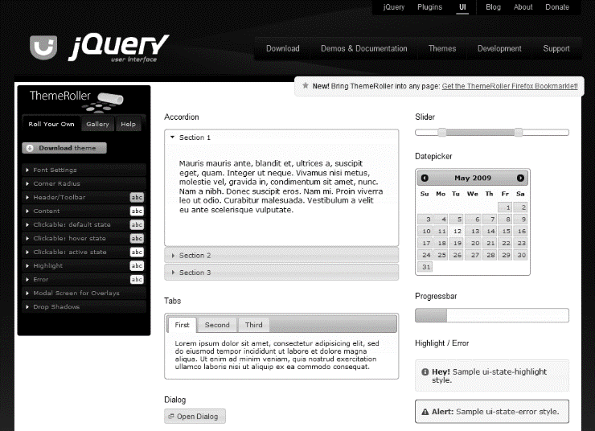
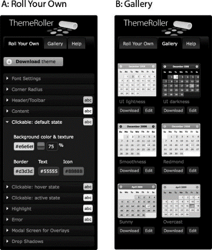
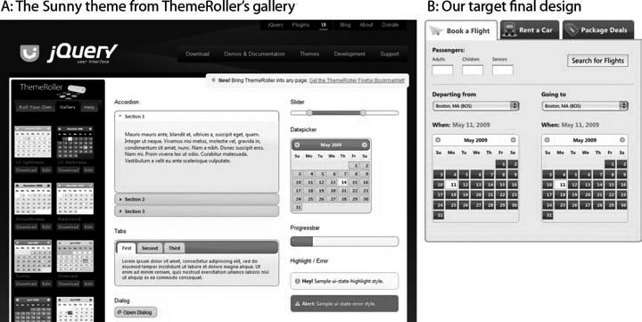
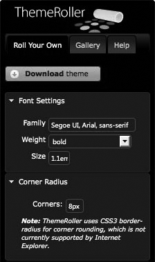
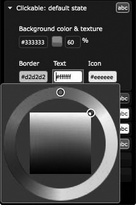
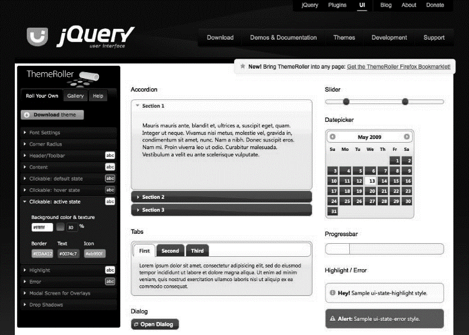
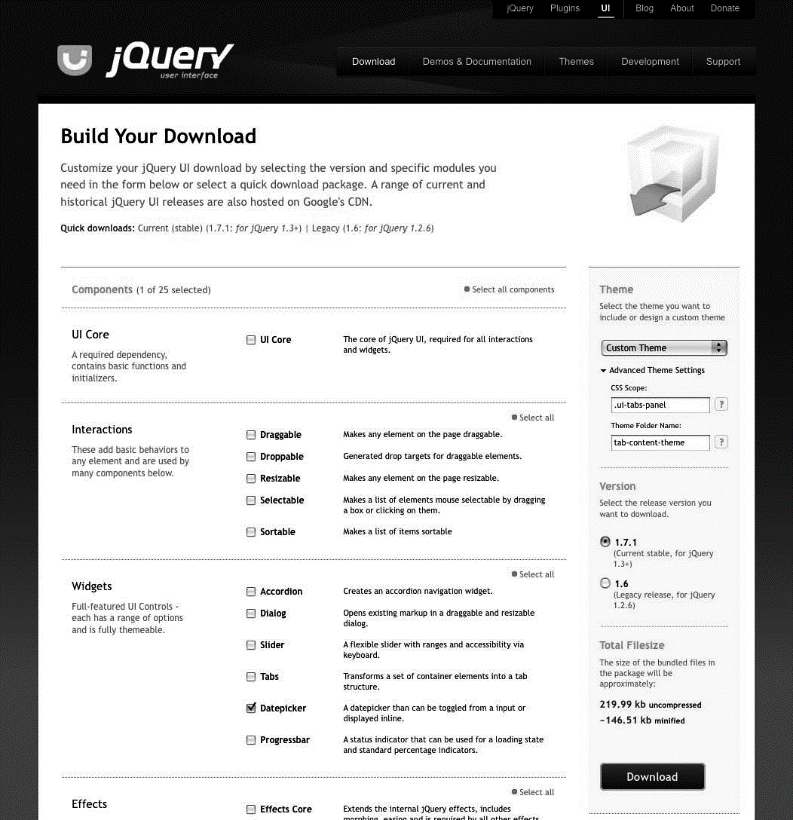
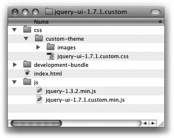
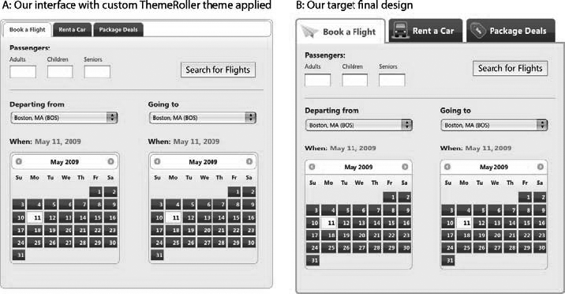

### 15.1.2　解决方案

> 你可以在任何时候将页面记入书签“保存”一个主题；ThemeRoller在每次刷新预览窗格时用相关的样式更新URL。将自定义主题记入书　签——甚至将多个主题记入书签进行比较——并从书签中重新加载主题进行修改或者为了下载而对其进行微调。
> 对于任何从ThemeRoller下载的主题，在样式表中都包含了完整的主题URL。打开样式表（如 `jqueryui-1.7.1.custom.css` ），搜索以如下内容开始的注释：

使用ThemeRoller，这是一个简单的Web应用程序，用于编辑jQuery UI CSS框架类，自定义jQuery UI窗口组件的观感。

注意

> 本秘诀有如下假设：
> + 你有CSS工作原理的基本知识，具体来说就是样式层叠、优先顺序和使用选择器类、id或者元素限定范围的方法。（关于建议的资源，请参考15.5节）。
> + 你已经熟悉了jQuery UI CSS类。（如果你不熟悉，可以复习15.0.1节）

```css
"To view and modify this theme,visit http://jqueryui.com/themeroller/..."

```

我们来看一个例子。

我们正在设计一个新的旅游预订网站，具体地说，我们构建预订航班的一部分界面。网页的设计有一组选择预定类型的选项卡组成（航班、汽车租赁或者套餐），航班预订选项卡包含一个输入乘客数量的表单、选择出发和到达城市的选择列表，设置出发和返回日期的日历以及一个提交按钮（见图15-1）。


<center class="my_markdown"><b class="my_markdown">图15-1　旅游程序的最终目标设计</b></center>

在这个秘诀中，将使用jQuery UI窗口组件来实现选项卡和日历选择器，并用ThemeRoller中创建的一个自定义主题设置它们的样式（除了标准的ThemeRoller输出之外，还可以修改主题样式表，使其更接近于你的设计——你将在秘诀15.2～15.4中看到具体的做法）。

#### 第1步：打开ThemeRoller

打开jQuery UI网站（<a class="my_markdown" href="['http://jqueryui.com']">http://jqueryui.com</a>），从顶部的导航条中选择Themes，或者直接访问<a class="my_markdown" href="['http://themeroller.com']">http://themeroller.com</a>。

ThemeRoller的界面分为两个主要部分，如图15-2所示：


<center class="my_markdown"><b class="my_markdown">图15-2　ThemeRoller的默认视图，左边是工具栏窗格，右边是窗口组件预览窗格</b></center>

+ **左列是ThemeRoller工具栏窗格** ，提供设置和修改主题中所有样式设置的工具。
+ 右边是示例窗口组件预览窗格，用于预览样式选择——每个窗口组件都交互式地显示各种样式（例如，用鼠标查看悬停和活动样式），当用工具栏编辑样式时实时更新。

ThemeRoller工具栏提供两种独特的方法自定义主题，可以从工具栏顶部的选项卡访问：

+ ** **Roll Your Own** 选项卡** （见图15-3）是用来创建主题的自定义样式的工作区。可自定义的设置分为几个部分，每个部分都有进行快速样式选择的输入框和工具，包括用于所有窗口组件的基本字体和圆角半径设置，以及背景颜色和纹理、文本颜色和图标颜色的设置。


<center class="my_markdown"><b class="my_markdown">图15-3　ThemeRoller的Roll Your Own选项卡（A）提供修改字体、
 圆角半径和一组交互状态颜色的控件；Gallery选项卡（B）
 提供对各种预构建主题的单击访问</b></center>

各个部分在默认情况下是关闭的，在标签的右侧以小图标的形式显示当前样式。在编辑的时候按照需要打开/关闭各个部分，右边的窗口组件预览示例实时反映你的修改。

注意

> JavaScript对于使用ThemeRoller不是必要的。如果禁用JavaScript，会显示一个Preview按钮，单击它可查看更改。

+ ** **Gallery** 选项卡** （见图15-3）提供一系列预先配置的主题，可以下载或者作为进一步自定义主题的起点。

#### 第2步：创建和预览主题

对于旅游预订应用，我们将选择与最终设计接近的画廊主题Sunny（如图15-4所示）。


<center class="my_markdown"><b class="my_markdown">图15-4　ThemeRoller的画廊主题为自定义设计提供了广泛的起点；
 Sunny（A）与我们的目标主题（B）共享许多样式</b></center>

Sunny指定了与最终设计类似的总体背景、字体和字体颜色，但是一些样式还需要编辑才能更接近于设计——例如，Sunny的选项卡是黄色的，背景为灰色，而我们的选项卡是暗灰色的，背景为白色。

单击画廊中Sunny图片之下的Edit按钮（转移到Roll Your Own视图）或者单击画廊中的Sunny图片激活它，然后单击工具栏顶部的Roll Your Own选项卡，可以轻松修改这些设置。

一旦在Roll Your Own选项卡中打开Sunny主题的设置，工具栏就预先用该主题的所有设置填充，并且可以开始编辑。调整如下设置，使Sunny主题匹配设计：


<center class="my_markdown"><b class="my_markdown">图15-5　字体设置和圆角设置部分</b></center>

+ **设置所有窗口组件的基本字体** ：Sunny主题中的默认字体和目标设计似乎非常相似，但是可以简单地打开Font Settings（字体设置）部分（如图15-5所示），确认设置正确，或者改变字体系列、粗细和大小的值。字体系列可以接受多个以逗号分隔的字体名称（和标准CSS记法相同）。下面是一些设计注意事项和技巧：
      + 默认情况下，字体大小以“em”为单位。建议使用em代替像素大小，这样窗口组件文本将会在用户操纵浏览器文本大小的时候随着窗口组件容器缩放。
    + 提供一组字体，预防在用户计算机上没有安装首选字体的情况。字体串以“Serif”或者“Sans-serif”等通用字体结束是一个好的习惯。  
+ **应用圆角半径** 。我们的设计在日期选择器和选项卡上包含了圆角。可以在ThemeRoller中打开Corner Radius（圆角半径）部分设置jQuery UI窗口组件的圆角半径，输入一个数值，然后是单位：用于固定半径的像素或者使半径与文本大小对应的em。较小的像素值使窗口组件的边角更方，而较大的值使边角更圆。将该值设置为0产生正方的边角。

注意

> 在本书编写期间，有些现代浏览器（最明显的是Internet Explorer）不支持CSS3的 `borderradius` 属性，因此无法显示框架类所应用的圆角。边角显示为方形。如果你的设计包含圆角且必须在所有浏览器中一致性地显示，你可能应该使用ddRoundies等JavaScript程序库来显示圆角。
> 我们已经在Filament Group lab上编写了一个基本的教程，说明在项目中加入ddRoundies的方法：“Achieving Rounded Corners in Internet Explorer for jQuery UI with DD_roundies”（<a class="my_markdown" href="['http://www.filamentgroup.com/lab/achieving_rounded_corners_in_internet_explorer_for_jquery_ui_with_dd_roundi']">http://www.filamentgroup.com/lab/achieving_rounded_corners_in_internet_explorer_for_jquery_ui_with_dd_roundi</a>）。

+ **将默认选项卡和按钮变为灰色** 。未选中的选项卡和折叠部分的标题或者日期选择器按钮一样，都是可单击元素，每个元素都指定一个类来表示其当前可单击状态：默认状态、悬停状态或者活动状态。这里将把默认状态背景颜色从灰色改为黄色，并更新文本和边框颜色以匹配设计（见图15-6）：


<center class="my_markdown"><b class="my_markdown">图15-6　ThemeRoller的可单击元素默认状态设置部分</b></center>

1．打开“Clickable: default state”（可单击元素：默认状态）部分。

2．将光标焦点放到背景颜色字段（包含了以 `#` 为前缀的十六进制值），并选择新的暗灰色或者输入一个十六进制值；在本例中，输入值 `#333333` 。

3．文本颜色为暗灰色，现在与背景融为一体，所以还要更新默认状态的文本颜色，以便和背景产生对比。把文本颜色值改为 `#FFFFFF` 。

4．和文本一样，出现在标题中的图标也是灰色的，需要更新才不会消失在灰色背景中。为其指定颜色值 `#EEEEEE` ，这种颜色是背景的补色，但是对比度不会高于文本。

5．最后，将边框颜色从黄色改为浅灰色；输入数值 `#D2D2D2` 。

6 **．** 按下Tab或者Enter键，或者单击页面的其他地方，在右边预览窗口组件的变化。

+ **更新悬停状态，匹配新的选项卡颜色** ：可单击元素的悬停状态样式在光标放在选项卡、折叠部分或者日期选择器等可单击组件上时显示。既然默认的状态为灰色，就调整悬停状态的背景和文本颜色，使用互补的深灰色背景与白色文本和图标协调一致：

1．打开“Clickable: hover state”部分。

2．在背景颜色字段中输入值 `#111111` 。

3．将文本和图标颜色更新为 `#FFFFFF` 。

4．还要将边框颜色设置为比默认边框更深的灰色—— `#888888` ，更好地匹配设计。

+ **将选项卡和日期选择器的标题背景改为白色** ：标题样式出现在多个jQuery UI窗口组件中：在选项卡的后面，在日期选择器顶部的月/年反馈信息和导航按钮，作为滑块范围，作为进度条完成指示器。在设计中，标题是浅白色，带有灰色文本和深黄色的图标：

1．打开Header/Toolbar（标题/工具栏）部分。

2．在背景颜色字段中输入十六进制值 `#FFFFFF` 。

3．单击背景输入字段旁边的纹理图标，选择第一个选项“flat”。（光标悬停于任何纹理图片上时会看到名称。）这样会删除背景图片，使得样式只设置一个平面背景颜色。

4．将背景不透明度设置为100%，确保标题完全不透明。

5．文本颜色为白色，在新的背景上不明显，所以将其改为暗灰色（ `#333333` ）以匹配默认的可单击状态。

6．最后，将边框和图标颜色改为 `#EDAA12` ，文本颜色改为白色—— `#FFFFFF` 。

+ **将内容容器边框颜色改为黄色** 。内容边框出现在折叠部分的周围，确定选项卡、对话框、滑块、日期选择器和进度条的容器。在设计中该边框和标题边框使用相同的浅黄色：

1．打开Content（内容）部分。

2．将焦点放在边框颜色字段，输入值 `#EDAA12` 。

+ **更新“活动”状态边框颜色，与容器融为一体** 。更新容器边框颜色之后，你将会看到选中的折叠部分和选中的选项卡仍然有暗灰色的边框。这个颜色用可单击元素活动状态类设置：

1．打开“Clickable: active state”部分。

2．将焦点放在边框颜色字段，输入值 `#EDAA12` 。

注意

这时，我们已经使ThemeRoller主题尽可能地匹配旅游预订应用的设计（见图15-7）。现在这个主题已经可以下载。


<center class="my_markdown"><b class="my_markdown">图15-7　最后的自定义ThemeRoller主题与设计很匹配</b></center>

#### 第3步：下载jQuery UI窗口组件和主题

单击ThemeRoller工具栏的Roll Your Own选项卡顶部的“Download theme”（下载主题）按钮，将打开jQuery UI下载构造器页面（见图15-8）。


<center class="my_markdown"><b class="my_markdown">图15-8　jQuery下载器将UI核心、
 你选择的交互和窗口组件以及你的主题合并为一个ZIP文件</b></center>

在Theme下的右侧栏目中，你将会看到下拉式菜单中预先选中的Custom Theme（自定义主题）。

注意

> 如果你从画廊中选择了一个默认主题且不作修改，就会看到该主题的名称（如Smoothness）。

接下来，我们将选择和主题一起下载的jQuery UI组件。默认情况下选择所有组件；简单地反选你不想下载的组件，或者单击Components（组件）部分顶部的“Deselect all components”（反选所有组件），只下载主题样式表。对于旅游预订应用，需要jQuery UI核心脚本和用于选项卡和日期选择器的插件脚本。

最后，选择你想使用的jQuery UI版本；默认选中最新的稳定版本。单击Download按钮，在本地保存ZIP文件。下载的ZIP文件将命名为 `jquery-ui-1.7.1.custom.zip` 。

（下载构建器的Theme部分中的Advanced Theme Settings（高级主题设置）部分允许你下载部分主题——我们将在秘诀15.4中详细解说。）

警告

> jQuery UI CSS随jQuery UI新版本的发行而更新——例如，新的发行版本不仅包含更新过的脚本，而且包含对CSS的修改和更新。
> 在本书编写的时候，jQuery UI的版本是1.7，本章中的秘诀和技术仅适用于该版本的主题功能。

#### 第4步：将文件合并到项目目录中

接下来，打开前一步下载的ZIP文件，查看其内容。jQuery UI文件编排为如下目录结构；文件夹和文件的顺序因为操作系统而有所不同（图15-9展示了在Mac OS X上打开的文件夹）。


<center class="my_markdown"><b class="my_markdown">图15-9　jQuery下载文件夹结构</b></center>

```css
index.html

```

选中的UI组件的标记样例标记。

注意

> 如果你选择不下载任何组件，这个文件将不会包含在下载中。

```css
/css

```

包含一个有如下文件的主题文件夹（例如，custom-theme）：

+ 一个图片目录，包含框架图标和背景纹理。
+ 你的主题样式表，如jquery-ui-1.7.1.custom.css，包含你刚刚编辑的样式，以及组件（如果下载）正常工作所必需的窗口组件相关样式。

```css
/js

```

已经过编译的jQuery UI JavaScript文件。

```css
/development-bundle

```

用于创建css和js文件夹中编译后版本的独立组件脚本和CSS，开放源码许可证文本和用jQuery UI进行高级开发所必需的相关资源。

当开发自己的项目时，一定要审核index.html中的标记，以它和<a class="my_markdown" href="['http://jqueryui.com']">http://jqueryui.com</a>上的演示和文档作为指南，将组件标记和脚本集成到项目中。

对于旅游应用，我们将复制css目录中的主题文件夹并粘贴到项目的样式目录中；为了简单起见，将样式文件夹命名为CSS。

警告

> 维护在主题文件夹中建立的目录结构很重要，这样图标图片就能被主题类正常引用。如果你修改了主题目录结构，在你决定升级到新版本的jQuery UI脚本和CSS时，可能不得不重复进行这些修改。

#### 第5步：在项目中引用主题样式表

最后，在页面的 `<head>` 元素中包含对主题样式表的引用。

记住，样式表引用应该始终出现在对jQuery UI脚本的引用之前，以便让CSS先加载；因为有些窗口组件依赖CSS才能正常工作，所以这一步是必需的。

我们将在旅游预订应用中所有脚本加载之前引用主题样式表（粗体表示）：

```css
<!doctype html>
<html>
<head>
　　 <meta charset="UTF-8">
　　 <title>travel application | Book a Flight, Rent a Car, or Find Package
Deals</title>
　　 <!-- jQuery UI styles -->
　　 <link rel="stylesheet" type="text/css" href="css/custom-theme/jquery-ui-
1.7.1.custom.css" />
　　 <!-- jQuery core & UI scripts -->
　　 <script type="text/javascript" src="js/jquery-1.3.2.min.js"></script>
　　 <script type="text/javascript" src="js/jquery-ui-1.7.1.custom.min.js"></script>
　　 <script type="text/javascript">
　　 $(function(){
　　　　　$('#travel').tabs();
　　　　　$("#departure-date-picker").datepicker({altField: '#departure-date',
altFormat: 'MM d, yy'});
　　　　　$("#arrival-date-picker").datepicker({altField: '#arrival-date',
altFormat: 'MM d, yy'});
　　 });
　　 </script>
</head>

```

当jQuery UI窗口组件标记和样式已经处于项目中的合适位置时，在浏览器中预览页面，以确定正确应用样式。预览旅游应用说明主题正确应用——正如你在图15-10中所看到的，默认选项卡为灰色，标题是白色而文本和图标的颜色与选择匹配。


<center class="my_markdown"><b class="my_markdown">图15-10　应用自定义ThemeRoller主题的设计界面（A）和最终目标设计（B）</b></center>

但是，界面明显需要更多的工作才能匹配目标设计（见图15-10）：选项卡太小，无法看到它们的自定义图标，日期选择器标题应该出现在顶部，可是它却包围在日期选择器窗口组件内。在秘诀15.2中，我们将研究如何对主题样式进行小的调整，使这些元素更好地匹配设计。

注意

> 如果页面中的jQuery UI窗口组件没有选择主题样式表，再次确认页面中引用的主题样式表目录路径，更正录入错误。如果不能解决这个问题，暂时禁用任何非jQuery样式或者脚本，测试它们对主题样式表的加载或者显示是否有影响，并修复相关的缺陷。

