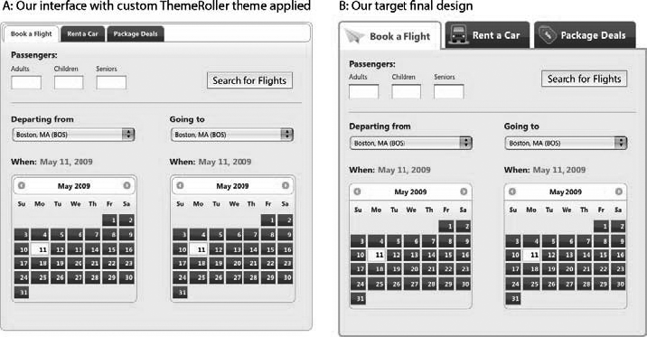
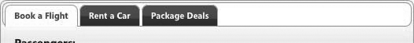
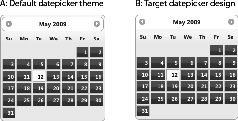
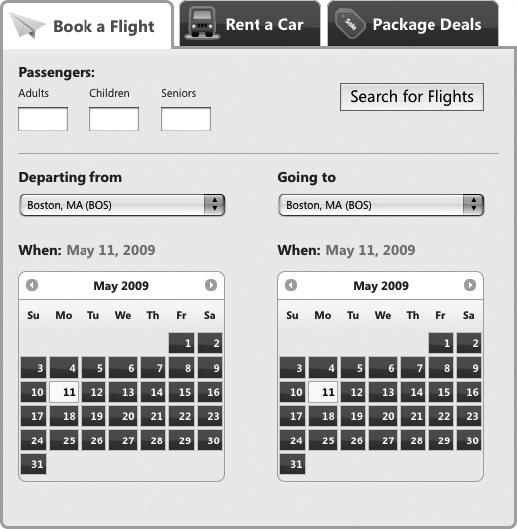

### 15.2.2　解决方案

> 在我们的范围ID  `#travel` 和 `.ui-tabs` 类之间故意不留空格，因为两者适用于标记中的同一个元素：

创建自定义覆盖样式，限制在需要附加非ThemeRoller样式的组件中，并对它们进行组织，使得它们不会与标准的jQuery UI CSS文件发生冲突或者覆盖。

警告

```css
<div id="travel" class="ui-tabs ui-widget ui-widget-content ui-corner-all">

```

> 后面的秘诀有如下假设：
> + 你有CSS工作原理的基本知识，具体地说是样式层叠、优先级，以及用选择器类、ID或者元素限制样式表的方法。（建议的资源请参见15.5节。）
> + 你已经熟悉了用ThemeRoller创建和编辑主题的方法（如果还不熟悉，复习秘诀15.1，该秘诀详细描述了创建和应用主题的方法。）

当下载jQuery UI脚本和主题样式表时，每个jQuery UI窗口组件都已经设置了现成的样式；不需要任何修改就可以将窗口组件和样式加入网站。但是默认的样式可能不完全匹配项目中的设计约定。例如，你可能想要减少标题的内边距或者使用自定义背景图片。

我们重拾前一个秘诀未完成的工作，继续完成旅游预订应用。正确地创建、下载和应用了主题样式表；但是，选项卡和日期选择器的默认jQuery UI样式与项目的设计不太匹配，如图15-11所示。


<center class="my_markdown"><b class="my_markdown">图15-11　应用自定义ThemeRoller主题的设计界面（A）
 和设计人员提供的目标设计（B）</b></center>

#### 第1步：检查jQuery UI插件所用的窗口组件标记和样式

首先，检查jQuery UI组件标记中的类如何指定，更好地理解应用这些类的方法（以及可能的覆盖方式）。

从选项卡标记开始。当在页面上初始化jQuery UI选项卡时，插件脚本为窗口组件标记指定多个类，这在下面说明（请注意，这些标记是由插件脚本变换或者插入的，是完成的产品，而不是JavaScript运行之前页面中就有的标记）。

特别要注意以 `ui-tabs` 前缀开始的类，这是选项卡的窗口组件相关类，在代码中以粗体显示：

```css
<div class="ui-tabs ui-widget ui-widget-content ui-corner-all" id="travel">
　　 <ul class="ui-tabs-nav ui-helper-reset ui-helper-clearfix ui-widget-header
ui-corner-all">
　　　　　<li class="ui-state-default ui-corner-top ui-tabs-selected ui-state-active">
<a href="#travel-flight" id="tab-flight">Book a Flight</a></li>
　　　　　<li class="ui-state-default ui-corner-top"><a href="#travel-car"
id="tab-car">Rent a Car</a></li>
　　　　　<li class="ui-state-default ui-corner-top"><a href="#travel-package"
id="tab-package">Package Deals</a></li>
　　 </ul>
　　 <div id="travel-flight" class="ui-helper-clearfix ui-tabs-panel
ui-widget-content ui-corner-bottom"></div><!-- /flight -->
　　 <div id="travel-car" class="ui-tabs-panel ui-widget-content ui-corner-bottom
ui-tabs-hide"></div><!-- /car -->
　　 <div id="travel-package" class="ui-tabs-panel ui-widget-content ui-corner-bottom
ui-tabs-hide"></div><!-- /package -->
</div><!-- /travel -->

```

这些类设置控制窗口组件布局的样式，并根据窗口组件的设计使其正常工作。在本例中，这些样式将一个无序的链接列表和 `<div>` 元素转换为具有相关内容面板的选项卡。（本章前面的15.0.1节详细地讨论了窗口组件相关类。）

这些类还确定了窗口组件的各个组成部分（如标题或者内容面板），因此很适合编写覆盖规则调整布局特征或者添加绘制图标等自定义效果。选项卡的窗口组件类标记了如下组件：

`ui-tabs`

包装选项卡导航和内容的外部容器。

`ui-tabs-nav`

导航选项的容器。选项卡列表项目和链接用后代选择器（即， `ui-tabs-nav li` ）设置样式。

`ui-tabs-selected`

选中选项卡“开启”状态，由脚本动态设置。一次只有一个选项卡指定该类。

`ui-tabs-panel`

映射到选项卡的内容区域。

`ui-tabs-hide`

内容面板的默认状态。在用户选择显示之前一直隐藏。

要查看与这些类关联的样式规则，可以打开主题样式表并寻找（Ctrl/Command+F快捷键）或者滚动到以 `ui-tabs` 开始的代码块。注意，这些规则只适用于布局特性，如位置、内边距或者边框宽度，而不设置任何主题样式（如背景或者边框颜色）：

```css
.ui-tabs { padding: .2em; zoom: 1; }
.ui-tabs .ui-tabs-nav { list-style: none; position: relative;
padding: .2em .2em 0; }
.ui-tabs .ui-tabs-nav li { position: relative; float: left;
border-bottom-width: 0 !important; margin: 0 .2em -1px 0; padding: 0; }
.ui-tabs .ui-tabs-nav li a { float: left; text-decoration: none;
padding: .5em 1em; }
.ui-tabs .ui-tabs-nav li.ui-tabs-selected { padding-bottom: 1px;
border-bottom-width: 0; }
.ui-tabs .ui-tabs-nav li.ui-tabs-selected a, .ui-tabs .ui-tabs-nav
li.ui-state-disabled a, .ui-tabs .ui-tabs-nav li.ui-state-processing
a { cursor: text; }
.ui-tabs .ui-tabs-nav li a, .ui-tabs.ui-tabs-collapsible .ui-tabs-nav
li.ui-tabs-selected a { cursor: pointer; } /* first selector in group seems
obsolete, but required to overcome bug in Opera applying cursor: text overall
if defined elsewhere... */
.ui-tabs .ui-tabs-panel { padding: 1em 1.4em; display: block; border-width: 0;
background: none; }
.ui-tabs .ui-tabs-hide { display: none !important; }

```

注意

> 如果你也下载选项卡插件，主题样式表将包含 `ui-tabs` 样式规则。

#### 第2步：创建覆盖样式表

我们已经找到了安全地微调窗口组件外观的最佳方法，就是编写新的样式规则覆盖jQuery UI主题样式并将这些“覆盖规则”附加到单独的样式表中。覆盖规则按照jQuery UI CSS类名编写，必须按照主题样式表中的顺序排列；因为样式表按照顺序读取，所以最后的样式规则总是具有优先权。

jQuery UI程序库不断发展，用更加简练的代码包含更多功能。通过在单独的文件中维护覆盖样式，你可以根据需要或多或少地自定义窗口组件样式，并且仍然保持在必要时升级jQuery UI文件以及在保持覆盖规则不变的情况下重写现有主题样式表的能力。覆盖规则可以在专用样式表中列出以覆盖主题样式，如果你想要限制链接到页面的文件数量（从而限制对服务器的请求数量），也可以将覆盖规则附加到整个项目的主样式表之后。

在本秘诀的工作中，将把覆盖样式附加到项目的主样式表 `travel.css` 中为应用程序开发的自定义样式块之后：

```css
/* ----- 旅游应用程序的自定义样式*/
body { font-size: 62.5%; }
fieldset { padding: 0 0 1.5em; margin: 0 0 1.5em; border: 0; }
p, label { padding: 0 0 .5em; margin: 0; line-height: 1.3; }
p label { display: block; }
...
/* ----- jQuery UI窗口组件的覆盖规则*/
/*这里是选项卡的背景样式 */
...

```

在页面的主题规则之后引用 `travel.css` ：

```css
<!doctype html>
<html>
<head>
　　 <meta charset="UTF-8">
　　 <title>travel application | Book a Flight, Rent a Car, or Find Package
Deals</title>
　　 <!-- jQuery UI styles -->
　　 <link rel="stylesheet" type="text/css" href="css/custom-theme/jquery-ui-
1.7.1.custom.css" />
　　 <!-- overrides & custom styles for the travel application -->
　　 <link rel="stylesheet" type="text/css" href="css/travel.css" />
....

```

#### 第3步：编辑覆盖样式表中的样式规则

我们已经检查了窗口组件类的命名和应用方式，以及在项目中引用覆盖样式的方法，现在用自定义的选项卡导航栏和日期选择器标题样式更新旅游预订应用程序。首先处理选项卡。

**限定覆盖范围** 。我们为选项卡所创建的设计专用于旅游预订应用程序，而且不一定希望在整个应用程序中的每个选项卡窗口组件中应用相同的自定义（如图标或者字体大小）。为了确保这些样式仅适用于旅游应用程序，将把覆盖规则限制为旅游应用程序的唯一ID。

每条新规则都从应用到要修改的组件上的窗口组件相关类开始；例如，当为选项卡的导航栏修改样式时，将编写用于 `.ui-tabs-nav` 类的规则：

```css
.ui-tabs-nav { /* our override style rule */ }

```

然后用预定的ID  `travel` 将规则限制在旅游应用程序的范围中：

```css
#travel .ui-tabs-nav { /* our override style rule */ }

```

**编写覆盖规则** 。应用主题样式表之后，选项卡面板如图15-12所示：单独的选项卡很小，周围有一个边框，该边框和最外层容器之间有几个像素的内边距。


<center class="my_markdown"><b class="my_markdown">图15-12　在覆盖之前应用了ThemeRoller主题的选项卡</b></center>

但是，该设计（见图15-13）需要带有图标而没有背景的大选项卡——它们好像出现在选项卡内容之上。


<center class="my_markdown"><b class="my_markdown">图15-13　目标选项卡设计</b></center>

为了覆盖默认的选项卡样式，下面进行一些样式修改：

1．首先，删除最外层的边框。整个选项卡组件四周包围着一个像素宽的边框，并有几个像素的内边距。为了让选项卡出现在内容面板之上，将两者删除：

```css
#travel.ui-tabs { padding: 0; border-width: 0; }

```

注意

2．接下来，把选项卡导航栏的底部扁平化（设置底部圆角半径为0）并删除顶部和两侧的边框。还将删除所有额外的内边距，使选项卡和组件的左侧等高，还将把边框的宽度加厚到3个像素，以匹配该设计：

```css
#travel .ui-tabs-nav {
　　 border-width: 3px;
　　 border-top-width: 0;
　　 border-left-width: 0;
　　 border-right-width: 0;
　　 -moz-border-radius-bottomleft: 0;
　　 -webkit-border-bottom-left-radius: 0;
　　 -moz-border-radius-bottomright: 0;
　　 -webkit-border-bottom-right-radius: 0;
　　 padding: 0;
}

```

3．选项卡有些过于靠近，所以添加右侧的外边距：

```css
#travel .ui-tabs-nav li {
margin-right: .5em;
}

```

4．更新选中的选项卡 `.ui-tabs-selected` ，使其与选项卡内容区域有所联系。把边框宽度增加到3个像素以匹配设计，然后校正选项卡和内容之间的缝隙。选项卡和内容面板之间的距离与选项卡导航栏边框的厚度相关，所以可以应用3个像素的底部外边距来弥补这一缝隙：

```css
#travel .ui-tabs-nav li.ui-tabs-selected {
　　 border-width: 3px;
　　 margin-bottom: -3px;
}

```

5．接下来，将应用自定义图标。因为每个图标对选项卡来说都是唯一的，所以可以用每个选项卡的唯一ID将每个图标作为背景图片。（从技术上说，这不是覆盖样式，但是在设置选中选项卡图标样式时需要引用这些规则。）

```css
#tab-flight {
　　 background: url(.../images/icon-tab-flight.png) no-repeat .3em center;
　　　　　padding-left: 50px;
}
#tab-car {
　　　　　background: url(.../images/icon-tab-car.png) no-repeat .1em center;
　　　　　padding-left: 45px;
}
#tab-package {
　　　　　background: url(.../images/icon-tab-package.png) no-repeat .1em center;
　　　　　padding-left: 45px;
}

```

6．选中的选项卡使用略有不同的图标，背景为白色而不是灰色。为每个选项卡添加一条规则，删除选中状态的窗口组件相关类 `ui-tabs-selected` ：

```css
#travel .ui-tabs-nav li.ui-tabs-selected #tab-flight {
　　　　　　background-image: url(.../images/icon-tab-flight-on.png);
}
#travel .ui-tabs-nav li.ui-tabs-selected #tab-car {
　　　　　　background-image: url(.../images/icon-tab-car-on.png);
}
#travel .ui-tabs-nav li.ui-tabs-selected #tab-package {
　　　　　　background-image: url(.../images/icon-tab-package-on.png);
}

```

7．选项卡还应该有更多的内边距和较大的字体尺寸：

```css
#travel .ui-tabs-nav a {
　　　 font-size: 1.5em;
　　　 padding-top: .7em;
　　　 padding-bottom: .7em;
}

```

8．为完成选项卡，调整内容面板的边框，使其匹配在选中的选项卡上设置的3像素边框：

```css
#travel .ui-tabs-panel {
　　　 border-width: 3px;
　　　 border-top-width: 0;
　　　 padding-top: 1.5em;
}

```

选项卡已经匹配设计，接下来更新日期选择器的标题。如图15-14所示，利用一些调整，可以使日期选择器的标题组件（日历上包含导航箭头和月/年反馈信息的条块）出现在上方而不是日期选择器内部。


<center class="my_markdown"><b class="my_markdown">图15-14　应用了ThemeRoller主题的日期选择器（A）和目标设计（B）</b></center>

和选项卡一样，当初始化页面上的日期选择器插件时，脚本将窗口组件标记写到包含jQuery UI窗口组件相关类和框架类的页面，设置其结构化和主题外观。在日期选择器标记的节选版本中，你可以看到窗口组件相关类遵循命名约定，以 `ui-datepicker` 开始，标识各个组件：

```css
<div id="ui-datepicker-div" class="ui-datepicker ui-widget ui-widget-content
ui-helper-clearfix ui-corner-all ui-helper-hidden-accessible">
　　 <div class="ui-datepicker-header ui-widget-header ui-helper-clearfix
ui-corner-all">
　　 <a class="ui-datepicker-prev ui-corner-all">title="Prev"><span class="ui-icon
ui-icon-circle-triangle-w">Prev</span></a>
　　 <a class="ui-datepicker-next ui-corner-all" title="Next"><span class="ui-icon
ui-icon-circle-triangle-e">Next</span></a>
　　 <div class="ui-datepicker-title">
　　　　 <span class="ui-datepicker-month">January</span><span class="ui-datepickeryear">
2009</span>
　　　 </div>
　　 </div>
　　 <table class="ui-datepicker-calendar">
　　　 <thead>
　　　 <tr>
　　　　　<th class="ui-datepicker-week-end"><span title="Sunday">Su</span></th>
　　　　　...
　　　 </tr>
　　　 </thead>
　　　 <tbody><tr>
　　　　　<td class="ui-datepicker-week-end ui-datepicker-other-month"> 1 </td>
　　　　　...
　　 </tr>
　　 </tbody>
　 </table>
　 <div class="ui-datepicker-buttonpane ui-widget-content">
　　 <button type="button" class="ui-datepicker-current ui-state-default
ui-priority-secondary ui-corner-all">Today</button>
　　 <button type="button" class="ui-datepicker-close ui-state-default
ui-priority-primary ui-corner-all">Done</button>
　 </div>
</div>

```

为日期选择器窗口组件类指定如下默认样式规则：

```css
.ui-datepicker { width: 17em; padding: .2em .2em 0; }
.ui-datepicker .ui-datepicker-header { position:relative; padding:.2em 0; }
.ui-datepicker .ui-datepicker-prev, .ui-datepicker .ui-datepicker-next {
position:absolute; top: 2px; width: 1.8em; height: 1.8em; }
.ui-datepicker .ui-datepicker-prev-hover, .ui-datepicker .ui-datepicker-next-hover {
top: 1px; }
.ui-datepicker .ui-datepicker-prev { left:2px; }
.ui-datepicker .ui-datepicker-next { right:2px; }
.ui-datepicker .ui-datepicker-prev-hover { left:1px; }
.ui-datepicker .ui-datepicker-next-hover { right:1px; }
.ui-datepicker .ui-datepicker-prev span, .ui-datepicker .ui-datepicker-next span {
display: block; position: absolute; left: 50%; margin-left: -8px; top: 50%;
margin-top: -8px; }
.ui-datepicker .ui-datepicker-title { margin: 0 2.3em; line-height: 1.8em;
text-align: center; }
.ui-datepicker .ui-datepicker-title select { float:left; font-size:1em;
margin:1px 0; }
.ui-datepicker select.ui-datepicker-month-year {width: 100%;}
.ui-datepicker select.ui-datepicker-month,
.ui-datepicker select.ui-datepicker-year { width: 49%;}
.ui-datepicker .ui-datepicker-title select.ui-datepicker-year { float: right; }
.ui-datepicker table {width: 100%; font-size: .9em; border-collapse: collapse;
margin:0 0 .4em; }
.ui-datepicker th { padding: .7em .3em; text-align: center; font-weight: bold;
border: 0; }
.ui-datepicker td { border: 0; padding: 1px; }
.ui-datepicker td span, .ui-datepicker td a { display: block; padding: .2em;
text-align: right; text-decoration: none; }
.ui-datepicker .ui-datepicker-buttonpane { background-image: none; margin: .7em
0 0 0; padding:0 .2em; border-left: 0; border-right: 0; border-bottom: 0; }
.ui-datepicker .ui-datepicker-buttonpane button { float: right; margin: .5em .2em
.4em; cursor: pointer; padding: .2em .6em .3em .6em; width:auto; overflow:visible; }
.ui-datepicker .ui-datepicker-buttonpane button.ui-datepicker-current { float:left; }
...

```

这只是日期选择器样式规则的一个子集；要查看所有样式，可以在主题样式表中寻找以 `ui-datepicker` 开始的样式代码块。

回到旅游应用程序，编写几条覆盖规则，使日期选择器的标题类似该设计：

1．首先删除将标题与日期选择器外部容器分开的内边距：

```css
#travel .ui-datepicker { padding: 0; }

```

2．和选项卡导航栏一样，应该将底部弄平并删除顶部和侧面的边框：

```css
#travel .ui-datepicker-header {
　　 border-top-width: 0;
　　 border-left-width: 0;
　　 border-right-width: 0;
　　 -moz-border-radius-bottomleft: 0;
　　 -webkit-border-bottom-left-radius: 0;
　　 -moz-border-radius-bottomright: 0;
　　 -webkit-border-bottom-right-radius: 0;
}

```

3．最后，删除悬停状态下“上一个”和“下一个”导航箭头中的边框和背景图片：

```css
#travel .ui-datepicker-prev-hover,
#travel .ui-datepicker-next-hover {
　　 border-width: 0;
　　 background-image: none;
}

```

应用覆盖样式之后，旅游应用现在和最终设计已经完全匹配了（见图15-15）。


<center class="my_markdown"><b class="my_markdown">图15-15　最终设计，应用了标准的ThemeRoller和覆盖的样式</b></center>

