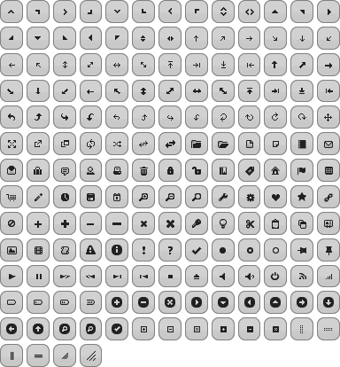
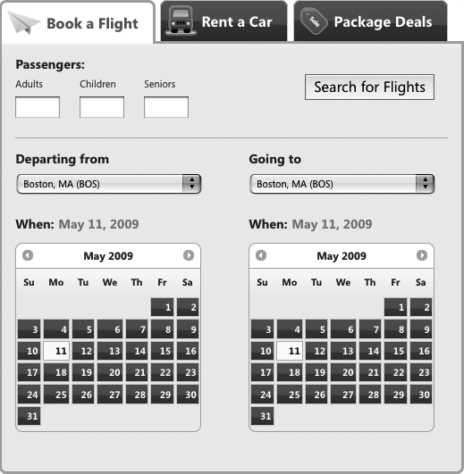
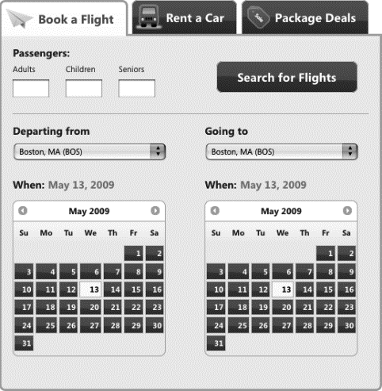

### 15.3.2　解决方案

可以为非jQuery UI元素指定框架类，应用与ThemeRoller样式元素相同的主题。（额外的好处是，这些元素将在应用已更新的ThemeRoller主题时自动更新。）

注意

> 后面的秘诀有如下的假设：
> + 你有CSS工作原理的基本知识，具体地说是样式层叠、优先级，以及用选择器类、ID或者元素限制样式表的方法。（建议的资源请参见15.5节。）
> + 你已经熟悉了用ThemeRoller创建和编辑主题的方法（如果还不熟悉，复习秘诀15.1，该秘诀详细描述了创建和应用主题的方法）。

在前两个秘诀中，使用ThemeRoller创建和下载一个主题，然后编写几条CSS规则覆盖默认主题样式，并使其更接近于最终的设计。现在，进一步采取另一个步骤，将框架类应用到项目中的元素，使它们与jQuery UI窗口组件以及创建的主题协调一致。

#### 第1步：检查可用的框架类，确认可以应用到组件的类

框架类是用ThemeRoller创建主题时下载的jQuery UI主题样式表的一部分。它们根据用途命名并应用背景颜色和纹理、边框和字体颜色、圆角和图标等主题样式。框架类内置于jQuery UI窗口组件，但是它们也适用于任何其他元素——例如，开发或者从第三方扩展的自定义窗口组件——可以在整个网站或者应用程序范围内实现一致的观感。

下面将概述组成框架的类、每个类应用的样式和在你自己的代码中引用它们的一般原则。

注意

> 除非另作说明，框架类设置的所有样式（包括任何文本、链接和图标样式）都由子元素继承。

布局助手类隐藏内容或者修复常见的结构问题，如将浮动子元素完全包装在一个容器中：

`.ui-helper-hidden`

应用 `display:none` 。这样隐藏的内容无法被屏幕阅读器访问。

`.ui-helper-hidden-accessible`

将元素定位在页面之外使其不可见，但是仍然可以被屏幕阅读器访问。

`.ui-helper-reset`

删除继承的内边距、外边距、边框、文本装饰和 `liststyle` ；将 `line-height` 设置为1.3， `font-size` 设置为100%。

`.ui-helper-clearfix`

强制非浮动容器元素完全包装浮动子元素。

窗口组件容器类只应该应用到作为容器命名原因的元素上，因为它们的子链接将从它们那里继承样式：

`.ui-widget`

在整个窗口组件上应用主题的字体系列和字体尺寸，并明确地为子表单元素设置相同的字体系列和1em的字体大小以强制继承。

`.ui-widget-header`

应用加粗字体。

`.ui-widget-content`

应用边框颜色、背景颜色和图片以及文本颜色。

交互状态设置可单击元素（如按钮、折叠标题和选项卡）的样式，在用户与之交互时提供相应的状态反馈；每个类都应用边框颜色、背景颜色和图片以及文本颜色。 `-hover` 、 `-focus` 和 `-active` 类的用途是替换与之等价的CSS伪类（ `:hover` 、 `:active` 、 `:focus` ），必须用客户端脚本指派给一个元素。状态类这样设计是为了避免样式冲突，以及由于CSS内置伪类所增加的选择器复杂性（如果伪类对项目是必需的，可以将它们添加到秘诀15.2中所描述的覆盖样式表中）。

+ `.ui-state-default`
+ `.ui-state-hover`
+ `.ui-state-focus`
+ `.ui-state-active`

交互提示设置内容的样式，以高亮或者错误消息、禁用的表单元素或者视觉层次结构的形式表达反馈。所有的类都应用边框颜色、背景颜色和图片以及文本颜色：

`.ui-state-highlight`

指定该类暂时高亮显示一个组件。

`.ui-state-error`

将该类指派给包含错误消息的任何组件。

`.ui-state-error-text`

只应用“错误”文本和图标颜色而没有背景。

`.ui-state-disabled`

用低的不透明度使表单元素看上去像禁用的样子，从而可以和其他用于设置该元素样式的类协同工作。该元素在应用该类时仍然可用；要禁用元素的功能，可以使用表单元素属性 `disabled` 。

`.ui-priority-primary`

当按钮的操作优先于另一个按钮时（即，Save按钮优先于Cancel按钮）指定该类。应用粗体文本。

`.ui-priority-secondary`

当按钮的操作是另一个按钮（例如，Cancel按钮）的辅助功能时指定该类。应用普通粗细的字体和较低的不透明度。

图标类以方向箭头和信息性符号（例如，X或者垃圾桶表示删除按钮）的形式提供附加反馈。用两个类为元素应用图标：

`.ui-icon`

基类，将元素尺寸设置为16像素的正方形，隐藏所有文本并设置ThemeRoller生成的图标精灵图作为背景。

`.ui-icon-[type]`

这里的“type”是将要显示的图标图形的一个描述符，这个类型是单个词（  `ui-icon-document` 、 `ui-icon-print` ）或者几个单词、数字和简写的组合；例如， `.ui-icon-carat-1-n` 将显示一个指向北方的插入符号，而 `.ui-icon-arrow-2-e-w` 将显示一个指向东方-西方的双箭头图标。

注意

> 因为 `ui-icon` 基类影响元素的尺寸并且隐藏所有内部文本，所以为它们自己的元素（如 `<span>` 标记）指定图标是一个好的做法，以便样式对任何子内容或者元素都不会有不利的影响。为了可访问性，在图标的 `<span>` 标记中包含简短的描述，它从用户的角度来说是隐藏的，但是仍然可用于屏幕阅读器。
> 而且，具有 `.ui-icon` 类的每个元素都根据双亲容器的状态指定一幅背景精灵图像。例如，在一个 `.ui-state-default` 容器内的图标元素将以ThemeRoller中设置的 `ui-state-default icon` 图标颜色显示图标。

jQuery UI提供一整套完整的框架图标（见图15-16）。在ThemeRoller中可以将光标悬停于窗口组件示例栏中的一个图标，预览它们的默认和悬停交互状态，还可以将光标悬停于一个图标上，查看它的类名。


<center class="my_markdown"><b class="my_markdown">图15-16　jQuery UI在单幅精灵图像中包含整组主题图标；它们的交互状态可以在ThemeRoller中预览</b></center>

圆角助手类为容器的所有圆角的一个子集应用圆角。圆角类名称的最后一段表示圆角应用的位置，如：

`.ui-corner-tl`

左上

`.ui-corner-tr`

右上

`.ui-corner-bl`

左下

`.ui-corner-br`

右下

`.ui-corner-top`

左上和右上

`.ui-corner-bottom`

左下和右下

`.ui-corner-right`

右上和右下

`.ui-corner-left`

左上和左下

`.ui-corner-all`

所有4个角

覆盖和阴影类可以用于为网站或者应用程序增加深度和尺寸：

`.ui-widget-overlay`

为模态屏幕应用100%宽度和高度的尺寸、背景和不透明度，模态屏幕是处于模态对话框和页面内容之间的一层，常用于使页面内容在模态窗口显示时暂时禁用。

`.ui-widget-shadow`

应用背景、圆角、不透明度顶部/左侧偏移量以定位窗口组件背后的阴影，以及阴影厚度（类似于边框宽度）。

因为这些框架类为jQuery UI窗口组件应用主题样式且可以用于设置页面上任何组件的样式，所以可以在一个界面中全面使用它们，创建统一的外观。在本秘诀中，将研究如何指定三种框架类：

+ 可单击元素状态类，包括 `.ui-state-default` 、 `.ui-state-hover` 和 `.ui-state-active`
+ 圆角类 `.ui-corner-all`
+ 禁用表单元素的交互提示类 `.ui-state-disabled`

#### 第2步：应用可单击元素状态框架类

让我们来继续调整旅游预订应用的外观。

应用ThemeRoller中创建的一个主题并通过覆盖规则修改默认样式之后，旅游应用的航班选择器界面几乎已经完成：jQuery UI组件中的可单击元素有一致的外观——默认情况下，选项卡和日期选择器按钮都为暗灰色，具有玻璃的纹理。

但是Search for Flights提交按钮没有遵循这种设计，而是类似于标准的无样式浏览器按钮（见图15-17）。我们希望它更像精致的主题样式。


<center class="my_markdown"><b class="my_markdown">图15-17　除了Search for Flights按钮没有设置样式之外，界面接近完成</b></center>

为了使搜索按钮和旅游应用中的其他可单击元素类似，为之指定设置可单击元素状态样式的框架类（ `.ui-statedefault` 、 `.ui-state-hover` 和 `.ui-state-active` ），然后编写一段简短的jQuery脚本，在用户与按钮交互时应用样式。还将用与选项卡和日期选择器组件相同的半径应用圆角。

首先，为按钮设置默认状态类，使其与其他可单击元素相匹配。将简单地（或者从主题样式表中复制）将 `ui-defaultstate` 写入按钮的 `class` 属性：

```css
<button id="search-flights" class="ui-state-default">Search for Flights</button>

```

因为可单击元素（如选项卡）具有圆角，所以为按钮的四个角都添加圆角，在 `class` 属性中附加 `ui-corner-all` 类：

```css
<button id="search-flights" class="ui-state-default ui-corner-all">Search for
Flights</button>

```

在标记中添加这些属性之后，已经为搜索按钮应用了可单击元素的默认主题样式，而且使其“可主题化”，以后，如果我们决定为旅游应用程序窗口组件创建和应用新的主题，搜索按钮将采用新样式表中的默认可单击元素和圆角样式。

最后，应用悬停和mousedown（活动）状态，为用户提供与按钮交互时的视觉反馈（见图15-18）。


<center class="my_markdown"><b class="my_markdown">图15-18　三个框架类用于指定可单击元素状态</b></center>

为了更新悬停和mousedown状态下的按钮外观，编写一个小的jQuery脚本。因为已经下载并在页面中包含了最新版本的jQuery核心程序库，而且在DOM就绪时初始化了窗口组件插件，所以将为DOM就绪代码块附加一个函数，切换为搜索按钮指定的状态类。正如下面的脚本块所指出的， `hover` 事件包含两个函数，第一个函数在mouseover事件发生的时候删除默认状态类并添加悬停状态，第二个函数则在mouseout事件发生时反转指定的类， `mousedown` 事件则用活动类代替默认和悬停状态类：

```css
$(function(){
　　 // 初始化选项卡和日期选择器
　　　　　$('#travel').tabs();
　　　　　$('#departure-date-picker').datepicker({altField: '#departure-date', altFormat:
'MM d, yy'});
　　　　　$('#arrival-date-picker').datepicker({altField: '#arrival-date', altFormat: 'MM
d, yy'});
　　 //搜索按钮悬停和活动状态
　　　　　$('#search-flights')
　　　　　　　 .hover(
　　　　　　　　　　function(){ $(this).removeClass('ui-state-default').addClass ('ui-state- hover');},
　　　　　　　　　　function(){ $(this).removeClass('ui-state-hover').addClass ('ui-state- default');}
　　　　　　　 )
　　　　　　　 .mousedown(
　　　　　　　　　　function(){ $(this).removeClass('ui-state-default, ui-stat-e  
hover').addClass('ui-state-active'); }
　　　　　　　 );
});

```

注意

> 为什么在CSS伪类（ `:hover` 、 `:active` 、 `:focus` ）能够起到相同作用的时候还要编写脚本更新按钮状态？我们在设计jQuery UI CSS时权衡了这个问题，出于几个关键原因，我们决定不使用伪类：
> + 伪类给样式表带来了一定的复杂性，使其几乎无法保持简洁，包含伪类要求我们考虑这些状态可能发生冲突的所有情况。
> + 伪类加剧了CSS的膨胀，可能显著地增加样式表的尺寸。
> + 因为有些浏览器（如老旧但仍然流行的Internet Explorer版本）只支持链接元素上的伪类，所以必须为所有可单击状态创建类。

最终，按钮外观类似图15-19。


<center class="my_markdown"><b class="my_markdown">图15-19　最终设计，搜索按钮应用了主题类</b></center>

现在，按钮已经设置了匹配应用程序的样式，可以有条件地添加一个交互提示类 `ui-state-disabled` ，提供当禁用按钮时的视觉反馈（见图15-20）。例如，假定航班预定表单的所有字段都必须提交。在这种情况下，搜索按钮应该在用户为每个字段输入有效值之前保持禁用；当表单完成时，启用该按钮提交表单。


<center class="my_markdown"><b class="my_markdown">图15-20　添加ui-state-disabled状态，使表单元素看上去是禁用的</b></center>

要为搜索按钮应用禁用的外观，为默认按钮附加框架类 `ui-state-disabled` 。（两个类对于最终外观都是必要的，因为禁用状态样式只是降低默认按钮的不透明度。）

```css
<button id="search-flights" class="ui-state-default ui-state-disabled ui-corner- 
all">Search for Flights</button>

```

应用禁用状态类只改变按钮的外观而不影响其功能；它仍然能接受用户输入以提交表单。为了确保该按钮真的禁用，一定要为按钮标记添加 `disabled` 属性和值：

```css
<button id="search-flights" class="ui-state-default ui-state-disabled ui-corner-all"
disabled="disabled">Search for Flights</button>

```

