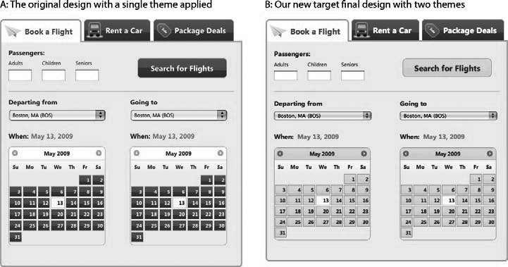
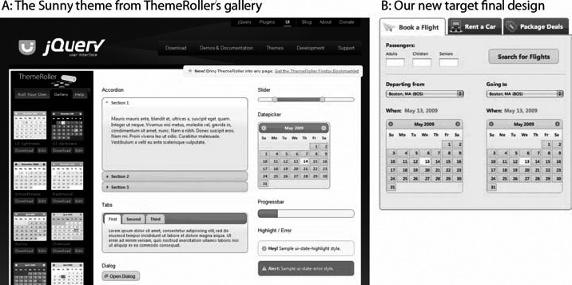
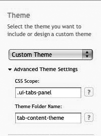
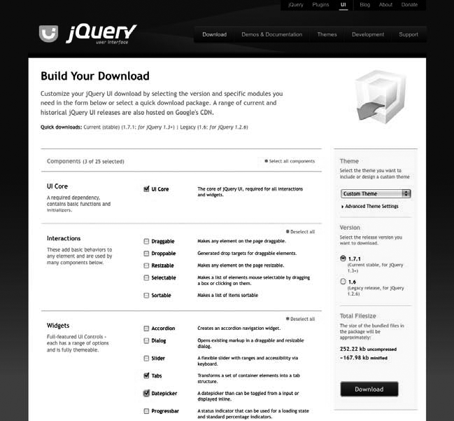
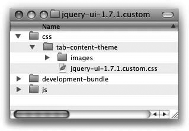
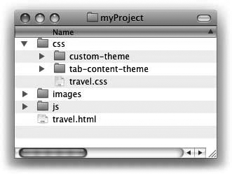

### 15.4.2　解决方案

用ThemeRoller创建第二个主题，并在下载过程中将新的主题与某个类、某个ID或者其他范围选择器关联，选择性地应用到窗口组件或者应用程序中的组件上。

注意

> 后面的秘诀有如下的假设：
> + 你有CSS工作原理的基本知识，具体地说是样式层叠、优先级，以及用选择器类、ID或者元素限制样式表的方法。（建议的资源请参见本章最后的附录。）
> + 你已经熟悉了用ThemeRoller创建和编辑主题的方法（如果还不熟悉，复习秘诀15.1，该秘诀详细描述了创建和应用主题的方法）。

jQuery UI主题的意图是在jQuery UI窗口组件和整个应用程序的其他界面组件中形成一致的观感，但是有时候设计更为复杂，必须根据组件在应用程序中出现的位置，为某些组件应用不同的观感。

在旅游应用示例中，假设设计人员审核最后的设计，觉得在所有可单击元素上使用暗灰色使得预订类型选项卡和其中的表单字段难以区分。他决定顶部的选项卡应该保持当前的样式，但是选项卡中的所有交互性组件（包括日期选择器和搜索按钮）应该有不同的样式，默认状态为黄色。图15-21展示了当前的设计和新的设计。


<center class="my_markdown"><b class="my_markdown">图15-21　原始主题（A）将所有交互式元素的可单击默认状态设置为灰色；新设计保持了顶部选型卡的颜色，但是将选项卡中的所有交互式组件改为黄色</b></center>

为选项卡内容创建样式例外有几种方法。正如秘诀15.2描述的，可以编写和引用覆盖规则，为日期选择器和按钮修改默认主题样式。为此，必须使用设计编辑工具（如Adobe Photoshop）计算出所有新的颜色十六进制值，然后生成新的黄色背景图片。

也可以在ThemeRoller中创建匹配次要主题（在本例中是黄色的可单击元素）的新主题，明确限制其作用范围为选项卡内容范围，然后在原始主题样式表之后应用它。jQuery UI下载构建器提供简单的界面来限制主题范围：下载页面上的Advanced Theme Settings（高级主体设置）区域可以设置为指定一个范围选择器——类、ID或者其他层次结构的CSS选择器——允许你准确地指出附加主题设置哪些组件的样式。

回到旅游预订应用，这时我们已经完成了秘诀15.1～15.3中描述的步骤：

+ 创建和下载一个主题，并在项目中引用（见秘诀15.1）。
+ 编写附加的覆盖规则修改几个主题默认样式（见秘诀15.2）。
+ 为搜索按钮添加几个框架类，应用主题样式（见秘诀15.3）。

现在，我们将研究如何限制第二个主题的范围，并将其应用到项目中。

#### 第1步：用ThemeRoller创建另一个主题

打开jQuery UI网站（<a class="my_markdown" href="['http://jqueryui.com']">http://jqueryui.com</a>）从顶部的导航栏选择Themes，或者直接访问<a class="my_markdown" href="['http://themeroller.com']">http://themeroller.com</a>。

创建原始主题设置设计中使用的所有窗口组件。但是，在本例中只设置选项卡内容面板内的组件；现在，可以不理会顶部的导航选项卡。

正如在秘诀15.1中所做的那样，从Sunny主题开始，因为它在默认情况下几乎匹配新设计中的黄色可单击状态和标题样式。

注意

> 你可以使用现有的自定义主题作为起点，没有必要从头开始。为此，打开主题样式表，搜索以“To view and modify this theme，visit <a class="my_markdown" href="['http://jqueryui.com/themeroller/...']">http://jqueryui.com/themeroller/...</a>”开始的组件，并将主题URL复制和粘贴到浏览器的地址栏，打开ThemeRoller并预加载主题设置。

Sunny主题非常接近于新的目标设计，只有两个例外：日期选项卡上的标题是灰色的，而该设计是黄色，内容区域和活动状态边框颜色比设计中指定的褐色更深。我们将返回到Roll Your Own选项卡，调整几个设置：


<center class="my_markdown"><b class="my_markdown">图15-22　新目标设计有黄色的可单击状态和选项卡内容标题，接近于Sunny画廊主题</b></center>

+ **将标题背景从灰色改为黄色** ：附加主题的背景颜色和边框必须匹配“可单击元素默认状态”。

1．打开Header/Toolbar部分。

2．在背景颜色字段输入 `#FECE2F` ；不需要对纹理或者不透明度设置作任何修改。

3．因为白色文本目前在黄色背景上不容易分辨，所以将它的颜色变深，以匹配应用程序其他地方的灰色文本；输入颜色值 `#333333` 。

4．同样，因为日期选择器标题中的图标需要与背景有更大的对比，所以将它设置为中等的褐色，输入 `#A27406` 。

5．最后，将边框颜色改为 `#D19405` 。

+ **将内容和活动状态边框改为浅褐色：** 内容边框出现在折叠组件周围，定义选项卡、对话框、滑块、日期选择器和进度条外部容器。

1．打开Content部分。

2．更新边框颜色匹配标题边框， `#D19405` 。

3．按下Tab或者Enter键，或者单击页面其他区域，在右边预览窗口组件的变化。

#### 第2步：限制新主题范围并下载

当你结束Sunny主题的编辑，单击Roll Your Own选项卡工具栏中的“Download theme”按钮，导航到jQuery UI下载构建器。

在编辑下载构建器设置之前，需要确定使用哪一个范围选择器将新的主题应用到旅游应用程序的内容面板。应该确保只影响选项卡内容，而不会改变应用到顶部导航选项卡的原始主题。

范围选择器是类、ID或者具体标识我们想要设置样式的元素双亲容器的和HTML标记。最好选择范围最为有限的范围选择器，这样你就不会因为疏忽而将样式应用到应该使用基本主题样式的元素。在旅游预订应用中，范围选择器应该标识包围选项卡内容而不包围选项卡导航面板的容器。

当我们查看在应用程序中生成的标记时，可以看到每个内容面板都指定了 `ui-tabs-panel` 类：

```css
<div class="ui-tabs ui-widget ui-widget-content ui-corner-all" id="travel">
　　 <ul class="ui-tabs-nav ui-helper-reset ui-helper-clearfix ui-widget-header uicorner-
all">
　　　　　<li class="ui-state-default ui-corner-top ui-tabs-selected ui-state-active">
<a href="#travel-flight" id="tab-flight">Book a Flight</a></li>
　　　　　<li class="ui-state-default ui-corner-top"><a href="#travel-car" id="tabcar">
Rent a Car</a></li>
　　　　　<li class="ui-state-default ui-corner-top"><a href="#travel-package"
id="tab-package">Package Deals</a></li>
　　 </ul>
　　 <div id="travel-flight" class="ui-helper-clearfix ui-tabs-panel
ui-widget-content ui-corner-bottom"></div><!-- /flight -->
　　 <div id="travel-car" class="ui-tabs-panel ui-widget-content ui-corner-bottom
ui-tabs-hide"></div><!-- /car -->
　　 <div id="travel-package" class="ui-tabs-panel ui-widget-content
ui-corner-bottom ui-tabs-hide"></div><!-- /package -->
</div><!-- /travel -->

```

因为内容面板标记单独出现在选项卡导航之后，我们可以安全地将新的样式应用范围设置为 `ui-tabs-panel` 类，不会影响顶部选项卡应用的样式。

标识了范围选择器，就可以返回到jQuery UI下载构建器。在Theme下的右侧栏目中，指定新主题在应用程序中的范围。单击Advanced Theme Settings展开这一部分，你将看到两个输入字段（见图15-23）。


<center class="my_markdown"><b class="my_markdown">图15-23　jQuery UI下载构建器的高级主题设置展开，提供CSS范围和新主题文件夹字段</b></center>

+ CSS Scope（CSS范围）接受范围选择器（类、ID或者HTML标记）。在编译主题样式表时，下载构建器用该值作为每条样式规则的前缀，仅将样式标题应用到指定容器中的元素。

对于旅游预订应用程序，输入限制范围的类 `.ui-tabs-panel` 。一定要包含前导的句点（.），或者，如果指定一个ID，要包含hash（#）——这些标记对于样式表正常显示是必要的。

注意

> 当这个字段留空时，主题应用到程序中的所有组件，没有限制在任何特定容器范围内。

+ Theme Folder Name（主题文件夹名称）接受一个新主题包含在下载的ZIP中的文件夹名称；这个文件夹包含主题样式表和图片文件。该值默认为选中主题的名称，在例子中应该是“custom-theme”，因为在到达下载构建器之前用ThemeRoller设计了一个自定义主题。

当在第一个字段中输入CSS范围时，下载构建器根据范围建议一个文件夹名称。这是有帮助的，但是你可能想用对项目目录结构更有意义的名称覆盖建议名称。

当对于旅游预订应用，编写自己的文件夹名称，用“tab-content-theme”更好地描述文件夹内容。

既然已经设置了CSS范围和文件夹名称，就选择使用新主题的所有jQuery UI窗口组件。


<center class="my_markdown"><b class="my_markdown">图15-24　在jQuery UI Download页面中填写高级主题设置并选择所有
 使用限制主题的窗口组件，下载该主题</b></center>

> **获得新组件**
> 你需要下载使用受限主题的窗口组件，以便在受限CSS中包含相应的样式。这些窗口组件所用的JavaScript自动包含在下载内容中。但是，如果你只需要限制范围的主题，可以放弃JavaScript，因为它可能是你已经拥有的代码的复制品。
> 如果你在这一步意识到需要下载项目所用的不包含在原始下载内容中的组件（例如，你需要添加一个进度条），我们强烈建议你不要和受限范围主题一起下载新的窗口组件。JS文件的合并太过复杂。
> 作为替代，我们建议重新完成整个下载过程，在项目中添加新的组件：在ThemeRoller中重新打开原始主题，然后下载项目中使用的所有jQuery UI组件。这样，你就可以简单地覆盖原始主题样式表，用包含应用程序中所有窗口组件的文件替代jQuery UI JavaScript文件。要做到这一点，只要打开原始主题样式表，搜索以“To view and modify this theme，visit <a class="my_markdown" href="['http://jqueryui.com/themeroller/...']">http://jqueryui.com/themeroller/...</a>”开头的注释，将主题URL复制和粘贴到浏览器的地址栏，打开ThemeRoller并预先加载主题设置，然后单击“Download theme”选择附加的组件。

选择你想要使用的jQuery UI版本（默认选择最新的稳定版本），单击Download按钮，并在本地存储ZIP文件（该文件的名称类似jquery-ui-1.7.1.custom.zip）。

#### 第3步：将文件合并到项目目录

下载文件夹包含CSS目录，该目录中有你的受限范围主题文件夹；组件JavaScript（js），可能是你已经使用（为了安全，在覆盖任何文件之前都要再次核对）的代码的复制品；开发包（development-bundle）包含用于创建css文件夹中汇编版本的单独css文件，开放源码许可证文本和高级开发必需的相关资源。文件夹和文件的内容根据操作系统而有所不同（图15-25显示了在Mac OS X中打开的文件夹）。


<center class="my_markdown"><b class="my_markdown">图15-25　当下载受限范围主题时，jQuery下载文件夹结构的截图</b></center>

现在，复制和粘贴tab-content-theme文件夹到旅游预订项目的样式目录中。

警告

> 维护主题文件夹中已经确立的文件结构很重要，这样主题类能够正常引用图标图片。如果你修改了主题目录结构，很可能在你决定升级到新版本的jQuery UI脚本和CSS时要重复进行这些修改。

新的主题文件夹将和样式目录中的原始主题文件夹放在一起，如图15-26所示。


<center class="my_markdown"><b class="my_markdown">图15-26　把受限范围主题文件夹附加到样式目录中</b></center>

#### 第4步：在你的项目中引用受限范围的主题样式

我们将在原始主题样式表之后，所有jQuery UI脚本之前引用受限范围的样式表。在页面上引用主题样式表的顺序不重要：

```css
<!doctype html>
<html>
<head>
　　 <meta charset="UTF-8">
　　 <title>Travel widget | Book a Flight, Rent a Car, or Find Package Deals</title>
　　 <!-- jQuery UI styles -->
　　 <link rel="stylesheet" type="text/css" href="css/custom-theme/jquery-ui-
1.7.1.custom.css" />
  　　<link rel="stylesheet" type="text/css" href="css/tab-content-theme/jquery-ui-
1.7.1.custom.css" />
　　 <!-- jQuery core & UI scripts -->
　　 <script type="text/javascript" src="js/jquery-1.3.2.min.js"></script>
　　 <script type="text/javascript" src="js/jquery-ui-1.7.1.custom.min.js"></script>
　　 <script type="text/javascript">
　　 $(function(){
　　　　　$('#travel').tabs();
　　　　　$("#departure-date-picker").datepicker({altField: '#departure-date',
altFormat: 'MM d, yy'});
　　　　　$("#arrival-date-picker").datepicker({altField: '#arrival-date', altFormat:
'MM d, yy'});
　　 });
</script>
</head>
...

```

当主题样式表链接就绪，我们在浏览器中预览页面，确认正常应用样式。因为我们将新主题的范围限制在选项卡内容面板，所以样式仅应用到内容的窗口组件，而不是上面的选项卡，如图15-27所示。


<center class="my_markdown"><b class="my_markdown">图15-27　应用受限范围主题的最终应用程序</b></center>

注意

> 这种技术的另一个例子可以参见这篇文章：<a class="my_markdown" href="['http://www.filamentgroup.com/lab/using_multiple_jquery_ui_themes_on_a_single_page/']">http://www.filamentgroup.com/lab/
> using_multiple_jquery_ui_themes_on_a_single_page/</a>。

