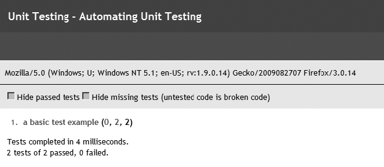

### 18.1.2　解决方案

虽然有用于JavaScript的其他单元测试框架，但我们将关注QUnit（<a class="my_markdown" href="['http://jquery-cookbook.com/go/qunit']">http://jquery-cookbook.com/go/qunit</a>）。QUnit是jQuery单元测试框架，广泛地用在各种项目中。

要使用QUnit，需要在网页中包含jQuery和两个QUnit文件。QUnit包含测试运行器和测试框架 `testrunner.js` ，以及设置测试套件页面样式，显示测试结果的 `testsuite.css：`

```css
<!DOCTYPE html>
<html>
<head>
　<title>QUnit basic example</title>
　<script src="http://code.jquery.com/jquery-latest.js"></script>
　<link rel="stylesheet"
href="http://jqueryjs.googlecode.com/svn/trunk/qunit/testsuite.css" type="text/css"
media="screen" />
　<script type="text/javascript"
src="http://jqueryjs.googlecode.com/svn/trunk/qunit/testrunner.js"></script>
<script type="text/javascript">
　　test("a basic test example", function() {
　　ok( true, "this test is fine" );
　　var value = "hello";
　　equals( value, "hello", "We expect value to be hello" );
　　});
</script>
</head>
<body>
　<div id="main"></div>
</body>
</html>

```

在浏览器中打开以上文件可以看到如图18-1的结果。


<center class="my_markdown"><b class="my_markdown">图18-1　浏览器中的测试结果</b></center>

`<body>` 元素中唯一必需的标记是具有 `id="main"` 属性的 `<div>` 。这对于所有QUnit测试都是必需的，即使元素本身为空也不例外。该元素提供了测试夹具，这将在秘诀18.6中解释。

有趣的部分是 `testrunner.js` 包含代码之后的 `<script>` 元素。它由对 `test` 函数的调用组成，使用了两个参数：以后用于显示测试结果的测试名称字符串，以及一个函数。该函数包含实际的测试代码，包括一个或者多个断言。该示例使用了两个断言 `ok()` 和 `equals()` ，秘诀18.2将介绍这些断言。

注意，代码中没有 `document-ready` 块。测试运行器会处理相关的工作：调用 `test()` 只是将测试添加到队列，它的执行被推迟，由测试运行器控制。

