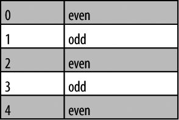

### 2.3.2　解决方案

根据你想要选择的元素，可以随意使用如下的过滤器。这些过滤器看上去很像CSS的伪类，但是在jQuery中它们称作过滤器。

`:first`

匹配选中的第一个元素。

`:last`

匹配选中的最后一个元素。

`:even`

匹配索引为偶数的元素（索引从0开始）。

`:odd`

匹配索引为奇数的元素（索引从0开始）。

`:eq(n)`

按照索引（n）匹配单个元素。

`:lt(n)`

匹配索引小于n的所有元素。

`:gt(n)`

匹配索引大于n的所有元素。

假设下面HTML标记：

```css
<ol>
　　 <li>First item</li>
　　 <li>Second item</li>
　　 <li>Third item</li>
　　 <li>Fourth item</li>
</ol>

```

列表中的第一项可以许多不同的方式选择：

```css
jQuery('ol li:first');
jQuery('ol li:eq(0)');
jQuery('ol li:lt(1)');

```

注意 `eq()` 和 `lt()` 过滤器都接受一个数字参数；因为索引从0开始，所以第一项为0，第二项为1，以此类推。

表格行中的交替样式是常见的需求，可以用 `:even` 和 `:odd` 过滤器实现：

```css
<table>
　　 <tr><td>0</td><td>even</td></tr>
　　 <tr><td>1</td><td>odd</td></tr>
　　 <tr><td>2</td><td>even</td></tr>
　　 <tr><td>3</td><td>odd</td></tr>
　　 <tr><td>4</td><td>even</td></tr>
</table>

```

可以根据每个表格行的索引应用不同的类：

```css
jQuery('tr:even').addClass('even');

```

在CSS样式表中必须指定对应的类（ `even` ）：

```css
table tr.even {
　　 background: #CCC;
}

```

这段代码产生的效果如图2-1所示。


<center class="my_markdown"><b class="my_markdown">图2-1　偶数行为暗色的表格</b></center>

