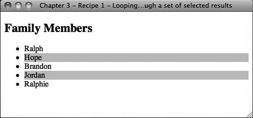

### 3.1.3　讨论

> 尽管这是 `$().each()` 最显而易见的用法，但是并不是处理交替背景颜色的最有效手段。可以用一行代码实现这一功能：
> 所需要做的是在CSS中将所有 `<li>` 元素设置为 `.even` 类，这样就可以用jQuery将索引为奇数的 `<li>` 元素设置为 `.odd` 类。

jQuery提供了一个核心方法，可以用它来循环读取选择的DOM元素集。 `$().each()` 就是jQuery的 `for` 循环，它将在集合中循环，并为集合中的每个元素提供一个单独的函数作用域。 `$().each()` 专用于jQuery对象中的循环。

警告

```css
$("ul > li:odd").addClass("odd");

```

> `$().each()` ；不同于jQuery工具方法 `jQuery.each(object, callback)；` 。 `jQuery.each` 方法是更通用化的循环方法，能够在对象和数组中循环。关于 `jQuery.each()` 的更多信息参见jQuery的在线文档：  `
> <a class="my_markdown" href="['http://docs.jquery.com/Utilities/jQuery.each']">http://docs.jquery.com/Utilities/jQuery.each</a>
> ` 。

在每次循环中，获取主选择集中当前元素的 `href` 属性。可以通过 `this` 关键字获取当前的DOM元素，然后将其包装在jQuery对象 `$(this)` 中，这样就可以对它执行jQuery方法/操作——在例子中是从DOM元素中提取 `href` 属性。最后的操作是将href属性赋值给一个全局数组 `urls` 。

我们已经看到，URL数组用逗号相互连接并在一个警告框中显示。还可以将这个列表添加到一个无序列表DOM元素显示给用户。更实用的方法是，可以将URL列表格式化为JSON格式，发送到服务器，以便在数据库中处理。

下面我们来看看另一个使用 `$().each()；` 的例子。这个例子可能是 `$().each()；` 最显而易见的用法。假定有一个无序的名称列表，希望突出显示每个名称。实现方法是为所有列表项设置交替的背景颜色：

```css
<!DOCTYPE html
　　 PUBLIC "-//W3C//DTD XHTML 1.0 Transitional//EN"
　　 "http://www.w3.org/TR/xhtml1/DTD/xhtml1-transitional.dtd">
<html xmlns="http://www.w3.org/1999/xhtml">
<head>
　　 <meta http-equiv="Content-Type" content="text/html;charset=UTF-8" />
　　 <title>Chapter 3 - Recipe 1 - Looping through a set of selected results</title>
　　 <style type="text/css">
　　　　　.even { background-color: #ffffff; }
　　　　　.odd { background-color: #cccccc; }
　　 </style>
　　 <script src="http://ajax.googleapis.com/ajax/libs/jquery/1.3.2/jquery.min.js "
type="text/javascript"></script>
　　 <script type="text/javascript">
　　　　　 (function($){
　　　　　　　 $(document).ready(function() {
　　　　　　　　　　$("ul > li").each(function(i) {
　　　　　　　　　　　　 if (i % 2 == 1)
　　　　　　　　　　　　 {
　　　　　　　　　　　　　　　$(this).addClass("odd");
　　　　　　　　　　　　 }
　　　　　　　　　　　　 else
　　　　　　　　　　　　 {
　　　　　　　　　　　　　　　$(this).addClass("even");
　　　　　　　　　　　　 }
　　　　　　　　　　});
　　　　　　　 });
　　　　　})(jQuery);
　　 </script>
</head>
<body>
　　 <h2>Family Members</h2>
　　 <ul>
　　　　　<li>Ralph</li>
　　　　　<li>Hope</li>
　　　　　<li>Brandon</li>
　　　　　<li>Jordan</li>
　　　　　<li>Ralphie</li>
　　 </ul>
</body>
</html>

```

图3-1展示了上述代码的输出效果。


<center class="my_markdown"><b class="my_markdown">图3-1　代码输出</b></center>

在循环读取每个 `<li>` 元素时，测试当前索引（作为执行函数时的唯一参数）除以2的余数是否为1，根据这个条件设置CSS类（.odd或者.even）。

注意

`$.each()；` 的基本功能是通过索引的引用循环读取匹配集合中的每个元素，执行某种操作，然后转到匹配集中的下一个元素，直到集合中所有元素都处理完。

