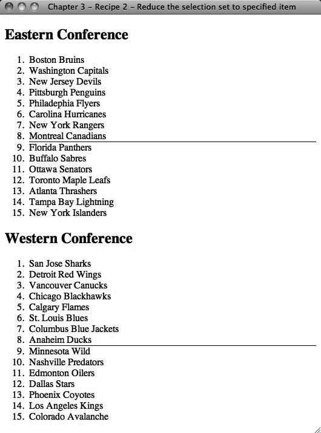

### 3.2.2　解决方案

使用jQuery选择元素之后，可以链接 `.eq()` 方法并传入你想要处理的选择集索引。

注意

> 选择集的索引值从0开始，选择集中的第一个项是 `$().eq(0)` ；这里的0代表选择集中的第1项。 `$ ().eq(4)；` 代表的是第5项。

我们以美国全国冰球联赛（NHL）季末排名为例，说明显示哪些球队进入季后赛，哪些球队被淘汰的方法。我们需要做的是按照赛季结束时的积分列出每个联盟中的所有球队。因为每个联盟的前8名有资格进入季后赛，所以只需要在每个列表中找到8个列表项，然后画上一条线：

```css
<!DOCTYPE html
　　 PUBLIC "-//W3C//DTD XHTML 1.0 Transitional//EN"
　　 "http://www.w3.org/TR/xhtml1/DTD/xhtml1-transitional.dtd">
<html xmlns="http://www.w3.org/1999/xhtml">
<head>
　　 <meta http-equiv="Content-Type" content="text/html;charset=UTF-8" />
　　 <title>Chapter 3 - Recipe 2 - Reducing the selection set to specified item</title>
　　 <script type="text/javascript"
src="http://ajax.googleapis.com/ajax/libs/jquery/1.3.2/jquery.min.js"></script>
　　 <script type="text/javascript">
　　　　　 (function($){
　　　　　　　 $(document).ready(function(){
　　　　　　　　　　$("ol#east > li").eq(7).css("border-bottom", "1px solid #000000");
　　　　　　　　　　$("ol#west > li").eq(7).css("border-bottom", "1px solid #000000");
　　　　　　　 });
　　　　　})(jQuery);
　　 </script>
</head>
<body>
　　 <h2>Eastern Conference</h2>
　　 <ol id="east">
　　　　　<li>Boston Bruins</li>
　　　　　<li>Washington Capitals</li>
　　　　　<li>New Jersey Devils</li>
　　　　　<li>Pittsburgh Penguins</li>
　　　　　<li>Philadelphia Flyers</li>
　　　　　<li>Carolina Hurricanes</li>
　　　　　<li>New York Rangers</li>
　　　　　<li>Montreal Canadians</li>
　　　　　<li>Florida Panthers</li>
　　　　　<li>Buffalo Sabres</li>
　　　　　<li>Ottawa Senators</li>
　　　　　<li>Toronto Maple Leafs</li>
　　　　　<li>Atlanta Thrashers</li>
　　　　　<li>Tampa Bay Lightning</li>
　　　　　<li>New York Islanders</li>
　　 </ol>
　　 <h2>Western Conference</h2>
　　 <ol id="west">
　　　　　<li>San Jose Sharks</li>
　　　　　<li>Detroit Red Wings</li>
　　　　　<li>Vancouver Canucks</li>
　　　　　<li>Chicago Blackhawks</li>
　　　　　<li>Calgary Flames</li>
　　　　　<li>St. Louis Blues</li>
　　　　　<li>Columbus Blue Jackets</li>
　　　　　<li>Anaheim Ducks</li>
　　　　　<li>Minnesota Wild</li>
　　　　　<li>Nashville Predators</li>
　　　　　<li>Edmonton Oilers</li>
　　　　　<li>Dallas Stars</li>
　　　　　<li>Phoenix Coyotes</li>
　　　　　<li>Los Angeles Kings</li>
　　　　　<li>Colorado Avalanche</li>
　　 </ol>
</body>
</html>

```

图3-2展示了代码的输出效果。


<center class="my_markdown"><b class="my_markdown">图3-2　代码输出</b></center>

正如你所看到的，我们只使用了一个排序列表按照球队的顺位列出它们，然后使用jQuery在每个列表中的第8个项上添加一个下边框。如果使用 `$("li").eq(7)；` ，就只会选择第一个列表中的对应元素，因为这个查询将页面上的所有 `<li>` 元素一起计数。

