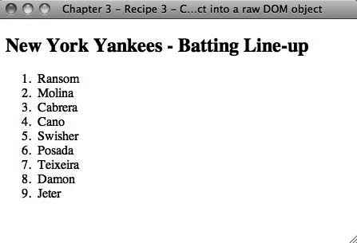

### 3.3.3　讨论

核心的 `get()` 方法可能非常有用，因为可以利用一些非JavaScript方法。假定有一个列表，需要以逆序显示。因为 `get()` 返回一个数组，所以可以使用原生的数组方法反向排序列表，然后重新显示：

```css
<!DOCTYPE html
　　 PUBLIC "-//W3C//DTD XHTML 1.0 Transitional//EN"
　　 "http://www.w3.org/TR/xhtml1/DTD/xhtml1-transitional.dtd">
<html xmlns="http://www.w3.org/1999/xhtml">
<head>
　　 <meta http-equiv="Content-Type" content="text/html;charset=UTF-8" />
　　 <title>Chapter 3 - Recipe 3 - Converting a selected jQuery object into a raw DOM
object</title>
　　 <script type="text/javascript"
src="http://ajax.googleapis.com/ajax/libs/jquery/1.3.2/jquery.min.js"></script>
　　 <script type="text/javascript">
　　 <!--
　　　　　 (function($){
　　　　　　　 $(document).ready(function(){
　　　　　　　　　　var lis = $("ol li").get().reverse();
　　　　　　　　　　$("ol").empty();
　　　　　　　　　　$.each(lis, function(i){
　　　　　　　　　　　　$("ol").append("<li>" + lis[i].innerHTML + "</li>");
　　　　　　　　　　});
　　　　　　　 });
　　　　　})(jQuery);
　　 //-->
　　 </script>
</head>
<body>
　　 <h2>New York Yankees - Batting Line-up</h2>
　　 <ol>
　　　　　<li>Jeter</li>
　　　　　<li>Damon</li>
　　　　　<li>Teixeira</li>
　　　　　<li>Posada</li>
　　　　　<li>Swisher</li>
　　　　　<li>Cano</li>
　　　　　<li>Cabrera</li>
　　　　　<li>Molina</li>
　　　　　<li>Ransom</li>
　　 </ol>
</body>
</html>

```

图3-4显示了输出的效果。


<center class="my_markdown"><b class="my_markdown">图3-4　代码输出</b></center>

