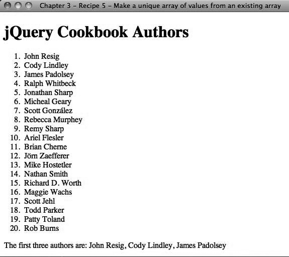

### 3.5.2　解决方案

假定在一个有序列表中列出一组人名。我们希望将这个有序列表中的前三个人名作为一个句子显示：

```css
<!DOCTYPE html
　　 PUBLIC "-//W3C//DTD XHTML 1.0 Transitional//EN"
　　 "http://www.w3.org/TR/xhtml1/DTD/xhtml1-transitional.dtd">
<html xmlns="http://www.w3.org/1999/xhtml">
<head>
　　 <meta http-equiv="Content-Type" content="text/html;charset=UTF-8" />
　　 <title>Chapter 3 - Recipe 5 - Making a unique array of values from an existing
array</title>
　　 <script type="text/javascript"
src="http://ajax.googleapis.com/ajax/libs/jquery/1.3.2/jquery.min.js"></script>
　　 <script type="text/javascript">
　　 <!--
　　　　　 (function($){
　　　　　　　 $(document).ready(function(){
　　　　　　　　　　var arr = $.map($("LI"), function(item, index){
　　　　　　　　　　　　while (index < 3)
　　　　　　　　　　　　{
　　　　　　　　　　　　　　return $(item).html();
　　　　　　　　　　　　}
　　　　　　　　　　　　return null;
　　　　　　　　　　});
　　　　　　　　　　$(document.body).append("<span>The first three authors are: " +
arr.join(", ") + "</span>");
　　　　　　　 });
　　　　　})(jQuery);
　　 //-->
　　 </script>
</head>
<body>
　　 <h1>jQuery Cookbook Authors</h1>
　　 <ol>
　　　　　<li>John Resig</li>
　　　　　<li>Cody Lindley</li>
　　　　　<li>James Padolsey</li>
　　　　　<li>Ralph Whitbeck</li>
　　　　　<li>Jonathan Sharp</li>
　　　　　<li>Michael Geary</li>
　　　　　<li>Scott González</li>
　　　　　<li>Rebecca Murphey</li>
　　　　　<li>Remy Sharp</li>
　　　　　<li>Ariel Flesler</li>
　　　　　<li>Brian Cherne</li>
　　　　　<li>Jörn Zaefferer</li>
　　　　　<li>Mike Hostetler</li>
　　　　　<li>Nathan Smith</li>
　　　　　<li>Richard D. Worth</li>
　　　　　<li>Maggie Wachs</li>
　　　　　<li>Scott Jehl</li>
　　　　　<li>Todd Parker</li>
　　　　　<li>Patty Toland</li>
　　　　　<li>Rob Burns</li>
　　 </ol>
</body>
</html>

```

图3-5展示了输出的效果。


<center class="my_markdown"><b class="my_markdown">图3-5　代码输出</b></center>

先从有序列表中建立一个 `<li>` 元素数组。将使用一个jQuery选择器选择页面上的所有 `<li>` 元素，并将其作为jQuery工具方法 `$.map()` 的参数，该方法将一个现有的数组“映射”到另一个数组。第二个参数是一个函数，循环读取数据、执行转换，并返回存储在新数组中的新值。

在上述的例子中，循环读取自己制作的数组，仅返回前三个列表元素的 `html()` 值，并将这些值映射到新的数组中。然后，用连接方法将该数组转换为一个字符串，并将其注入文档的尾部。

