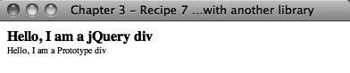

### 3.7.2　解决方案

假定你继承一个需要更新的网页，以前的程序员使用了另一个JavaScript程序库（如Prototype），而你仍然打算使用jQuery。这会导致冲突，根据两个程序库在页面头部排列的先后，其中一个程序库无法正常工作。

如果在同一个页面声明jQuery和Prototype，如：

```css
<script type="text/javascript"
src="http://ajax.googleapis.com/ajax/libs/prototype/1.6.0.3/prototype.js"></script>
<script type="text/javascript"
src="http://ajax.googleapis.com/ajax/libs/jquery/1.3.2/jquery.min.js"></script>

```

这会导致一个JavaScript错误：`element.dispatchEvent is not a function inprototype.js`.（ `element.dispatchEvent` 不是 `prototype.js` 中的函数）。幸好，jQuery提供了 `jQuery.noConflict()` 方法来解决这一问题：

```css
<!DOCTYPE html
　　 PUBLIC "-//W3C//DTD XHTML 1.0 Transitional//EN"
　　 "http://www.w3.org/TR/xhtml1/DTD/xhtml1-transitional.dtd">
<html xmlns="http://www.w3.org/1999/xhtml">
<head>
　　 <meta http-equiv="Content-Type" content="text/html;charset=UTF-8" />
　　 <title>Chapter 3 - Recipe 7 - Configuring jQuery to free up a conflict with
another library</title>
　　 <script type="text/javascript"
src="http://ajax.googleapis.com/ajax/libs/prototype/1.6.0.3/prototype.js"></script>
　　 <script type="text/javascript"
src="http://ajax.googleapis.com/ajax/libs/jquery/1.3.2/jquery.min.js"></script>
　　 <script type="text/javascript">
　　 <!--
　　　　　jQuery.noConflict();
　　　　　// Use jQuery via jQuery(...)
　　　　　jQuery(document).ready(function(){
　　　　　　 jQuery("div#jQuery").css("font-weight","bold");
　　　　　});
　　　　　// Use Prototype with $(...), etc.
　　　　　document.observe("dom:loaded", function() {
　　　　　　　 $('prototype').setStyle({
　　　　　　　　　　fontSize: '10px'
　　　　　　　 });
　　　　　});
　　 //-->
　　 </script>
</head>
<body>
　　 <div id="jQuery">Hello, I am a jQuery div</div>
　　 <div id="prototype">Hello, I am a Prototype div</div>
</body>
</html>

```

图3-7展示了输出效果。


<center class="my_markdown"><b class="my_markdown">图3-7　代码输出</b></center>

当调用 `jQuery.noConflict()` 时，它会将 `$` 变量的控制权交还给首先实现它的程序库。在释放 `$` 变量之后，就只能用 `jQuery` 变量访问jQuery。例如，在过去一直使用 `$("div p")` 的地方，现在要使用 `jQuery("div p")` 。

