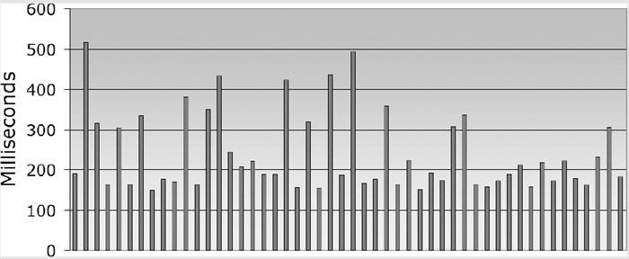

### 5.8.3　讨论

> 小心Firebug!如果在计时的页面上启用Firebug，它可能对结果有很大的影响。JavaScript的 `eval()` 函数被jQuery 1.3.2及更早的版本用来解析下载的JSON数据，它所受到的影响达到了极端的程度：按照秘诀5.11中的格式，10 000个姓名/地址的数组在Firefox中正常花费2.2秒，而启用Firebug的脚本（Script）窗格之后花费了55秒。后来的jQuery使用 `Function()` ，不会受到Firebug的影响。
> 如果Firebug严重影响你的页面，而你无法找到解决方法，可以检测Firebug并显示一个警告：

分析器是寻找代码中最耗时的部分的一种手段。你可能已经有了至少一种好的JavaScript分析器。Firebug有一个分析器，IE 8和Safari 4也自带了这类工具。这些分析器都是全功能的：可以启动分析，与页面交互，停止分析，然后获得一个报告，说明每个函数中花费的时间。这可能已经足以告诉你所需要加速的代码。

也可以在网上搜索“jquery profiler”，寻找专用于jQuery的分析器。这些分析器可以剖析选择器性能，更深入地了解jQuery函数性能。

为了真正细致地分析，需要分析比函数更小的代码独立段，这时可以用几行代码编写一个简单的分析器。你可能已经用这种临时性的风格编写过代码：

```css
<div id="firebugWarning" style="display:none;">
　　 Your warning here
</div>
$(document).ready(function() {
　　 if(window.console && console.firebug)
　　　　　$('#firebugWarning').show();
});

```

```css
var t1 = +new Date;
// ... do stuff ...
var t2 = +new Date;
alert( ( t2 - t1 ) + ' milliseconds' );

```

注意

> 代码中的 `+new Date` 只是较为熟悉的 `new Date().getTime():` 的简单方式，返回以毫秒表示的当前时间。

为什么这个语句可以正常工作？ `newDate` 部分是一样的；它返回一个代表当前时间的 `Date` 对象（因为没有参数，所以 `()` 是可选的）。 `+` 运算符将对象转换为一个数值。JavaScript将对象转换为一个数值的方法是调用对象的 `.valueOf()` 方法。 `Date` 对象的 `.valueOf()` 方法正好和 `.getTime()` 方法相同，给出以毫秒表示的时间。

可以仅用15行代码就建立更通用和更易用的函数：

```css
(function() {
　　 var log = [], first, last;
　　 time = function( message, since ) {
　　　　　var now = +new Date;
　　　　　var seconds = ( now - ( since || last ) ) / 1000;
　　　　　log.push( seconds.toFixed(3) + ': ' + message + '<br />' );
　　　　　return last = +new Date;
　　 };
　　 time.done = function( selector ) {
　　　　　time( 'total', first );
　　　　　$(selector).html( log.join('') );
　　 };
　　 first = last = +new Date;
})();

```

现在有一个 `time()` 函数，可以再想要记录自最后一个 `time()` 调用后经过的时间（或者，可以选择记录从指定的某个时间后经过的时间）。当我们做好准备报告结果时，调用 `time.done()` 。下面是一个例子：

```css
// do stuff
time( 'first' );
// do more stuff
time( 'second' );
// and more
time( 'third' );
time.done( '#log' );

```

上述JavaScript代码需要在页面上添加如下HTML代码：

```css
<div id="log">
</div>

```

代码运行后， `<div>` 中将填写如下列表：

```css
0.102 first
1.044 second
0.089 third
1.235 total

```

我们可以看到 `time('first')` 和 `time('second')` 调用之间花费的时间最长。

警告

对于许多优化应用，这样的代码可能足够了。但是如果需要测试的代码在循环中会怎么样呢？

```css
for( var i = 0; i < 10; ++i ) {
　　 // do stuff
　　 time( 'first' );
　　 // do more stuff
　　 time( 'second' );
　　 // and more
　　 time( 'third' );
}
time.done( '#log' );

```

现在，小分析器将显示第一个、第二个和第三个项各10次！这不难修复——当多次调用它时，只需要累加每个具体消息标签花费的时间就可以了：

```css
(function() {
　　 var log = [], index = {}, first, last;
　　 //累计指定消息所花费的时间
　　 //每个消息字符串都有自己的总计秒数
　　 function add( message, seconds ) {
　　　　　var i = index[message];
　　　　　if( i == null ) {
　　　　　　　 i = log.length;
　　　　　　　 index[message] = i;
　　　　　　　 log[i] = { message:message, seconds:0 };
　　　　　}
　　　　　log[i].seconds += seconds;
　　 }
　　 time = function( message, since ) {
　　　　　var now = +new Date;
　　　　　add( message, ( now - ( since || last ) ) / 1000 );
　　　　　return last = +new Date;
　　 }
　　 time.done = function( sel ) {
　　　　　time( 'total', first );
　　　　　$(sel).html(
　　　　　　　 $.map( log, function( item ) {
　　　　　　　　　　return(
　　　　　　　　　　　　 item.seconds.toFixed(3) +
　　　　　　　　　　　　 ': ' +
　　　　　　　　　　　　 item.message + '<br />'
　　　　　　　　　　);
　　　　　　　 }).join('')
　　　　　);
　　 };
　　 first = last = +new Date;
})();

```

经过这样的修改，从循环中可以得到有用的结果：

```css
0.973 first
9.719 second
0.804 third
11.496 total

```

> **当计时测试的结果变化时**
> 当在网页上运行计时测试的时候，不会每次都得到相同的结果。实际上，如果重新加载页面或者多次重新运行测试，计时的结果可能有很大不同。
> 你应该怎么做才能获得“真实”的数字？取结果的平均值吗？
> 可能不行。下面是秘诀5.11中的fillTable()连续运行50次的统计图表，每次运行之间间隔大约10秒：
> 
> 这里有一个特别的模式：大部分运行时间介于150～200毫秒之间，一小部分零散的运行花费的时间更长一些。175毫秒左右似乎是真实的运行时间，而花费时间很多的运行可能是受到机器上的其他进程影响。
> 有些花费时间较长的运行结果可能是由于浏览器垃圾收集机制的影响。因为很难区分其他进程花费的时间，所以最实用的处理方法可能是不考虑这些异常值。

