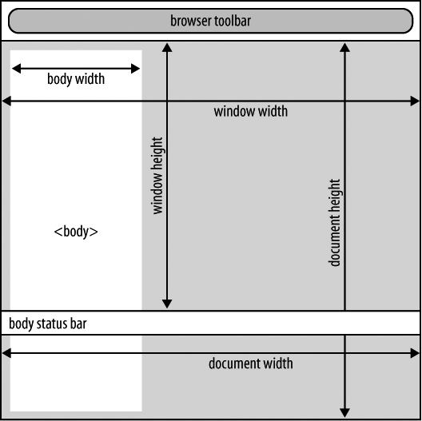

### 6.1.3　讨论

理解文档宽度和高度可能（而且很有可能）与窗口的宽度和高度不同这一点很重要。窗口的尺寸指的是视区（浏览器可用于显示文档的部分）的大小。在大部分情况下，文档的高度大于窗口的高度。文档的宽度总是至少等于窗口的宽度，但也可以大于窗口宽度。在图6-1中， `jQuery('body').width() < jQuery(docu ment).width()` ，
`jQuery(document).width() == jQuery(window).width()` 。如果文档主体宽于窗口，文档宽度相应增加。

<b class="my_markdown">图6-1　文档大小和窗口大小往往不同</b>

如果你想要设置元素的尺寸， `width` 和 `height` 方法也可以接受参数。参数可以是整数——这时它被看做像素数，也可以是字符串——这是它被看做类似CSS的度量方式（也就是 `$('#foo').width('300px')` 这样的写法）。

