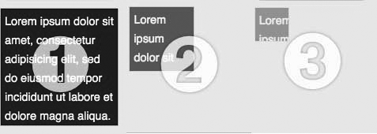

### 7.1.3　讨论

正如在前面的解决方案中所看到的那样，滑动和淡入/淡出方法比起直接显示（和隐藏）以及切换方法前进了一步。滑动方法有如下几种：

+ `slideUp`
+ `slideDown`
+ `slideToggle`

淡入/淡出方法没有明确的切换功能，但是也可以实现该功能，淡入/淡出方法有如下几个：

+ `fadeIn`
+ `fadeOut`
+ `fadeTo`

除了 `fadeTo` 之外，其余方法都以 `speed` 作为第一个参数，第二个参数则是一个回调函数，这两个参数都是可选的。回调函数在动画完成时调用，把上下文设置为动画应用的元素；也就是说， `this` 变量指的是当前元素。

我选择 `animate` 代替 `fadeTo` 切换不透明度的原因是 `fadeTo` 的参数很容易误解。如果新的开发人员查看这段代码，使用动画函数几乎就和普通的英语没什么两样，因而更容易阅读和理解代码中所发生的操作。

还要再补充一点，如果在 `show` （或者 `hide` ）方法中使用速度值，该方法将在一次动画中变动高度、宽度、不透明度、外边距和内边距，如图7-1所示。

<b class="my_markdown">图7-1　向show方法传递速度参数，
 在动画中变动高度、宽度、内边距、外边距和不透明度</b>

