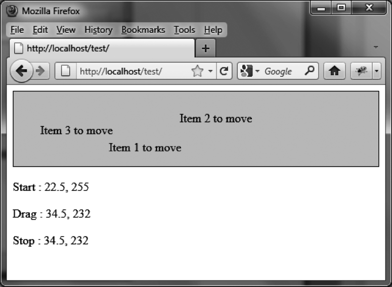

### 10.3.1　在移动过程中执行额外处理

让我们来试试显示元素在移动过程中的坐标位置（见图10-1）。

```css
 <script src = jquery.js></script> 
 <script src = jqueryui/js/jquery-ui-1.8.16.custom.min.js></script> 
 <link rel=stylesheet type=text/css 
　　　　href=jqueryui/css/smoothness/jquery-ui-1.8.16.custom.css /> 
 <div id=div1 style="border:solid 1px;background-color:gainsboro;"> 
　 <span>Item 1 to move</span><br /><br /> 
　 <span>Item 2 to move</span><br /><br /> 
　 <span>Item 3 to move</span> 
 </div> 
 <p>Start : <span id=start></span></p> 
 <p>Drag : <span id=drag></span></p> 
 <p>Stop : <span id=stop></span></p> 
 <script> 
$("#div1 span").draggable ({ 
　start : function (event, ui) 
　{ 
　　$("#start").text (ui.offset.top + ", " + ui.offset.left); 
　}, 
　drag : function (event, ui) 
　{ 
　　$("#drag").text (ui.offset.top + ", " + ui.offset.left); 
　}, 
　stop : function (event, ui) 
　{ 
　　$("#stop").text (ui.offset.top + ", " + ui.offset.left); 
　}
});
</script>
```

起始的移动会触发 `start` 事件，而后的移动将由 `drag` 事件管理。当鼠标按键松开时， `stop` 事件被触发。


<center class="my_markdown"><b class="my_markdown">图10-1　拖动过程中的坐标</b></center>

