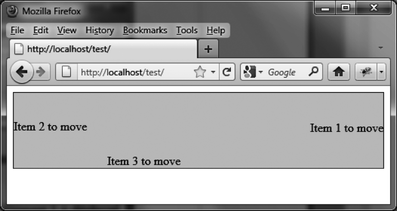
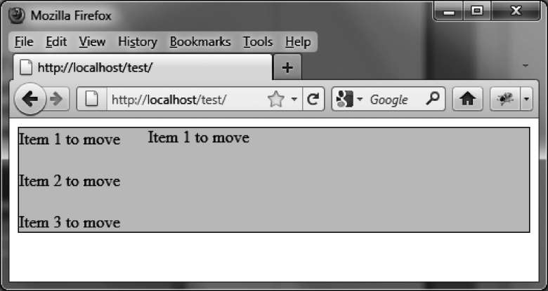
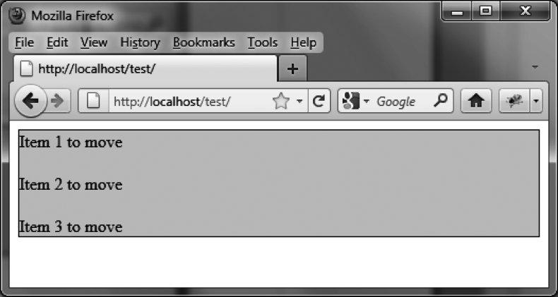
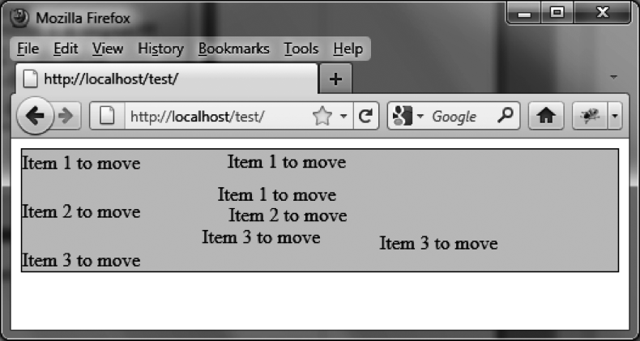
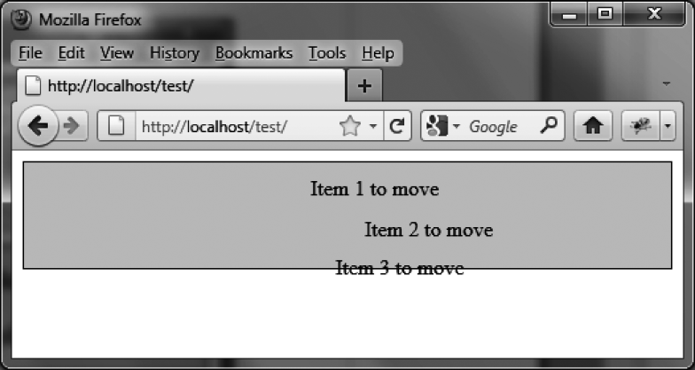

### 10.3.2　给移动施加一些限制

你可以限制元素在屏幕上的移动。下面我们就来看看各种可能的限制方案。

#### 1．将移动限制在给定的空间内

下面，我们将对前面的示例做一些增补，以使 `<span>` 元素不能被移到父元素 `<div>` 外面。而在目前的代码里，由于没有做任何限制，任何使用 `draggable (options)` 方法的元素都可以在页面上被随处拖动。

```css
<script src = jquery.js></script> 
<script src = jqueryui/js/jquery-ui-1.8.16.custom.min.js></script> 
<link rel=stylesheet type=text/css 
　　　 href=jqueryui/css/smoothness/jquery-ui-1.8.16.custom.css /> 
<div id=div1 style="border:solid 1px;background-color:gainsboro;"> 
　<span>Item 1 to move</span><br /><br /> 
　<span>Item 2 to move</span><br /><br /> 
　<span>Item 3 to move</span> 
</div> 
<script> 
$("#div1 span").draggable ({ 
　 containment : "#div1" 
}); 
</script> 
```

`containment` 选项指定了移动的限制范围。此时 `<span>` 元素不能再被移到 `id` 名为 `div1` 的 `<div>` 元素范围外（如图10-2所示）。


<center class="my_markdown"><b class="my_markdown">图10-2　将移动局限在一个 `<div>` 元素内</b></center>

由于此例中的 `<div>` 元素同时也是被拖动元素的父元素，限制语句也可以写作：

```css
containment:"parent"
```

此外还可以单独在水平或垂直方向上施加移动限制，我们会在下一节看到具体的使用。

#### 2．将移动限制在水平或垂直方向

我们可以把 `options.axis` 值设置为 `"x"` 或 `"y"` ，来限制元素只能水平或垂直地运动。例如，若要使 `<span>` 元素只能水平移动，我们可以编写如下代码（如粗体所示）：

```css
<script src = jquery.js></script> 
<script src = jqueryui/js/jquery-ui-1.8.16.custom.min.js></script> 
<link rel=stylesheet type=text/css 
　　　　　href=jqueryui/css/smoothness/jquery-ui-1.8.16.custom.css /> 
<div id=div1 style="border:solid 1px;background-color:gainsboro;"> 
　 <span>Item 1 to move</span><br /><br /> 
　 <span>Item 2 to move</span><br /><br /> 
　 <span>Item 3 to move</span> 
</div> 
<script> 
$("#div1 span").draggable ({ 
　 axis : "x" 
 }); 
</script> 
```

在此基础上进一步将移动范围限制在父元素 `<div>` 内，则需要加上 `options.containment` ：

```css
<script> 
$("#div1 span").draggable ({ 
　axis : "x", 
　containment : "parent" 
}); 
</script> 
```

#### 3．移动一个元素的副本

下面，我们将尝试移动一个当前所选元素的副本（如图10-3所示）。


<center class="my_markdown"><b class="my_markdown">图10-3　移动一个复制过的元素</b></center>

要实现这一点，只需使用 `options.helper` 选项，为其赋值 `"clone"` ：

```css
<script src = jquery.js></script> 
<script src = jqueryui/js/jquery-ui-1.8.16.custom.min.js></script> 
<link rel=stylesheet type=text/css 
　　　 href=jqueryui/css/smoothness/jquery-ui-1.8.16.custom.css /> 
<div id=div1 style="border:solid 1px;background-color:gainsboro;"> 
　<span>Item 1 to move</span><br /><br /> 
　<span>Item 2 to move</span><br /><br /> 
　<span>Item 3 to move</span> 
</div> 
<script> 
$("#div1 span").draggable ({ 
　 helper : "clone" 
}); 
</script> 
```

在图10-3中，第一个元素被拖动了——不过实际上被拖动的仅仅是其副本，原元素仍停留在原处。如果你松开鼠标按键，副本会立即消失，而原元素依旧“岿然不动”（见图10-4）。实际移动的是副本元素，且其会在移动结束时从DOM树中被移除。


<center class="my_markdown"><b class="my_markdown">图10-4　原元素原地不动</b></center>

现在我们想要被拖动的副本元素能够留在页面上。要实现这一点，我们必须在拖动结束的位置再创建一个一样的新元素（结果如图10-5所示）。

```css
<script src = jquery.js></script> 
<script src = jqueryui/js/jquery-ui-1.8.16.custom.min.js></script> 
<link rel=stylesheet type=text/css 
　　　 href=jqueryui/css/smoothness/jquery-ui-1.8.16.custom.css /> 
<div id=div1 style="border:solid 1px;background-color:gainsboro;"> 
　<span>Item 1 to move</span><br /><br /> 
　<span>Item 2 to move</span><br /><br /> 
　<span>Item 3 to move</span> 
</div> 
<script> 
$("#div1 span").draggable ({ 
　helper : "clone", 
　stop : function (event, ui) 
　{ 
　　ui.helper.clone ().appendTo ($(this).parent ()); 
　} 
}); 
</script> 
```


<center class="my_markdown"><b class="my_markdown">图10-5　移动一个副本元素，并使其在移动结束后仍留在页面上</b></center>

在移动结束的时候（即调用 `stop ()` 方法时），我们先使用 `ui.helper.clone ()` 方法复制被移动的元素，然后使用 `appendTo ()` 方法将其插入到和被移动的 `<span>` 元素同级的页面位置。

由于每次移动 `<span>` 元素的时候都创建并保留了一个副本，所以页面上留下了几个一模一样的元素。

我们还可以进一步改进这段脚本，通过删除原元素来避免多个副本的生成。这样一来，在拖动之后，原元素就会自然消失（被移动后的副本元素所替代）：

```css
<script src = jquery.js></script> 
<script src = jqueryui/js/jquery-ui-1.8.16.custom.min.js></script> 
<link rel=stylesheet type=text/css 
　　　 href=jqueryui/css/smoothness/jquery-ui-1.8.16.custom.css /> 
<div id=div1 style="border:solid 1px;background-color:gainsboro;"> 
　<span>Item 1 to move</span><br /><br /> 
　<span>Item 2 to move</span><br /><br /> 
　<span>Item 3 to move</span> 
</div> 
<script> 
$("#div1 span").draggable ({ 
　helper : "clone", 
　stop : function (event, ui) 
　{ 
　　ui.helper.clone ().appendTo ($(this).parent ()); 
　　$(this).remove (); 
　} 
}); 
</script> 
```

`$(this).remove ()` 语句在移动结束后删除了原元素。

这段脚本的运行结果如图10-6所示。


<center class="my_markdown"><b class="my_markdown">图10-6　原元素被移除了</b></center>

然而要注意的是，每一个被移动后的元素是不能被再次拖动的！我们确实是在页面上插入了一个新的复制过的元素，但并没有赋予它可拖动的特性。要使其能够移动，我们还是需要使用 `draggable ()` 方法。如此一来，移动完成的元素会被复制，然后不断重复移动和复制的过程：

```css
<script src = jquery.js></script> 
<script src = jqueryui/js/jquery-ui-1.8.16.custom.min.js></script> 
<link rel=stylesheet type=text/css 
　　　 href=jqueryui/css/smoothness/jquery-ui-1.8.16.custom.css /> 
<div id=div1 style="border:solid 1px;background-color:gainsboro;"> 
　<span>Item 1 to move</span><br /><br /> 
　<span>Item 2 to move</span><br /><br /> 
　<span>Item 3 to move</span> 
</div> 
<script> 
$("#div1 span").draggable ({ 
　helper : "clone" 
}).bind ("dragstop", f = function (event, ui) 
{ 
　 ui.helper.clone () 
　　　　　　　.appendTo ($(this).parent ()) 
　　　　　　　.draggable ( { helper : "clone" } ) 
　　　　　　　.bind ("dragstop", f); 
　 $(this).remove (); 
}); 
</script> 
```

在这里，我们使用 `dragstop` 事件替代之前使用的 `stop ()` 方法。事实上，对于副本元素来说，使用这一事件处理方法非常有必要，所以最简单的将其传递的方式就是使用 `bind ("dragstop",f)` 方法了，而这里的函数 `f` 就是前面已经使用过的回调函数。

