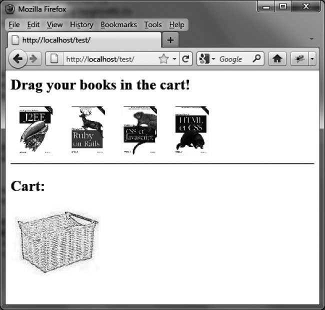
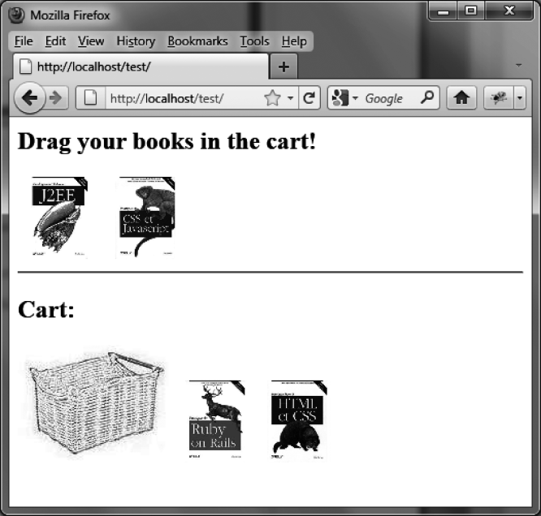

### 10.6.1　使用拖放功能来创建一辆购物车

让我们来使用放置功能来管理一辆图书购物车。图书以图片的方式显示，用户可以将它们拖曳到一辆购物车中来购买（如图10-7所示）。每一本书都可以被移动，而购物车可以用来放置它们。当图书被放入购物车时，它会被摆放在购物车的右侧（如图10-8所示）。

```css
<script src=jquery.js></script> 
<script src=jqueryui/development-bundle/ui/jquery-ui-1.8.4.custom.js></script> 
<link rel=stylesheet type=text/css 
　　　 href="jqueryui/development-bundle/themes/smoothness/jquery.ui.all.css" /> 
<h2> Drag your books in the cart! </h2> 
<div id=books> 
　 
　 
　 
　 
</div> 
<hr /> 
<h2> Cart: </h2> 
<div id=shopping> 
　 
</div> 
<script> 
$("div#books img").draggable ({ 
　 revert : "invalid" 
}); 
$("div#shopping img.basket").droppable ({ 
　drop : function (event, ui) 
　{ 
　　$("div#shopping").append (ui.draggable); 
　　$(ui.draggable).css ({ position:"relative", top:"0px", left:"0px" }) 
　　　　　　　　　　 .draggable ("disable") 
　　　　　　　　　　 .css ({ opacity : 1 }); 
　} 
}); 
</script> 
```

`$("div#books img").draggable ()` 方法使每一张图片都变得可以移动，而购物车则通过 `$("div#shopping img.basket").droppable ()` 方法被定义成了一个保管元素。如果没有被正确放置到购物车中， `revert` 选项 `"invalid"` 会把那些被拖动的元素重置到原始位置。


<center class="my_markdown"><b class="my_markdown">图10-7　空的购物车</b></center>


<center class="my_markdown"><b class="my_markdown">图10-8　购物车中有了两本书</b></center>

`drop ()` 方法能够在给购物车放置图书时施加额外处理。此时被移动的图片（即 `ui.draggable` ）会被添加到购物车的末尾（通过 `append ()` 方法）。然后使用 `css ()` 方法将图书的图片从原先的位置移除，而在购物车篮的右侧赋予其一个新的位置。最后使用 `draggable ("disable")` 方法禁止用户再次移动这个图片，并通过 `css ()` 方法将其透明度值改回1（因为 `draggable ("disable")` 方法会自动降低元素的透明度）。

