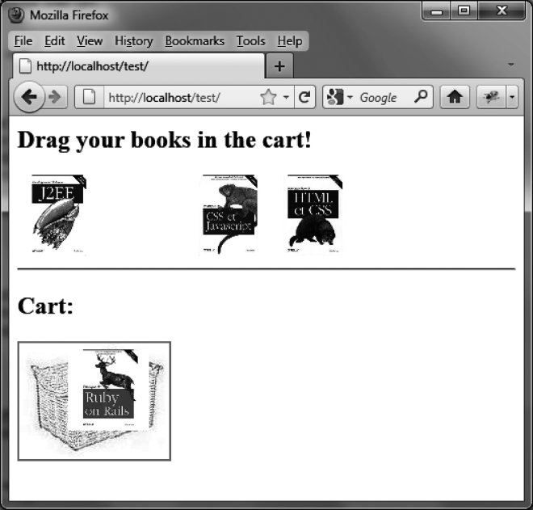

### 10.6.2　给购物车的放置过程添加视觉特效

当一本书的图片被拖入购物车时，暂时还没有任何视觉效果来提示你可以把图片放置在此处。

让我们来修改一下代码，使购物车能够在用户放置图书时出现一些响应。例如，可以显示一个红色的边框（如图10-9所示）。

```css
<script src = jquery.js></script> 
<script src = jqueryui/js/jquery-ui-1.8.16.custom.min.js></script> 
<link rel=stylesheet type=text/css 
　　　 href=jqueryui/css/smoothness/jquery-ui-1.8.16.custom.css /> 
<style type=text/css> 
　.basket { 
　　border : transparent solid 2px; 
　} 
　.hover { 
　　border-color : red; 
　} 
</style> 
<h2> Drag your books in the cart! </h2> 
<div id=books> 
　 
　 
　 
　 
</div> 
<hr /> 
<h2> Cart: </h2> 
<div id=shopping> 
　 
</div> 
<script> 
$("div#books img").draggable ({ 
　 revert : "invalid" 
}); 
$("div#shopping img.basket").droppable ({ 
　 hoverClass : "hover", 
　 drop : function (event, ui) 
　 { 
　　 $("div#shopping").append (ui.draggable); 
　　 $(ui.draggable).css ({ position:"relative", top:"0px", left:"0px" }) 
　　　　　　　　 　　 .draggable ("disable") 
　　　　　　　　 　　 .css ({ opacity : 1 }); 
　 } 
}); 
</script> 
```


<center class="my_markdown"><b class="my_markdown">图10-9　向购物车中放置元素时的视觉特效</b></center>

我们在脚本的 `droppable (options)` 方法中添加了 `hoverClass` 选项。这使得你可以指定一个或多个CSS类，在被接纳元素移动到保管元素上方时添加给保管元素。此例中的CSS类包含了一个 `border-`   `color:red` 的CSS样式。要使这个样式正常生效，我们最好先在 `basket` 类中（这个类会被保管元素，也就是购物车所使用）预设一个透明的边框，这样可以避免将元素移动到购物车中时造成的轻微抖动（如果不事先指定一个边框，此时添加的红色边框会改变保管元素的尺寸，造成一个抖动）。

