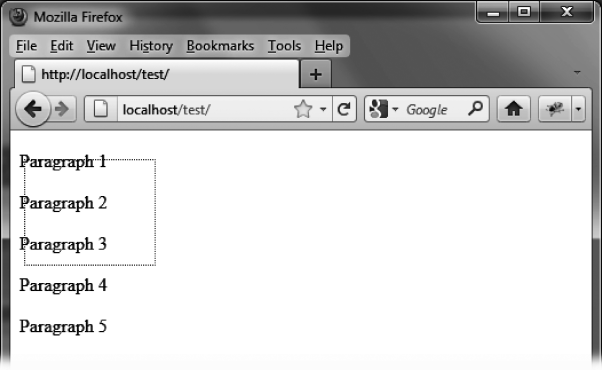

### 11.1　选择元素的基本用法

假设我们现在想写一段HTML代码来显示图11-1所示的选区。此例中有5个段落，我们用鼠标选择了前3个。随着鼠标的移动，页面上出现了一个由虚线形成的矩形框，代表着已经选择的区域。


<center class="my_markdown"><b class="my_markdown">图11-1　在HTML页面中选择元素</b></center>

可供选择的元素应该都放在同一个 `<div>` （或其他父元素）元素中。此元素的所有后代元素都可以被选择。

在 `<script>` 标签中，外层的 `<div>` 标签由jQuery UI的 `selectable ()` 方法管理：

```css
<script src = jquery.js></script> 
<script src = jqueryui/js/jquery-ui-1.8.16.custom.min.js></script> 
<link rel=stylesheet type=text/css 
　　　 href=jqueryui/css/smoothness/jquery-ui-1.8.16.custom.css /> 
<div id=div1> 
　<p> Paragraph 1 </p> 
　<p> Paragraph 2 </p> 
　<p> Paragraph 3 </p> 
　<p> Paragraph 4 </p> 
　<p> Paragraph 5 </p>　　 
</div> 
<script> 
$("#div1").selectable (); 
</script>
```

