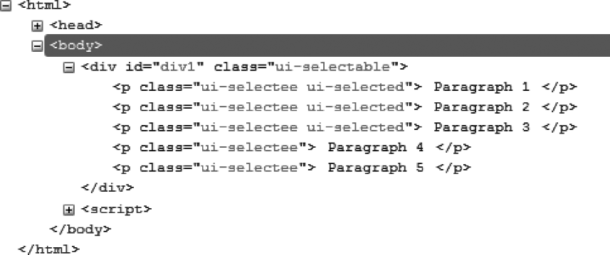
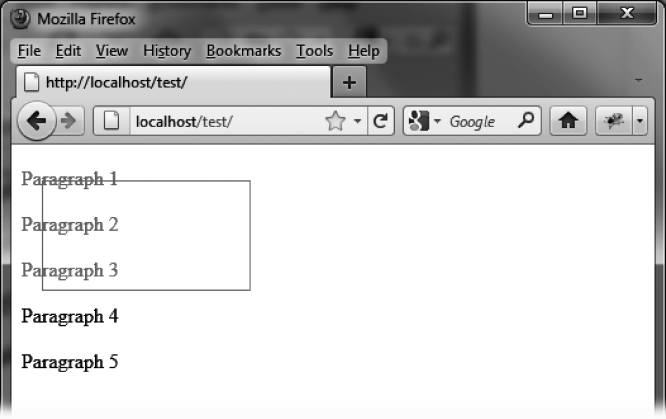
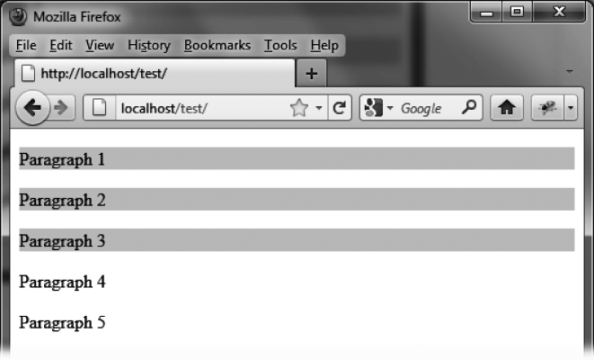
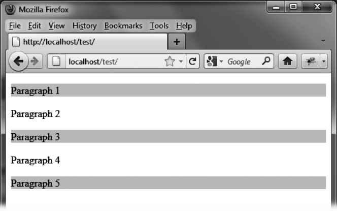

### 11.2　格式化内容

`selectable ()` 方法使用虚线矩形框来展示选区。此外，它还给那些可选及已选的HTML元素添加了新的CSS类。

正如图11-2中所示，在执行 `selectable ()` 方法之后，由jQuery UI生成的HTML代码已经改变了（图中的代码是用Firefox的Firebug扩展查看的）。


<center class="my_markdown"><b class="my_markdown">图11-2　由 `selectable ()` 方法创建的HTML代码</b></center>

外层的 `<div>` 元素被赋予了名为 `ui-selectable` 的CSS类，而它所包含的可选元素被加上了 `ui-selectee` 类。前3个正在被选择的段落拥有 `ui-selecting` 类。当鼠标按键松开时，最终被选的段落则会得到 `ui-selected` 类（取代 `ui-selecting` ）。

请注意，有一个 `<div>` 元素（类名为 `ui-selectable-helper` ）是被jQuery UI创建的，它被用来表示选区的虚线矩形框。当鼠标按键松开后，此元素会从页面上被移除。

你可以利用元素的CSS类来定制外观。例如，如果我们修改了和 `<p>` 元素相关的CSS类 `ui-selecting` 及 `ui-selected` ，就可以得到正在被选择和已经选中的元素的新样式。

可以通过在HTML页面中添加一个 `<style>` 标签来修改这些元素，使矩形选框和已选中的段落以实心红线的形式显示（如图11-3所示），而当鼠标按键松开的时候，已选段落的背景会显示为浅灰色（如图11-4所示）。

```css
<script src = jquery.js></script> 
<script src = jqueryui/js/jquery-ui-1.8.16.custom.min.js></script> 
<link rel=stylesheet type=text/css 
　　　 href=jqueryui/css/smoothness/jquery-ui-1.8.16.custom.css /> 
<style type=text/css> 
　p.ui-selecting { 
　　color : red; 
　} 
　p.ui-selected { 
　　background-color : gainsboro; 
　} 
　div.ui-selectable-helper { 
　　border-color : red; 
　　border-style : solid; 
　} 
</style> 
<div id=div1> 
　<p> Paragraph 1 </p> 
　<p> Paragraph 2 </p> 
　<p> Paragraph 3 </p> 
　<p> Paragraph 4 </p> 
　<p> Paragraph 5 </p> 
</div> 
<script> 
$("#div1").selectable (); 
</script>
```


<center class="my_markdown"><b class="my_markdown">图11-3　正在进行中的选区的自定义样式</b></center>


<center class="my_markdown"><b class="my_markdown">图11-4　自定义样式的已选元素</b></center>

用户可以在按住Ctrl键的同时单击来选择或是取消选择某个段落。例如，用户可以再选择第五段，同时取消选择第二段和第四段，如图11-5所示。


<center class="my_markdown"><b class="my_markdown">图11-5　修改原先的选区</b></center>

