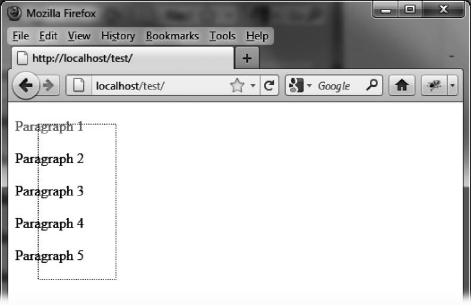

### 11.5.2　禁止选择某特定元素

默认情况下，可选元素的所有后代元素都是可选择的。 `filter` 选项则提供了一个选择器，可以明确指定我们希望用户能够选择哪些元素。例如，只允许选择第一个段落，代码如下：

```css
<script src = jquery.js></script>
<script src = jqueryui/js/jquery-ui-1.8.16.custom.min.js></script>
<link rel=stylesheet type=text/css
　　　 href=jqueryui/css/smoothness/jquery-ui-1.8.16.custom.css />
<style type=text/css>
　p.ui-selecting {
　　color : red; 
　}
　p.ui-selected {
　　background-color : gainsboro;
　} </style>
<div id=div1>
　<p> Paragraph 1 </p>
　<p> Paragraph 2 </p>
　<p> Paragraph 3 </p>
　<p> Paragraph 4 </p>
　<p> Paragraph 5 </p>
</div>
<script>
$("#div1").selectable ({
　filter : "p:first-child"
});
</script>
```

我们可以看到尝试选择图11-7中所有段落的显示结果。只有第一个段落被实际选中，尽管5个段落都被选区框中了。


<center class="my_markdown"><b class="my_markdown">图11-7　禁止除第一段外的其他段落被选中</b></center>

反过来，我们当然也能使用如下代码来单独禁止第一段被选中（如图11-8所示）。

```css
<script> 
$("#div1").selectable ({ 
　 filter : "p:not(:first-child)" 
}); 
</script> 
```


<center class="my_markdown"><b class="my_markdown">图11-8　禁止选中第一段</b></center>

