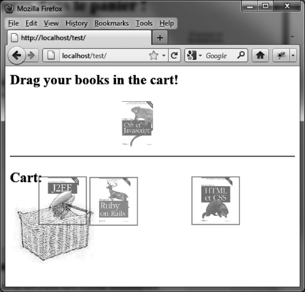

### 11.5.4　管理购物车

我们将改进第10章中的购物车例子，使用户可以选择一本或多本书并将它们拖放到购物车中。这样一来，用户只需一次鼠标操作，便能同时选择多本想要购买的书（如图11-9所示）。


<center class="my_markdown"><b class="my_markdown">图11-9　三本书被同时放入购物车中</b></center>

这里还需要考虑IE和其他浏览器的一些差异。尤其在把书移到购物车中时，IE中会出现一个问题——移动操作可能被解释为一次新的选择序列。为解决这个问题，我们给每一本被选的书加上 `isSelected` 属性（当书被选择时设为 `true` ）。而其他浏览器在选择元素时则使用jQuery UI自动添加的 `ui-selected` 类。经过这样处理，我们的程序便能兼容了。

```css
<script src = jquery.js></script> 
<script src = jqueryui/js/jquery-ui-1.8.16.custom.min.js></script> 
<link rel=stylesheet type=text/css 
　　　 href=jqueryui/css/smoothness/jquery-ui-1.8.16.custom.css /> 
<style type=text/css> 
　.basket { 
　　border : transparent solid 2px; 
　} 
　.hover { 
　　border-color : red; 
　} 
　img.border { 
　　border : transparent solid 2px; 
　} 
　img.ui-selected { 
　　border-color : red; 
　} 
</style> 
<h2>Drag your books in the cart! </h2> 
<div id=books> 
　 
　 
　 
　 
</div> 
<hr /> 
<h2> Cart: </h2> 
<div id=shopping> 
　 
</div> 
<script> 
$("div#shopping img.basket").droppable ({ 
　hoverClass : "hover", 
　deactivate : function (event, ui) 
　{ 
　　var selector = $.browser.msie ? 
　　　　　　　　　　　　　 "div#books img[isSelected=true]" : 
　　　　　　　　　　　　　 "div#books img.ui-selected"; 
　　$(selector).each (function (index) 
　　{ 
　　　$(this).css ({ position:"relative", top:"0px", left:"0px" }); 
　　}); 
　}, 
　drop : function (event, ui) 
　　{ 
　　var selector = $.browser.msie ? 
　　　　　　　　　　　　　 "div#books img[isSelected=true]" : 
　　　　　　　　　　　　　 "div#books img.ui-selected"; 
　　$(selector).each (function (index) 
　　{ 
　　　$("div#shopping").append (this); 
　　　$(this).css ({ position:"relative", top:"0px", left:"0px" }) 
　　　　　　　 .removeClass ("ui-selected"); 
　　}); 
　} 
}); 
$("div#books").selectable ({ 
　selected : function (event, ui) 
　{ 
　　ui.selected.isSelected = true; 
　　$(ui.selected).draggable ({ 
　　　start : function (event) 
　　　　{ 
　　　　　$("div#books").selectable ("disable"); 
　　　}, 
　　　drag : function (event, ui) 
　　　{ 
　　　　var selector = $.browser.msie ? 
　　　　　　　　　　　　　　　　"div#books img[isSelected=true]" : 
　　　　　　　　　　　　　　　　"div#books img.ui-selected"; 
　　　　$(selector).each (function (index) 
　　　　{ 
　　　　　$(this).css ({ position : "relative", 
　　　　　　　　　　　　　　　　top : ui.helper.css ("top"), 
　　　　　　　　　　　　　　　 left : ui.helper.css ("left") }); 
　　　　}); 
　　　}, 
　　　stop : function (event) 
　　　{ 
　　　　$("div#books").selectable ("enable"); 
　　　} 
　　}); 
　}, 
　unselected : function (event, ui) 
　{ 
　　ui.unselected.isSelected = false; 
　　$(ui.unselected).draggable ("destroy"); 
　} 
}); 
</script> 
```


