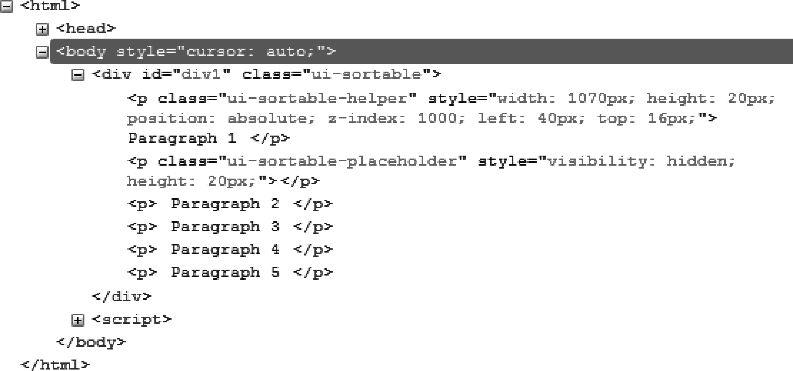
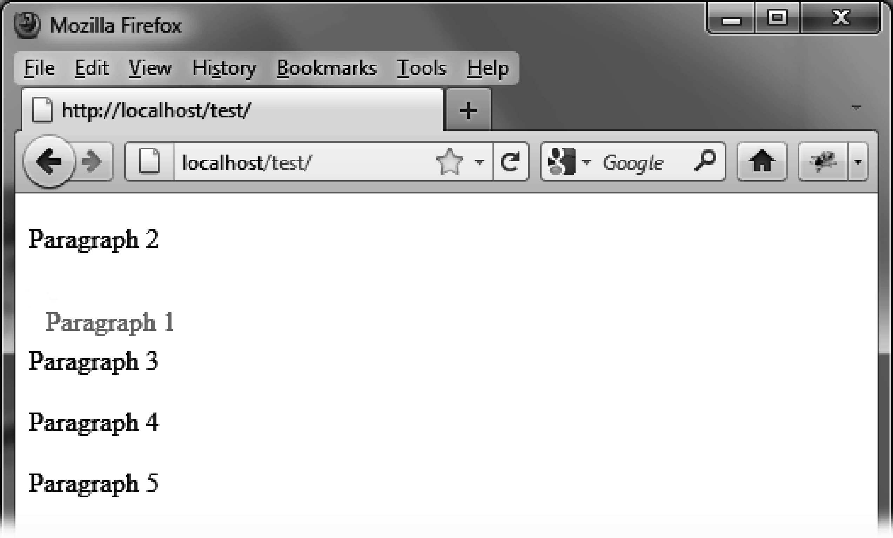

### 12.2　格式化内容

`sortable()` 方法允许用户通过鼠标移动已选中的元素，并给正在被移动的元素添加新的CSS类。

正如图12-2所示， `sortable()` 方法改变了HTML代码（这段代码是用Firefox的扩展Firebug查看的）。


<center class="my_markdown"><b class="my_markdown">图12-2　 `sortable ()` 方法生成的HTML代码</b></center>

外层的 `<div>` 元素被赋予了 `ui-sortable` 类，而正在被移动的段落则被赋予了 `ui-sortable-helper` 类。值得注意的是，jQuery UI创建了一个 `<div>` 元素（类名为 `ui-sortable-placeholder` ）用来占据段落被移走后的位置。这个 `<div>` 元素会随着调序的过程逐步移动，并在鼠标按键松开时从页面上被移除。

我们可以使用CSS类来定制外观。例如，如果我们修改了元素移动时对应的CSS类 `ui-sortable-`   `helper` ，便可以得到一个移动中的元素的新外观。

添加一个 `<style>` 标签来修改HTML页面中的这些元素，使正在被移动的段落显示为红色，而在被放置后变为黑色（如图12-3所示）。

```css
<script src = jquery.js></script> 
<script src = jqueryui/js/jquery-ui-1.8.16.custom.min.js></script> 
<link rel=stylesheet type=text/css 
　　　 href=jqueryui/css/smoothness/jquery-ui-1.8.16.custom.css /> 
<style type=text/css> 
　　p.ui-sortable-helper { 
　　 color : red; 
　　} 
</style> 
<div id=div1> 
　<p> Paragraph 1 </p> 
　<p> Paragraph 2 </p> 
　<p> Paragraph 3 </p> 
　<p> Paragraph 4 </p> 
　<p> Paragraph 5 </p> 
</div> 
<script> 
$("#div1").sortable (); 
</script> 
```


<center class="my_markdown"><b class="my_markdown">图12-3　定制外观的元素</b></center>

