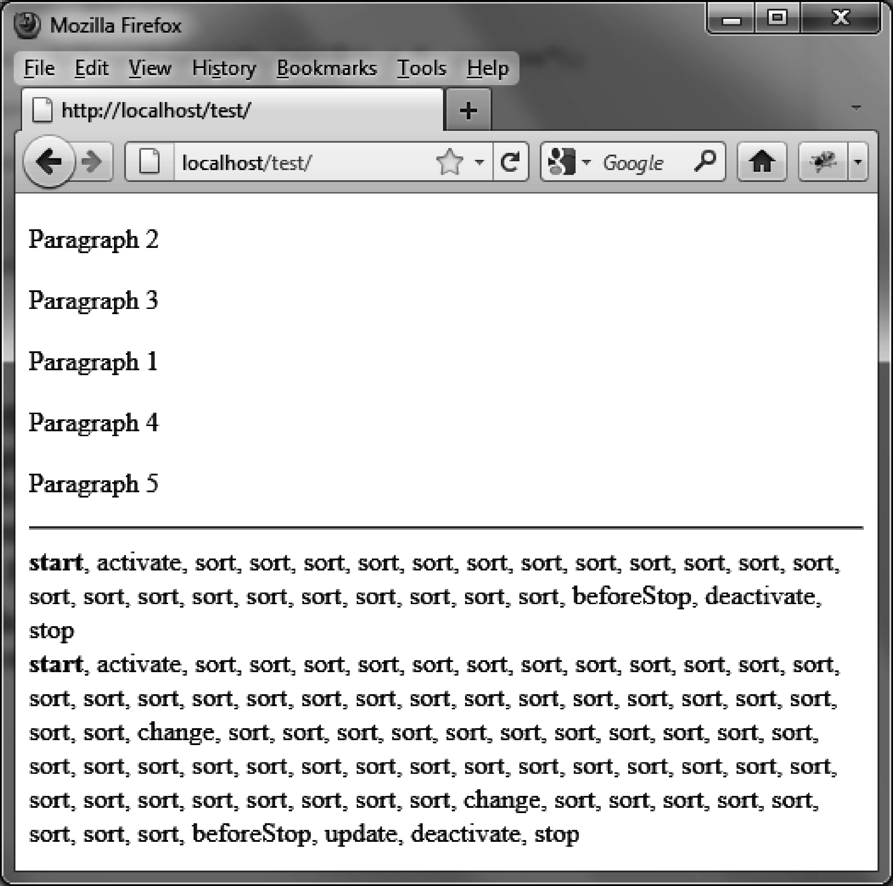
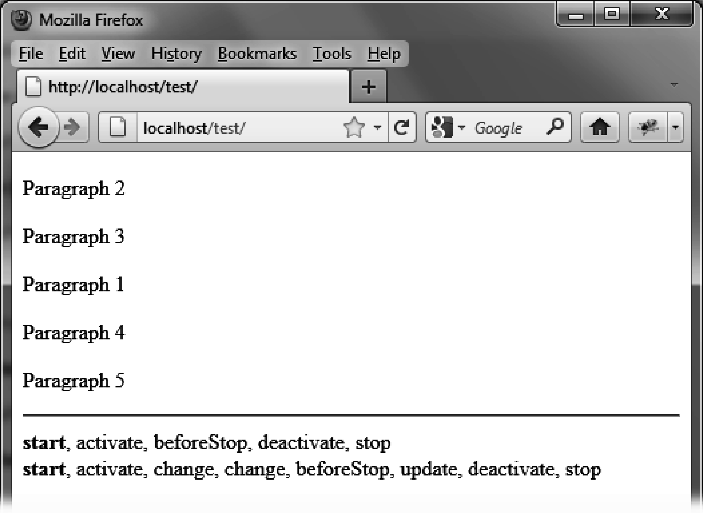
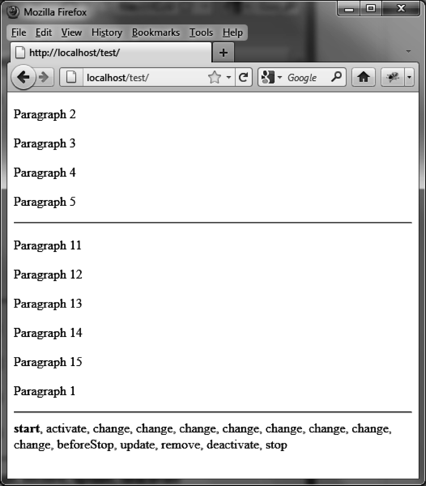
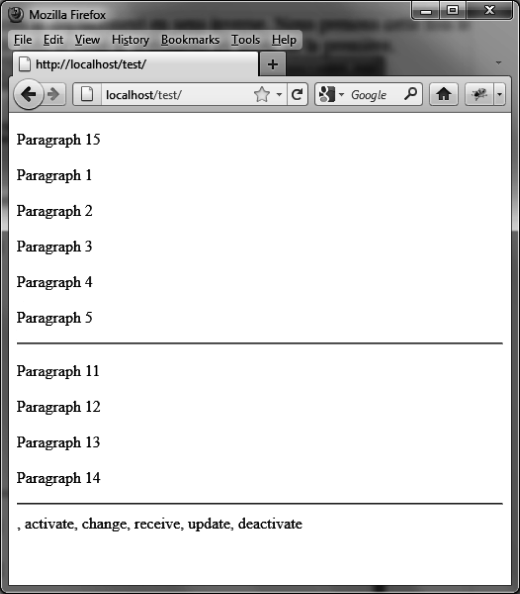

### 12.5.1　显示事件出现的顺序

元素既可以在多个列表间调序，也可以在单个列表中调序。我们首先创建一段脚本来允许用户在单个列表中移动元素，然后再用一段脚本允许列表间的移动。

#### 1．在单个列表中调序时

下面这个例子的目的是显示单个列表中的事件发生的顺序。为此，首先在页面上显示5个可调序的段落及一个包含了事件名称的 `<span>` 元素。每一个 `stop` 事件后都加上了一个换行标签。

```css
<script src = jquery.js></script>
<script src = jqueryui/js/jquery-ui-1.8.16.custom.min.js></script> 
<link rel=stylesheet type=text/css 
　　　 href=jqueryui/css/smoothness/jquery-ui-1.8.16.custom.css /> 
<style type=text/css> 
　p.ui-sortable-helper { 
　 color : red; 
　} 
</style> 
<div id=div1> 
　<p> Paragraph 1 </p> 
　<p> Paragraph 2 </p> 
　<p> Paragraph 3 </p> 
　<p> Paragraph 4 </p> 
　<p> Paragraph 5 </p> 
</div> 
<hr /> 
<span id=result></span> 
<script> 
$("#div1").sortable ({ 
　revert : 1000, 
　start : function (event, ui) 
　{ 
　　$("span#result").html ($("span#result").html () + "<b>start</b>"); 
　}, 
　stop : function (event, ui) 
　{ 
　　$("span#result").html ($("span#result").html () + ", stop <br />"); 
　}, 
　sort : function (event, ui) 
　{ 
　　$("span#result").html ($("span#result").html () + ", sort"); 
　}, 
　change : function (event, ui) 
　{ 
　　$("span#result").html ($("span#result").html () + ", change"); 
　}, 
　beforeStop : function (event, ui) 
　{ 
　　$("span#result").html ($("span#result").html () + ", beforeStop"); 
　}, 
　update : function (event, ui) 
　{ 
　　$("span#result").html ($("span#result").html () + ", update"); 
　}, 
　remove : function (event, ui) 
　{ 
　　$("span#result").html ($("span#result").html () + ", remove"); 
　}, 
　receive : function (event, ui)
　{
　　$("span#result").html ($("span#result").html () + ", receive");
　},
　activate : function (event, ui)
　{ 
　　$("span#result").html ($("span#result").html () + ", activate"); 
　}, 
　deactivate : function (event, ui) 
　{ 
　　$("span#result").html ($("span#result").html () + ", deactivate"); 
　} 
}); 
</script>
```

在对第一段进行两次拖放后，显示结果应该类似于图12-4所示的情形。第一次的原地放置不同于第二次（调用了 `update` 事件），并没有调整元素顺序。第二次放置中出现的两次 `change` 事件表明有两个元素和第一个段落成功地交换了位置，形成了最终的调整后的段落顺序。


<center class="my_markdown"><b class="my_markdown">图12-4　调序时触发的事件</b></center>

此外，我们还可以看到，出现最频繁的是 `sort` 事件，而它对应的正是鼠标的移动。

如果我们注释掉 `sort` 事件的显示，则显示结果就更加清晰易懂了（如图12-5所示）：

```css
 // sort : function (event, ui)
 // {
 //　　$("span#result").html ($("span#result").html () + ", sort");
 // },
```


<center class="my_markdown"><b class="my_markdown">图12-5　sort事件不再出现在列表中</b></center>

本例中移动的段落都隶属于一个列表。下面我们来看看两个列表间的元素移动。

#### 2．在两个列表间调序时

我们还是使用上面的示例，但这次用到了两个列表。元素可以在列表间移动，也仍然可以在单个列表中调序。为简单起见，我们只监听第一个列表的事件：

```css
<script src = jquery.js></script>
<script src = jqueryui/js/jquery-ui-1.8.16.custom.min.js></script>
<link rel=stylesheet type=text/css
　 　　href=jqueryui/css/smoothness/jquery-ui-1.8.16.custom.css />
<style type=text/css>
　p.ui-sortable-helper {
　　color : red;
　}
</style>
<div id=div1>
　<p> Paragraph 1 </p>
　<p> Paragraph 2 </p>
　<p> Paragraph 3 </p>
　<p> Paragraph 4 </p>
　<p> Paragraph 5 </p>
</div>
<hr />
<div id=div2>
　<p> Paragraph 11 </p>
　<p> Paragraph 12 </p>
　<p> Paragraph 13 </p>
　<p> Paragraph 14 </p>
　<p> Paragraph 15 </p>
</div>
<hr />
<span id=result></span>
<script>
$("#div1").sortable ({
　revert : 1000,
　connectWith : "#div2",
　start : function (event, ui)
　{
　　 $("span#result").html ($("span#result").html () + "<b>start</b>");
　},
　　 stop : function (event, ui)
　{
　　 $("span#result").html ($("span#result").html () + ", stop <br />");
　},
// sort : function (event, ui)
// {
//　　$("span#result").html ($("span#result").html () + ", sort");
// },
　change : function (event, ui)
　{
　　 $("span#result").html ($("span#result").html () + ", change");
　},
　beforeStop : function (event, ui)
　{
　　 $("span#result").html ($("span#result").html () + ", beforeStop");
　},
　update : function (event, ui)
　{
　　 $("span#result").html ($("span#result").html () + ", update");
　},
　remove : function (event, ui)
　{
　　 $("span#result").html ($("span#result").html () + ", remove");
　},
　receive : function (event, ui)
　{
　　 $("span#result").html ($("span#result").html () + ", receive");
　},
　activate : function (event, ui)
　{
　　 $("span#result").html ($("span#result").html () + ", activate");
　},
　deactivate : function (event, ui)
　{
　　 $("span#result").html ($("span#result").html () + ", deactivate");
　}
});
$("#div2").sortable ({
　revert : 1000,
　connectWith : "#div1"
});
</script>
```

通过使用 `connectWith` 选项，两个列表现在得以联通。我们不再显示 `sort` 事件，因为它们出现得实在是太频繁了。

图12-6显示了我们在第二个列表中移动第一段时的事件序列。 `change` 事件在两个列表的调序过程中都被触发了。值得注意的是 `update` 事件之后的 `remove` 事件，它揭示了元素被从一个列表中移除的过程。如果第二个列表也监听了这些事件，那它随后应该接收到 `receive` 事件。


<center class="my_markdown"><b class="my_markdown">图12-6　列表间调换元素时触发的事件</b></center>

在图12-7中，我们反过来移动元素，即将第二个列表尾部的元素移动到第一个列表的头部。

第一个列表不会再接收到 `start` 和 `stop` 事件，但能接收到 `activate` 和 `deactivate` 事件。此外，还接收一个单独的 `change` 事件，以及紧随其后的 `receive` 和 `update` 事件。


<center class="my_markdown"><b class="my_markdown">图12-7　从第二个列表中往第一个列表放置元素过程中触发的事件</b></center>

