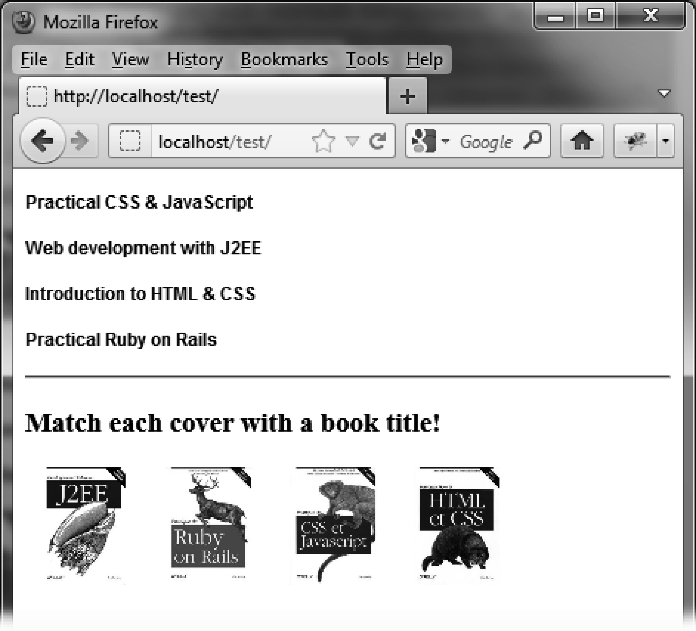
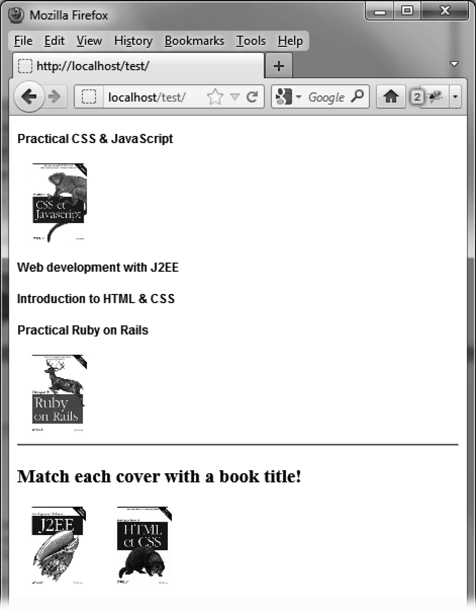
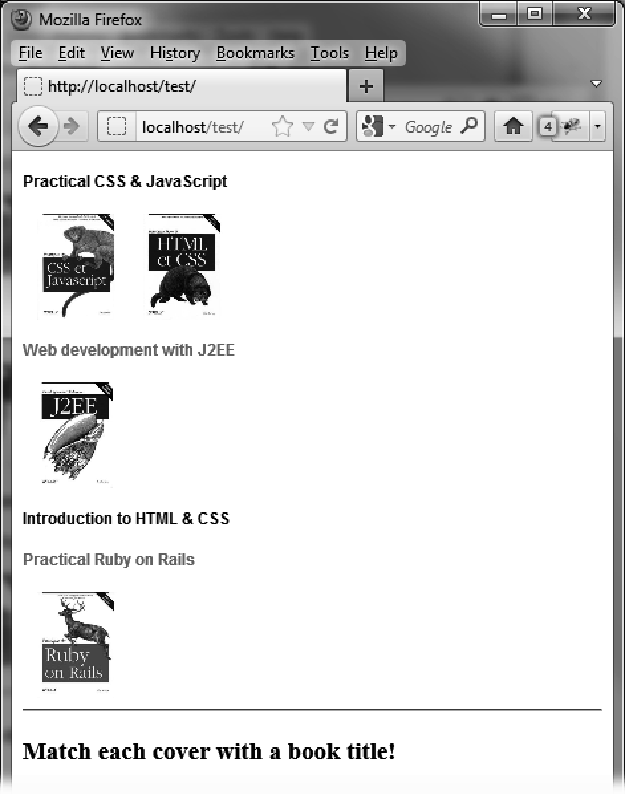

### 12.5.2　在列表中放置任何元素

在本节的例子中，你可以自由创建和管理往列表中放置元素的功能。

#### 1．将图片插入到一个书名列表中

到目前为止，我们还只学习了列表间调换元素的情形。下面来看看如果要插入一个不在列表中的元素应该如何做。

下面的例子将一些图书的书名显示在一个列表中。这个列表包含了可调序的元素。而在页面的另一处位置将显示这些图书的封面（如图12-8所示）。这个例子要实现的是将封面插入到包含图书书名的列表中。


<center class="my_markdown"><b class="my_markdown">图12-8　将每本书的封面和标题对应起来</b></center>

你需要一个一个地将图片拖到图书书名上。图12-9演示了两个封面和书名正确匹配的结果。

```css
<script src = jquery.js></script>
<script src = jqueryui/js/jquery-ui-1.8.16.custom.min.js></script>
<link rel=stylesheet type=text/css
　 　　href=jqueryui/css/smoothness/jquery-ui-1.8.16.custom.css />
<style type=text/css>
　h4 {
　　font-family : arial;
　　font-size : 12px;
　}
　.placeholder {
　　height : 80px;
　}
</style>
<div id=titles>
　<h4> Practical CSS & JavaScript </h4> 
　<h4> Web development with J2EE </h4>
　<h4> Introduction to HTML & CSS </h4>
　<h4> Practical Ruby on Rails </h4>
</div>
<hr />
<h3> Match each cover with a book title! </h3>
<div id=covers>
　
　
　
　
</div>
<script>
$("div#covers img").draggable ({
　revert : "invalid",
　connectToSortable : "div#titles"
});
$("div#titles").sortable ({
　placeholder : "placeholder",
　forcePlaceholderSize : true,
　sort : function (event, ui)
　{
　　ui.placeholder[0].height = ui.helper[0].height;
　　ui.placeholder[0].src = ui.helper[0].src;
　},
　receive : function (event, ui)
　{
　　 ui.item.draggable ("destroy");
　}
});
</script>
```


<center class="my_markdown"><b class="my_markdown">图12-9　图书封面插入到了书名列表中</b></center>

我们首先将每一张图片都指定为可以移动的（使用 `draggable()` 方法），然后利用 `connectToSortable` 选项将它们和书名列表关联起来。

列表已经被声明为可调序的列表了（使用 `sortable()` 方法）。我们给 `options.placeholder` 添加一个CSS类，以使在图片被移走后，空出来的位置能够维持图片的高度（在这里是80个像素）。如果忽略掉这一设置，那么操作看起来就不那么美观了。

鼠标的每一点移动都会调用 `sort()` 方法。它用被移动的图书的封面来初始化占位元素的内容。不这样做的话，移动时图片将不能正常显示。

此例中使用的 `receive()` 方法是用来避免 `draggable()` 方法对被移入列表中的元素进行操作。由于元素已经成为列表的一部分，所以应该由 `sortable()` 方法来管理它的移动。

#### 2．添加视觉处理

当一本书被移动到书名处时，并没有任何提示使用户知道所选的书名是否正确。我们可以在书名和封面进行配对的时候添加一些处理来显示不匹配的情形。

脚本需要做一些修改，使用户在把图书封面和书名进行正确匹配后，将书名文字显示为红色。否则，显示为黑色（如图12-10所示）。这里需要用到 `update` 事件，它可以在元素被放置到列表中时执行处理。


<center class="my_markdown"><b class="my_markdown">图12-10　添加一个视觉处理，指示正确匹配的情形</b></center>

```css
<script src = jquery.js></script>
<script src = jqueryui/js/jquery-ui-1.8.16.custom.min.js></script>
<link rel=stylesheet type=text/css 
　　　 href=jqueryui/css/smoothness/jquery-ui-1.8.16.custom.css />
<style type=text/css> 
　h4 {
　　　font-family : arial; 
　　　font-size : 12px;
　 }
　　.placeholder {
　　　 height : 80px; }
　 </style>
　 <div id=titles>
　　 <h4 class=javascript> Practical CSS & JavaScript </h4> 
　　 <h4 class=j2ee> Web development with J2EE </h4>
　　 <h4 class=html> Introduction to HTML & CSS </h4>
　　 <h4 class=rails> Practical Ruby on Rails </h4>
　 </div>
　 <hr />
　 <h3> Match each cover with a book title! </h3>
　 <div id=covers>
　　  
　　 
　　 
　　 
　 </div>
　 <script>
　 $("div#covers img").draggable ({
　　 revert : "invalid",
　　 connectToSortable : "div#titles" 
　 });
　 $("div#titles").sortable ({
　　 placeholder : "placeholder",
　　 forcePlaceholderSize : true,
　　 sort : function (event, ui) 
　　 {
　　　 ui.placeholder[0].height = ui.helper[0].height;
　　　 ui.placeholder[0].src = ui.helper[0].src; 
　 },
　 receive : function (event, ui) 
　 {
　　　 ui.item.draggable ("destroy");
　 },
　 update : function (event, ui) 
　 {
　　 $("div#titles h4").each (function (index) 
　　 {
　　　 var titleClass = this.className; 
　　　 var isSameClass = $(this).next ().hasClass (titleClass); 
　　　 var isOneImg = $(this).next ().next ().length == 0 ||
　　 　　　 　　　　　　!$(this).next ().next ()[0].tagName.match (/img/i); 
　　 　if (isSameClass && isOneImg) $(this).css ({ "color" : "red" });
　　 　else $(this).css ({ "color" : "black" }); 
　　 });
　 }
}); 
</script>
```

我们在 `update(event,ui)` 方法中检查每个书名是否与封面正确匹配。要实现这一点，我们给每一对封面和书名都事先分配一样的CSS类（例如 `"html"` 、 `"javascript"` 之类）。变量 `isSameClass` 的作用即为检查书名对应的 `<h4>` 元素类名是否与其后的图片元素类名一致。

还有一项检查旨在确认只有一张图片与书名对应。事实上，在这个例子里可以将两张图都拖放到同一个书名上。通过这个检查可以向用户指出这一错误（书名会显示为黑色而不是红色）。

<a class="my_markdown" href="['#ac121']">①</a>　原书这里只有 `item` 、 `helper` 、 `plalecholder` 、 `sender` 和 `offset`  5个属性，但实际上最新的1.8.22版本中含7个属性。表12-10的内容译者也做了相应的补充。——译者注


